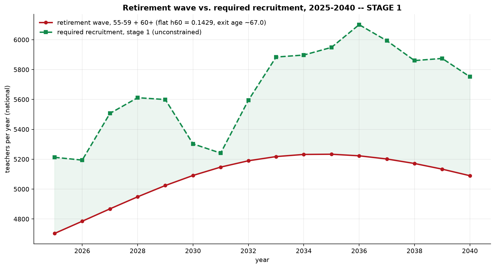
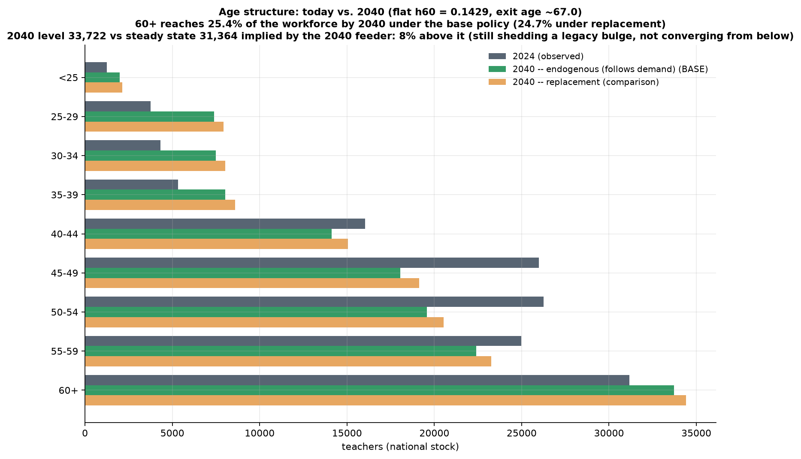
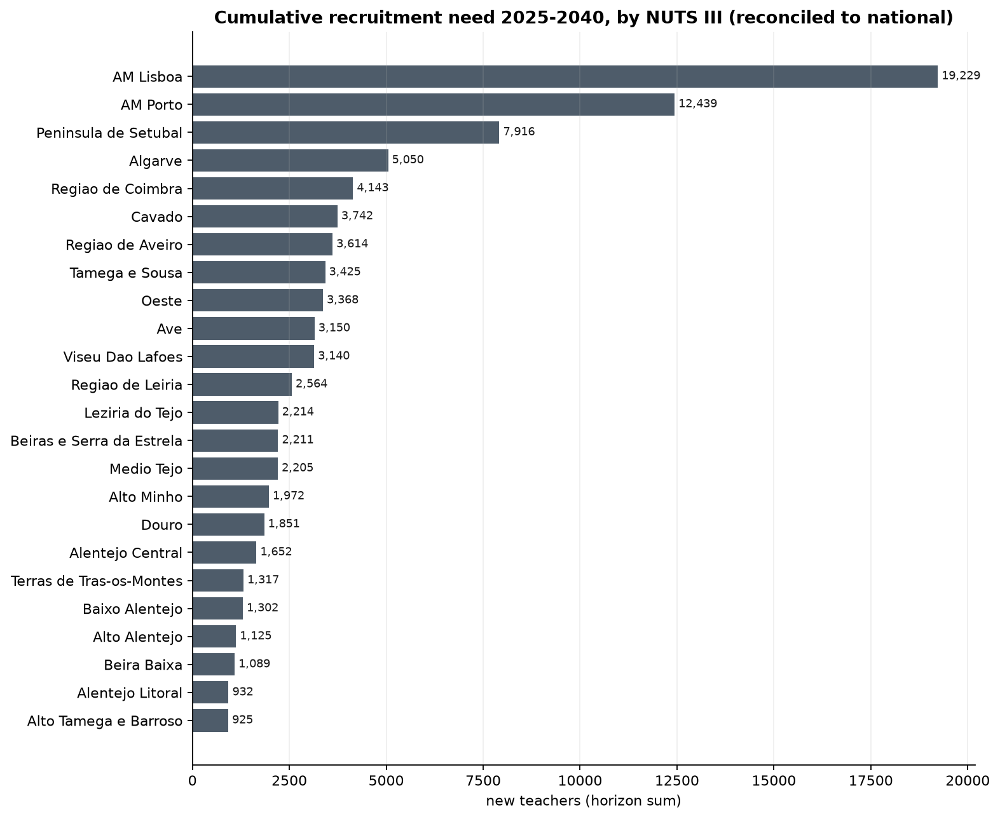
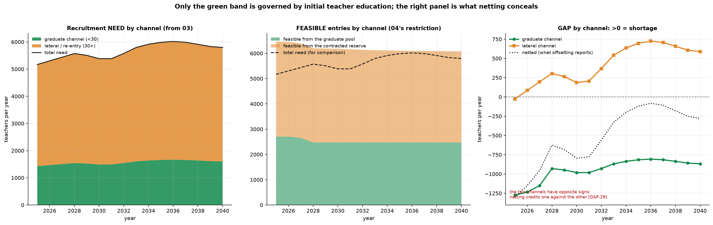
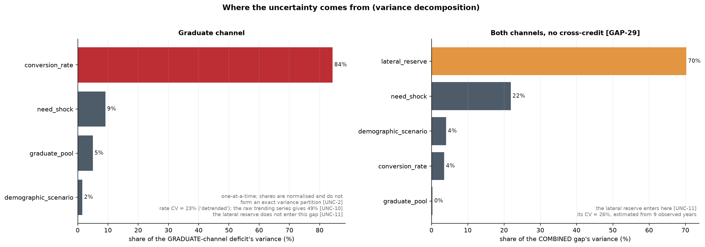

## The problem

Two demographic transitions are running through the Portuguese school system at the same time, and they move in opposite directions. Births fell, and the smaller cohorts work their way up through the cycles of schooling with a predictable lag, so enrolment declines first in pre-school and the first cycle and then at the levels above. Meanwhile the teaching workforce sits heavily in the upper age bands, the legacy of a long stretch of low recruitment that interrupted generational renewal.

The first transition reduces the number of teaching posts the system requires. The second obliges it to replace a growing share of the people who occupy them. Which of the two dominates is an empirical question, and the answer is not the intuitive one.

The reference study makes the arithmetic explicit. Total enrolment in mainland public schools falls to 1,078,353 pupils in 2034/35, about five per cent below 2025/26, while the teachers active in 2024/25 who remain in service fall from 121,884 to 76,293, a reduction of thirty-seven per cent (Nunes et al., 2025). Recruitment need is the difference between two falling quantities, and it is governed by the faster one. A contraction of five per cent on the demand side cannot absorb a contraction of thirty-seven per cent on the supply side.

That is why the official projection puts cumulative recruitment at 38,779 new teachers to 2034/35, an average close to 3,800 a year in a system that is shrinking. The figure is worth holding onto, because everything below eventually comes back to it.

## What this projection does, in one chapter

We built an independent projection of teacher requirements for mainland Portugal, by NUTS III region and schooling cycle, running from 2025 to 2040. It is assembled from published statistics, and the code that produced every figure is released with it, which places it on different footing from the official studies, whose reliance on individual-level administrative records puts them beyond replication.

The chain has six linked blocks, each writing a file the next one reads:

- enrolment, projected from the school-age population and a coverage rate;
- demand, converting pupils into posts;
- supply, ageing the existing workforce forward and computing the recruitment needed to close the distance to demand;
- the training constraint, asking whether the qualifying pipeline can deliver those recruits;
- uncertainty, propagated by simulation over stated assumptions;
- validation, which reads every other block and feeds none of them.

Demand rests on a student-teacher ratio, and the behaviour of that ratio over sixteen years is the single assumption that most affects the result. Rather than fixing it by convention, we compared ten candidate projection methods in a rolling-origin bake-off and let the backtest select per cell. Separately, the enrolment elasticity of teacher demand was tested against the conventional assumption of strict proportionality. The estimate of 0.506 survived that test in one cell only, and it is deployed in that cell alone; everywhere else the chain reverts to proportionality.

Supply is a cohort chain over nine age bands with age-specific exit hazards, and entry is set endogenously as whatever recruitment would restore the stock implied by projected demand. Nothing in the supply block limits how many people are available to be recruited.

That is the design choice that separates this exercise from the official studies. Requirement and feasibility are answered by different blocks. The supply block says how many teachers must be hired. The training constraint block asks whether they exist. Those questions have different answers, and the graduate constraint is applied only to the channel that initial teacher education actually governs, rather than to the total.

One more distinction carries every headline number. The supply block publishes two recruitment paths. The flat chain applies a uniform statutory exit age; the tenure queue models exit through accumulated service. The figures below are the flat chain unless stated otherwise. Derivations of the method, the bake-off tables, the elasticity estimation and the wild cluster bootstrap that supports it, the hindcast, and the data-preparation defects all sit in the [full report](/projects/teacher-forecasting/teacher_requirements_mainland_portugal_2025_2040.qmd).

## What it found

Over 2025 to 2040 the live flat chain requires 90,575 recruitments, an average of 5,661 a year. The tenure queue puts the same quantity at 98,579. The first decade alone accounts for 55,045, an average of 5,505 a year on the smoothed path.

Total exits over the horizon come to 96,908 against a requirement of 90,575, so replacement is 107.0 per cent of recruitment and the expansion component is negative in all sixteen years. Of those exits, 81,260 are retirements and 15,648 are attrition below age 55, roughly a sixth of the total. Between 58.4 and 63.6 per cent of the 2024 workforce retires inside the horizon, depending on the specification.

{#fig-wave width=100%}

@fig-wave shows why the requirement does not ease. The wave does not pass within the window. The stock aged 55 and over falls only 8.5 per cent over sixteen years, and the band aged 60 and above is larger in 2040 than it was in 2024. The system replaces an ageing corps with recruits who then age into the same bands.

{#fig-pyramid width=100%}

@fig-pyramid makes the same point structurally. The distribution shifts, but it does not rejuvenate.

Set against the system's own history, the ask is demanding without being unprecedented. No projected year exceeds the all-time high of 6,298 entries recorded in 2020. Eight of the sixteen projected years exceed the second-highest year on record. A requirement that sits above the second-best year for half the horizon is a serious test of a recruitment apparatus, measured against what that apparatus has actually delivered.

{#fig-regional width=100%}

Territorially, the requirement concentrates. Three regions carry 43.70 per cent of the national total, as @fig-regional shows. Two cautions attach to reading that map. Regional requirement is where the posts are, not where the teachers come from: forty-two per cent of teachers holding a master's degree obtained after 2013 teach in a region different from the one in which they qualified (Nunes et al., 2025). And accuracy in projections of labour demand falls as the horizon lengthens and as the geography disaggregates (Richardson and Tan, 2007), which applies with full force here.

Against the official benchmark of 38,779 to 2034/35, our first-decade figure is 41.9 per cent higher raw, and 24.5 per cent higher after a perimeter adjustment of 1.140 that reconciles the two workforce universes. The residual is not explained by anything we can identify in the available data, and we do not present either estimate as the correct one.

| Quantity | Value |
|---|---:|
| Recruitment requirement, 2025-2040 (flat chain) | 90,575 |
| Recruitment requirement (tenure queue) | 98,579 |
| Total exits | 96,908 |
| Retirements | 81,260 |
| Attrition below 55 | 15,648 |
| Graduate channel requirement (27.68%) | 25,072 |
| Lateral channel requirement (72.32%) | 65,503 |
| Feasible graduate entries | 40,208 |
| Feasible lateral entries | 58,764 |
| Cumulative graduate surplus | 15,136 |
| Cumulative lateral shortfall | 6,765 |

: Headline quantities, mainland Portugal, 2025-2040 {#tbl-headline}

## The channel that binds

Entry into teaching happens through two routes, and the chain keeps them apart. The split is 27.68 per cent graduate and 72.32 per cent lateral, estimated from the entry age profile of recent years. In levels, that is 25,072 recruits the graduate channel must deliver and 65,503 the lateral channel must deliver.

{#fig-channels width=100%}

@fig-channels reports coverage, defined as feasible entries over required entries. The graduate channel never falls below 148.5 per cent. It starts at 189.1 per cent and ends at 154.1 per cent, and the constraint never binds in any of the sixteen years. Initial teacher education, on these numbers, is not the binding constraint on the recruitment path.

The lateral channel is. Coverage drops below 100 per cent from 2026 and reaches 83.3 per cent by 2036, leaving 6,765 positions unfilled over the horizon. Cumulatively the graduate channel runs a surplus of 15,136.

The reported shortfall of 6,765 exists only because we refuse to offset one channel against the other. Netting the channels reports exactly zero unmet need in every year, and the two ways of combining them differ by 15,304 teachers. Readers who prefer the netted convention should see plainly that it removes the entire deficit. Our reason for refusing is that the two channels draw on different populations: a surplus of new graduates does not staff a post that requires an experienced re-entrant, and the age profile underlying the split does not support the substitution.

Against that, a limitation of the same magnitude. The lateral channel is projected as a fixed rate applied to a falling workforce. There is no stock model of the contracted reserve anywhere in the chain, because the Portuguese data do not measure it. The channel that binds is the one we model least well.

## What the result rests on

Three dependencies govern the sign and the level of what is reported above. None of them is an estimate in the ordinary sense.

The first is an external anchor. The conversion rate from qualified graduate to placed teacher is scaled by a factor of 1.6243, an uplift of 62.4 per cent on observed graduate entries, to reconcile the estimated flow with an external estimate of the graduate entry level. Anchored, the mean graduate gap is a surplus of 946 a year. Unanchored, it is a shortage of 19.9. The sign reverses. The validation suite records this as a failure rather than as a caveat, and the anchor is documented in full at [full report](/projects/teacher-forecasting/teacher_requirements_mainland_portugal_2025_2040.qmd).

The second is the descriptive student-teacher ratio. It records the staffing that occurred, including posts that went unfilled, so if the system was short of teachers during the observation window the ratio is biased upward and projected demand is biased downward. The mechanism is old and well documented: a system short of teachers adjusts by relaxing qualification requirements and raising the workload of the teachers it has, and those adjustments are absorbed into the observed ratio (Santiago, 2002). We impose no normative target anywhere in the chain. The requirement reported here is a lower bound.

The third is the retirement hazard for the band aged 60 and above. It is set from the statutory exit age rather than estimated from the data, and the three estimated alternatives are all lower. That single assumption generates 94.7 per cent of the retirement wave, which in turn generates the recruitment requirement. Describing it as an estimate would be wrong.

Beyond the three, one quantity sits entirely outside every figure in this post. The substitution reserve, the pool of contracted teachers who cover absences and temporary vacancies during the school year, is not modelled at any point. At twenty per cent of the 2025 stock it would amount to 27,722 teachers, which is 4.10 times the shortfall the chain reports. The age-band sum of 139,098 on which the supply block works, and the reference census of approximately 122,000 active teachers in mainland public education, describe different universes, and comparisons that cross them are not like for like.

## What transfers

Three things about this exercise generalise to projections of the same family.

{#fig-variance width=100%}

The variance decomposition inverts between the two deficits, as @fig-variance shows. On the graduate gap, the conversion rate accounts for 84.3 per cent of the variance; on the combined gap, the same parameter accounts for 3.5 per cent, while the lateral reserve accounts for 70.3 per cent. Reporting one decomposition therefore selects the answer by selecting the target. Any sensitivity analysis that names a single dominant driver should be read alongside the question of what deficit it was computed on.

The validation suite reports sixteen passes among twenty evidential checks, not twenty-three among twenty-seven. Seven of the twenty-seven hold by construction: the quantities they compare are built from the same inputs and agree because the arithmetic requires it. A definition is not a finding, and counting it as one inflates the apparent standing of the result. The full count and the reasoning behind each exclusion are at `PROJECT_URL`.

And a single organisational assumption moves the reference study's own requirement from 38,779 to between 15,579 and 16,474 (Nunes et al., 2025). Those alternative scenarios reallocate teachers' classroom availability fully to classroom needs. The range they open is larger than the entire gap between the two studies, which places roughly six in every ten projected recruitments in the domain of how schools are organised rather than in the domain of demography. The replacement and expansion decomposition used above is a standard international framing for exactly this reason (Bruneforth, Gagnon and Wallet, 2009): it separates what the population does from what the institution does.

You should use these figures as a lower bound on permanent posts under stated assumptions, not as a forecast of hires. The requirement is bounded below because the ratio is descriptive; the feasibility verdict flips sign if you remove the anchor; the deficit is zero if you net the channels; and the substitution reserve is absent throughout. If you disagree with the anchor, the ratio, or the channel split, the code is released so that the disagreement can be made precise.

## References

Bruneforth, M., Gagnon, A. and Wallet, P. (2009). *Projecting the global demand for teachers: Meeting the goal of universal primary education by 2015*. Technical Paper No. 3. Montreal: UNESCO Institute for Statistics.

Nunes, L. C., Gomes, S., Capelo, C., Gião, J., Duarte, J., Ferreira, A. P. and Silva, P. L. (2025). *Estudo de diagnóstico de necessidades docentes de 2025 a 2034*. Lisbon: Direção-Geral de Estatísticas da Educação e Ciência.

Richardson, S. and Tan, Y. (2007). *Forecasting future demands: What we can and cannot know*. Adelaide: National Centre for Vocational Education Research.

Santiago, P. (2002). *Teacher demand and supply: Improving teaching quality and addressing teacher shortages*. OECD Education Working Papers, No. 1. Paris: OECD Publishing. [VERIFY]

