# Framing {#sec-framing}

## The public policy problem

The Portuguese school system is passing through two demographic transitions at once, and
they push in opposite directions. On the demand side, the fall in births works its way
through the cycles of schooling with a predictable lag, reducing enrolment first in
pre-school and the first cycle and then, in sequence, at the levels above. On the supply
side, the teaching workforce is concentrated in the upper age brackets, the result of a
long period of low recruitment that interrupted generational renewal and shifted the mass
of the age distribution beyond fifty. The first transition lowers the number of teaching
posts the system requires. The second obliges it to replace a growing share of the people
who occupy them. The balance between the two is not obvious in advance, and it is the
object of this exercise.

The intuition that fewer pupils means fewer teachers fails here for a reason that the most
recent official projection makes explicit. Nunes et al. (2025) project total enrolment in
mainland public schools falling to 1,078,353 pupils in 2034/35, a reduction of five per
cent against 2025/26, while the number of teachers active in 2024/25 who remain in service
falls from 121,884 to 76,293 over the same horizon, a reduction of thirty-seven per cent.
Recruitment requirements rise despite the fall in pupils, because the contraction on the
supply side is an order of magnitude larger than the contraction on the demand side.
Recruitment need is the difference between two quantities that are both falling, and the
arithmetic is governed by the faster of the two. That asymmetry is what justifies modelling
supply as an age cohort chain with endogenous exits, rather than treating it as a residual
of projected enrolment.

The magnitudes involved are large relative to the existing workforce. The 2025 study puts
the cumulative requirement at 38,779 new teachers to 2034/35 in its base scenario, or
38,084 after an adjustment for teachers who do not retire at the reference age, an average
of 3,808 per year. The requirement peaks in the first year of the horizon, at 4,691 without
the adjustment and 3,996 with it, falls to 3,338 in 2026/27, rises to a secondary peak of
4,122 in 2030/31, and then eases. Its distribution across levels of education is uneven.
The combined third cycle and secondary group carries the largest absolute requirement at
20,606 teachers, followed by the second cycle at 6,407, the first cycle at 5,190 and
pre-school education at 4,053. Measured against the stock in service in 2024/25 the
ordering reverses, with pre-school education showing the highest relative requirement at
forty-three per cent and the second cycle at thirty-seven per cent. Pre-school education
also faces the steepest proportional loss of staff over the horizon, at fifty-five per
cent, against thirty-nine per cent in the third cycle and secondary, forty-two per cent in
the second cycle and twenty-nine per cent in the first cycle.

Territorially, relative requirements are more similar across regions than absolute figures
suggest. Cumulative recruitment to 2034/35 as a share of the 2024/25 stock ranges from
twenty-seven per cent in the Algarve to thirty-four per cent in the Centro and the Lisbon
Metropolitan Area at NUTS II level, and between twenty-two and thirty-eight per cent across
NUTS III regions. In absolute terms the Norte leads with 13,381 teachers, followed by the
Lisbon Metropolitan Area with 10,711 and the Centro with 9,656. At NUTS III level the two
metropolitan areas dominate, with 10,711 in Lisbon and 6,062 in Porto.

The flow of qualified entrants bounds any recruitment path, and the evidence points to a
constriction upstream. Drawing on the higher education enrolment and graduation register,
the 2025 study reports 2,962 enrolments and 1,922 graduations in teacher training courses
in 2020/21, 2,841 and 2,051 in 2021/22, and 3,276 and 2,141 in 2022/23. Graduations run at
between sixty-five and seventy-two per cent of enrolments across the three years, which the
authors read as evidence of substantial non-completion. Growth is concentrated in courses
preparing teachers for the third cycle and secondary education, where enrolments rose from
961 to 1,316 and graduations from 646 to 842. Set against an average requirement of 3,808
new teachers per year, both enrolments and graduations fall short of projected needs in the
aggregate and at every level of education.

Two points of definition follow from that comparison. The qualifying route to the
profession runs through the masters in teaching listed in the study's own annex, and the
enrolment and graduation figures are filtered on that basis; degrees in basic education at
first-cycle level do not by themselves confer professional qualification and should not be
counted in the qualifying flow. And the shortfall between enrolments and graduations occurs
before qualification, so it should not be applied a second time when converting graduates
into placed teachers.

Two further pressures sit alongside the demographic ones, documented in the annual review
of Portuguese education published by EDULOG (Figueiredo et al., 2025). The proportion of
teachers aged fifty or above rose across all cycles between 2018/19 and 2022/23, reaching
fifty-six per cent in pre-school education, alongside a share of fixed-term contracts that
indicates turnover within an already ageing corps. Over the same period the composition of
the pupil population changed quickly. Pupils of foreign nationality in mainland
pre-university education more than doubled, raising their share from five to eleven per
cent, with the largest increase among pupils from Portuguese-speaking countries, who rose
from 52,157 in 2018/19 to 112,533 in 2022/23. The pressure falls unevenly and is heaviest
in the first cycle, where foreign nationals exceeded thirteen per cent overall and in some
municipalities more than a third of pupils. Retention and drop-out rates for pupils with two
foreign parents run at more than three times the rate for pupils with Portuguese parents
throughout basic and secondary education. Changes of this kind alter the staffing intensity
required to deliver a given enrolment, a channel that pupil-teacher ratios estimated on
historical data capture only with a lag.

## Existing studies and what remains unanswered

Work on projecting teacher requirements falls into three strands that rarely speak to one
another. The first is the official national projection, produced by or for education
ministries, which answers an administrative question about how many teachers to recruit and
where. The second is a methodological literature on flow and cohort models, concerned with
how the accounting should be organised and which transitions deserve to be modelled
explicitly. The third is a conceptual and empirical literature on what a teacher shortage
is and at what level of aggregation the concept remains meaningful.

### Official projections for Portugal

Two studies define the reference point. The 2021 exercise, prepared by the Centre for the
Economics of Education at Nova SBE with the Directorate-General for Education and Science
Statistics, projected recruitment requirements from 2021/22 to 2030/31 and found that
roughly forty per cent of the teachers working in Portuguese public schools in 2018/19
would retire within the horizon (Nunes et al., 2021). It estimated average annual
recruitment requirements of about 3,450 new teachers, rising to roughly 4,100 by 2030/31
(Nunes, Reis, Freitas and Conceição, 2022). Disaggregated by level, cumulative requirements
to 2030/31 were 15,663 teachers for the combined third cycle and secondary group, 6,926 for
the first cycle, 5,655 for the second cycle, 4,419 for pre-school education, and 1,845 for
special education, Portuguese sign language and moral and religious education, a total close
to 34,500. Across NUTS III regions, cumulative requirements as a share of the 2018/19 stock
clustered between twenty-five and thirty-five per cent, with Tâmega e Sousa at nineteen per
cent and Lezíria do Tejo at twenty-three per cent at the lower end, and Beira Baixa at
thirty-six per cent and Terras de Trás-os-Montes at thirty-nine per cent at the upper end.

The 2025 update (Nunes et al., 2025) raises the cumulative figure to 38,779 and rebalances
its composition, with the combined third cycle and secondary group rising to 20,606 while
the first cycle falls to 5,190. Part of the revision follows from a shorter gap between the
last year of data and the first year of projection: the 2025 teacher projections rest on
the December 2024 census of teaching staff conducted by the Directorate-General for School
Administration, which removed a lag that had affected the earlier exercise. Part follows
from a different treatment of teaching hours, and part from a base year that already
incorporates several cohorts of below-replacement births. Two studies five years apart,
agreeing in their qualitative message and differing materially in magnitude and composition,
give some indication of how much the answer depends on vintage.

One distinction should be settled before the figures are compared with anything else.
Retirements and required entries are different quantities. In a contracting system the
second is the first net of the reduction in posts, so a projection of retirements will
exceed a projection of recruitment need by the amount of the contraction, and the two are
routinely conflated in secondary reporting.

Three assumptions in the 2025 study condition the interpretation of any projection built on
similar principles, including this one.

The first concerns retirement. The model assumes a single reference retirement age of
sixty-seven for all teachers, chosen because the statutory age in 2026 and in the years to
2035 sits closest to that value on an annual projection grid. The authors are explicit that
the simplification cuts both ways. At the end of 2024 there were 1,389 teachers aged
sixty-seven or above still in service, whom the model retires immediately, while teachers
who retire early are held in service too long. Using the education statistics for 2021/22
and 2022/23 they estimate continuity rates of sixty-five per cent from age sixty-five to
sixty-six, fifty-five per cent from sixty-six to sixty-seven, fifty-five per cent from
sixty-seven to sixty-eight, fifty per cent from sixty-eight to sixty-nine and fifteen per
cent from sixty-nine to seventy, and apply a correction of 695 teachers to the 2025/26
projection. The correction is a level adjustment in a single year, and the authors describe
it as approximate.

The second concerns the definition of demand. The projection converts pupils into classes,
classes into teaching hours by subject through the curricular matrices, and teaching hours
into recruitment groups. To this it adds the hours teachers spend on activities other than
classroom teaching, by assuming that in 2024/25 the staff available in each unit matched
the need, and holding the resulting ratio of required to available teaching hours constant
across the horizon. Two alternative scenarios in which teachers' classroom availability can
be fully reallocated to classroom needs reduce the cumulative requirement to 16,474 and
15,579 teachers respectively, against 38,779 in the base case. Non-classroom activities
therefore account for roughly six in every ten projected recruitments. Realising such a
scenario would require substantial changes to how schools operate, which places the finding
in the domain of organisational policy rather than demography.

The third concerns regional closure. Drawing on the qualifications recorded in the 2024/25
teacher census, the study finds that forty-two per cent of teachers holding a master's
degree obtained after 2013, 1,992 out of a sample of 4,597, teach in a NUTS II region
different from the one in which they qualified. The pattern is asymmetric. Eighty-six per
cent of teachers working in the Norte qualified there, against sixty-five per cent in the
Lisbon Metropolitan Area, fifty-two per cent in the Centro, twenty-six per cent in the
Alentejo and sixteen per cent in the Algarve. Regional projections of teacher requirements
cannot be read as regional projections of teacher supply.

Both Portuguese studies share three features that matter for what follows. Teacher supply
is projected by ageing the observed stock forward and applying a retirement rule, so the
supply side is accounting rather than behaviour. Demand is anchored on an assumption that
staffing observed in a base year matched the requirement, which imports the historical
equilibrium, including any unfilled positions, into the projected requirement. And the flow
of qualified graduates enters as a comparison at the end rather than as a constraint inside
the model: the 2025 study reports enrolments and graduations, observes that both fall short
of projected needs at every level, and stops there. The projection is therefore of
requirements, and requirements coincide with outcomes only if recruitment is unconstrained.

Adjacent Portuguese work fills in parts of the picture without joining it up. Cavique,
Pombinho, Tallón-Ballesteros and Correia (2020) work on the enrolment side, building a
stochastic model of pupil flow from the same administrative source, with dropout, retention
and progression as the three outcomes available to a pupil in each grade. Their treatment
of the pupil pipeline has no counterpart on the teacher side in the Portuguese literature.

### Flow models and the assumptions they require

The international methodological literature converges on a common accounting skeleton and
disagrees about how much of it to populate. The most explicit recent statement is the model
proposed by Bordón, Lara and Marotta (2025) for Latin America and the Caribbean, which
defines a system of cells indexed by region, geographic zone, administrative dependency of
the school, subject, gender and age, and projects each cell forward through the identity
that teachers in situation $s$ at time $t$ equal teachers in that situation at $t-1$, plus
entries, minus exits. Entries have three sources: newly trained teachers beginning work,
teachers who occupied a different cell in the previous year, and teachers who were outside
the profession and returned. Exits decompose into movement to another teaching cell,
movement to another function within education, movement to another sector, unemployment,
and retirement. The authors are direct about the cost of that structure, observing that
models of this family require numerous assumptions and that the assumptions themselves add
uncertainty to the projections.

The earlier and more widely used reference is the projection model of the UNESCO Institute
for Statistics, documented by Bruneforth, Gagnon and Wallet (2009) for primary education.
That model works with a smaller set of moving parts: enrolment, a pupil-teacher ratio
target, and an attrition rate. Its treatment of attrition is the part most relevant here.
The technical paper sets out the relationship between attrition rates and the implied
theoretical duration of a teaching career, and catalogues the factors associated with
different attrition levels, which makes explicit something usually left implicit: a constant
attrition rate is equivalent to an assumption about expected career length, and the two
should be checked against each other. The paper also compares the underlying assumptions of
the main teacher projection models then in use, which is the closest thing in this
literature to a formal comparison of specifications.

Aaronson and Meckel (2009) take a different route, projecting requirements for new full-time
public school teachers in the United States between 2009 and 2020 under varying assumptions
about fertility, pupil-teacher ratios and turnover. Their headline range runs from 2.3
million to 4.5 million, with a preferred path of roughly 277,000 new teachers in 2009/10
rising to 303,000 by 2020/21, and retirements accounting for about a third of those leaving
the workforce over the period. A factor of two between the low and high paths, generated by
assumptions that each seemed reasonable, quantifies how much of the answer is imported
rather than estimated, and it sits awkwardly beside the practice of reporting a single
central figure.

Two further contributions address parts of the problem the main models leave aside. Langford
(1986) works on secondary teacher forecasting with subject specialisation as the organising
problem, arguing that aggregate secondary projections conceal the specialisms where
recruitment actually binds, and proposing a subject-specialist planning methodology. Fiori
Maccioni (2023) develops a stochastic Markov chain for estimating new entrants into
professional orders and their pension funds, driven by the observation that trends in
academic enrolment anticipate changes in the professional job market over the medium term
and that fertility anticipates the stock of young adults over the long term. The structure
is a direct analogue of the qualifying pipeline problem: a cohort passes through education,
converts into the profession at a rate that is itself uncertain, and the conversion governs
whether the stock can be maintained.

Reduced-form alternatives exist and are used. Xia (2025) forecasts demand for full-time
teachers in China's compulsory education using an ARIMA specification with enrolment, a
target pupil-teacher ratio, the current stock and projected retirements, producing an
estimate of 788,500 full-time teachers required by 2027. Approaches of this kind buy
tractability at the cost of the age structure, which is the object that generates the
retirement wave in an ageing corps, so they answer a different question from the cohort
models even when they project the same quantity.

Lindsay, Wan, Berg-Jacobson, Walston and Redford (2017) approach the problem from the side
of study design. Working with the Minnesota Department of Education, they redesigned an
annual teacher supply and demand study around explicit research questions, having found the
existing product to be an unfocused compilation of data summaries. Their review covers
studies published between 1983 and 2012 and matches data sources and analytic methods to
each question. In a field where the common defect is a report that never states which
question each table answers, the procedural contribution has some weight.

### What counts as a shortage

The conceptual literature is where the official projections are most exposed. The
operational definition set out by Lindsay et al. (2017) is that a shortage occurs when the
number of teachers available in a given grade, subject or geographic area is less than the
number required there. The definition is difficult to apply, because supply and requirement
are both unobserved at the level of disaggregation at which the shortage occurs.

Edwards, Kraft, Christian and Candelaria address this by measuring unfilled teaching
positions at the start of the school year in Tennessee, in the autumn of 2019 and therefore
before the pandemic. Less than two per cent of teaching positions in the state were vacant,
a figure that would support the conclusion that Tennessee had no shortage. Those vacancies
were concentrated in a quarter of the state's schools, and at least seventy per cent of the
variation in the share of unfilled positions occurred between schools within the same
district rather than between districts or regions. Secondary schools accounted for
seventy-three per cent of vacancies. Shortages and surpluses coexisted, and the aggregate
concealed both. Among their predictors, historical attrition is the strongest: a one
standard deviation increase in teacher turnover is associated with a sixty-seven per cent
increase in the share of unfilled positions at a school, equivalent to one percentage point.

That finding constrains what a national or regional projection of requirements can claim. The
quantity that binds is local and subject-specific, and aggregation averages a shortage in one
cell against a surplus in another. The Portuguese studies disaggregate by recruitment group
and by organic unit, which is the right granularity, but the comparison against the
qualifying pipeline is made in the aggregate, where the offsetting occurs.

At European level, De Witte, De Cort and Gambi (2023) review interventions intended to
alleviate teacher shortages and assess both the strength of the evidence and the expected
effectiveness of each. For most interventions the evidence base is low-to-medium and the
expected effectiveness is likewise low-to-medium. Targeted financial incentives are the
exception, rated highly effective at medium cost for teachers in disadvantaged schools and
hard-to-staff subjects, with evidence from Oslo that a retention premium of around ten per
cent, forfeited on moving to a low-vacancy school, reduced the probability of voluntary
quitting by approximately six percentage points. Incentives aimed at retired teachers or
career switchers are judged less cost-effective on a thinner evidence base, which bears
directly on any model that projects a lateral entry channel, because it concerns exactly
the population such a channel draws on.

### What the forecasting literature says about exercises of this kind

Two contributions from outside education research should condition expectations about what a
sixteen-year projection can deliver.

Richardson and Tan (2007), writing for the Australian National Centre for Vocational
Education Research, examine the accuracy of labour demand forecasting and conclude that
accuracy falls rapidly as the projection horizon extends, as skills become more
disaggregated, and as projections are made by region. Their assessment of the MONASH model,
among the better models of its type, is that occupational projections are often out by ten
or twenty per cent within a few years, and that over a nine-year period the direction of
change was in some cases wrong, with growth projected where decline occurred. The three
dimensions along which they find accuracy to deteriorate are the three dimensions on which
teacher requirement projections are routinely published. @sec-demand returns to that
assessment at the point where the regional figures are produced.

Pathak and Shi (2014) address the evaluation problem rather than the accuracy problem. They
observe that systematic comparisons of the ex ante counterfactual predictions of structural
models against what subsequently occurred are rare, and they construct one by pre-registering
forecasts of a school assignment reform in Boston before the outcome data existed, comparing
a discrete choice model against a simpler statistical alternative and publishing the analysis
plan in advance so that no post-analysis bias could enter. The methodological point transfers
cleanly. Projections of teacher requirements are published, used, and superseded by the next
vintage, and the published record contains almost no instance of a projection being scored
against what happened.

### What remains unanswered

Five questions survive this literature, and they define what the present exercise attempts.

The first is whether the projections perform out of sample. No published evaluation scores a
Portuguese teacher projection against a holdout period, and the international literature
contains very few such evaluations for any country. Any claim about accuracy should be
supported by a hindcast that withholds recent years, re-estimates on the remainder, and
reports performance against a no-change benchmark at the level of disaggregation at which the
model is used, which for an ageing workforce means by age band and not only in aggregate.

The second is whether the qualifying pipeline binds. The Portuguese studies observe that
graduations fall short of projected requirements and treat the observation as context. If the
pipeline is a constraint, then the projected requirement overstates achievable recruitment,
and the difference between the two is the quantity policy cares about. Turning the comparison
into a constraint requires a conversion rate from qualified graduate to placed teacher, which
is estimable from the ratio of entries to the graduate pool, and requires stating what that
rate implies about the share of a cohort that ultimately enters teaching.

The third is whether the two entry routes should be modelled separately. New graduates and
lateral or returning entrants are drawn from different populations, respond to different
policy instruments, and face different constraints. Initial teacher education bounds the
first and has no purchase on the second, which draws on a contracted reserve whose size is
not measured in the Portuguese data. Applying a graduate constraint to total requirements
sets a bound derived from one population against a requirement defined over two.

The fourth is how much of the answer is assumption. Aaronson and Meckel (2009) report a range
spanning a factor of two; the Portuguese studies report central paths. The 2025 study does
provide alternative scenarios, and the two that reallocate teaching availability reduce
cumulative requirements from 38,779 to roughly 16,000, which is a statement about how much of
the projection is organisational rather than demographic. That is a scenario analysis, and it
does not answer which input the projection is most sensitive to, or what interval the result
carries. Both questions are answerable by simulation over the parameters the model actually
uses, provided the parameters are allowed to vary, including the inconvenient ones.

The fifth is the status of the pupil-teacher ratio. Converting enrolment into posts through a
ratio estimated on history embeds the staffing that was observed, including positions that
went unfilled. The 2025 study reaches the same place by assuming that available staff in
2024/25 matched the requirement in each unit. Neither approach separates the descriptive
equilibrium from a normative target, and the distinction determines whether the projection
describes the staffing the system would arrive at or the staffing a stated standard would
require.

## Contribution and scope

This report documents a projection chain for teacher requirements in mainland Portugal,
disaggregated by NUTS III region and by schooling cycle, from 2025 to 2040. The mainland
partition contains 24 NUTS III regions, and that partition is used throughout. The chain has
six linked blocks: a projection of the school-age population and of enrolment; conversion of
enrolment into teaching posts; projection of the teaching workforce through a cohort model
with age-specific exit hazards; confrontation of the resulting recruitment requirement with
the capacity of initial teacher education to supply it; quantification of uncertainty by
simulation; and a transversal validation suite. Data contracts between blocks are defined
explicitly. The whole exercise is built on published statistics and is released with the
code that produced every figure and table
([repository](https://github.com/joaovieira22/teacher-forecasting)), which places
it on a different footing from the official projections, whose reliance on
individual-level administrative records puts them beyond independent replication.

The first contribution is the separation between requirement and feasibility. The supply
block ages the current workforce forward, applies exit hazards, and computes the recruitment
that would restore the stock implied by enrolment. A second question is answered separately:
whether the flow of qualified graduates is large enough to deliver those recruits. The two
questions have different answers, and the distinction has practical consequences. A system
can face a large requirement and still fill it, or face a modest requirement and fail to fill
it, depending on the state of the qualifying pipeline. Keeping the blocks apart makes it
possible to say which of the two binds in each year and in each entry channel.

The second contribution concerns how the projection method was chosen. The demand block rests
on a ratio of students to teachers, and the behaviour of that ratio over the horizon is the
single assumption that most affects the result. Rather than fixing the ratio by convention,
ten candidate projection methods were compared in a rolling-origin backtest across four
origins and four cell definitions, scored by mean absolute scaled error against the in-sample
naive benchmark. The selected method differs by cell, and the tables report the margin by
which it beats the benchmark, which in several cells is small. Where a sophisticated method
barely improves on holding the last observation constant, the honest reading is that the
ratio is close to flat and the added machinery buys little.

The third contribution is an explicit audit of the enrolment elasticity of teacher demand.
The convention in the reference literature is strict proportionality, where a ten per cent
fall in enrolment produces a ten per cent fall in teaching posts. Departing from that
convention requires evidence against it, and the evidence has to survive the inferential
problem created by having twenty-four regional clusters. Cluster-robust standard errors
over-reject at that number of clusters, so the elasticity is tested with a wild cluster
bootstrap using Rademacher weights and the null imposed. Two nulls are tested. The first asks
whether any elasticity is detectable at all. The second asks whether the data reject
proportionality, and it is the second that governs whether the elasticity-based method is
admitted into the projection. A cell where proportionality cannot be rejected reverts to the
conventional treatment, even when the point estimate lies away from one.

The fourth contribution is the split of the recruitment requirement between entry channels.
Entry into teaching in Portugal occurs both from recent graduates of masters programmes in
teaching and from older entrants drawn from the contracted reserve and from re-entry. The
gap block applies the graduate constraint only to the channel the graduate pool actually
governs, and models the second channel separately as a rate on the existing workforce.
Netting the two channels against each other would allow a surplus in one to cancel a
shortfall in the other, which the age profile underlying the split does not support, so
results are reported per channel as well as in aggregate.

The fifth contribution is coverage. The reference study projects to 2034/35 and reports
national and regional aggregates. This chain extends to 2040, which places the trough of the
demographic decline and the subsequent partial recovery inside the projection window rather
than beyond it, and reports results at NUTS III throughout.

The sixth contribution is procedural. Each block writes a manifest recording the parameters
used, the checks that passed, the checks that were skipped because an input was missing, and
the caveats that must travel with the numbers. Failed identities are printed rather than
suppressed, and comparisons that are true by construction are labelled as such so they are
not mistaken for validation.

### Boundaries of the exercise

The requirement modelled here is for permanent teaching posts. It excludes the substitution
reserve, the pool of contracted teachers who cover absences, sick leave and temporary
vacancies during the school year. That component is not measured in any of the sources
reviewed here and is not measured in what follows, so the levels reported are a floor on the
effective requirement of the system in any year, and comparisons with figures that include
substitution are not like for like. @sec-training-constraint quantifies the implied size of
that omission.

Demand is derived from the observed ratio of students to teachers. That ratio is descriptive:
it records the staffing that actually occurred, including any posts that went unfilled. If
the system was short of teachers during the observation window, the observed ratio is biased
upwards, and dividing projected enrolment by an upward-biased ratio understates the teachers
required. The demand path carries that bias, and its direction is known even though its
magnitude is not. No normative target ratio, whether derived from class-size policy or from
an international benchmark, is imposed anywhere in the chain.

The projection is aggregated into four cells: pre-school, the first cycle, the second cycle,
and the third cycle together with secondary education. These are referred to throughout as
the four cells. The projection says nothing about individual subjects. The evidence on
Portugal locates the shortage very unevenly across subjects, and a model that aggregates the
third cycle and secondary education into a single cell cannot address that question. The
results describe the size of the recruitment task rather than its composition within the
upper cycles, and a subject-level extension would require a different data structure from
the one used here.

Entry into the profession is treated as a rate applied to a pool. The rate is estimated from
observed placements and projected forward under alternative rules, with the level anchored to
an external estimate of the graduate entry flow. It contains no price mechanism. Salaries,
the structure of the placement system, geographic mobility costs and working conditions all
affect how many qualified graduates choose to teach and how long they stay, and all of them
are policy instruments. The evidence reviewed by De Witte et al. (2023) confirms that these
margins respond to incentives. Treating the conversion rate as a parameter rather than as a
behavioural response means the projection cannot say what a salary change would do to the
pipeline. It can say what happens if entry behaviour continues as observed, or moves to a
stated alternative.

Regional results describe where the posts are, not where the teachers come from. Given the
mobility documented in the 2025 study, no regional closure is assumed, and the regional
figures should not be read as implying that each region must produce its own recruits. The
reconciliation between the regional series and the national total is performed explicitly and
its residual is diagnosed rather than absorbed silently.

Uncertainty is propagated through scenarios and not through a probability model. The report
carries three demographic scenarios from the enrolment block, a band on the conversion rate
derived from its recent dispersion, and alternative rules for the projection of that rate.
These are deterministic paths, and the intervals they generate describe the spread across
stated assumptions. They do not support probability statements, and they do not cover
specification error, which in an exercise of this kind is likely to dominate parameter
uncertainty. Where a band in this report is wide, that width comes from assumptions that were
varied deliberately; where it is narrow, the reader should not conclude that the underlying
quantity is well determined.

Two data questions constrain external comparison and are treated in @sec-data rather than
here. The workforce universe in the panel used for this exercise differs in level from the
universe used by the reference study, which covers 835 public organic units in mainland
Portugal and excludes private schools, schools under association contracts, the autonomous
regions and adult education and training. The difference is large enough to affect any
comparison of levels. The territorial nomenclature in the panel also requires reconciliation
before regional figures can be set beside published regional results. Both are stated as open
rather than resolved, and every comparison with external benchmarks is reported twice, once
raw and once adjusted for the perimeter difference.

The work is independent. It was produced by a single author from published sources, without a
commission, and it represents no institution. Where its results diverge from the published
reference study, the divergence is reported and its sources are traced as far as the
available data allow, with no presumption that either estimate is correct.

The most consequential assumptions in the chain are the descriptive ratio in the demand
block, the entry rate and its external anchor in the gap block, and the channel split
inherited from the supply block, which determines how much of the total requirement the
graduate constraint is allowed to bind on. A reader who disagrees with any of the three will
reach a different answer, and the code is released so that the disagreement can be made
precise.

# Data {#sec-data}

The projection chain rests on a single analytical panel indexed by NUTS III region and
school year. That panel is assembled from published statistics by eleven scripts that run in
a fixed order, each writing an intermediate file that the next reads. The scripts, the raw files and the model code are in the project repository
(<https://github.com/joaovieira22/teacher-forecasting>). This section states
which variables enter the chain and why, what the raw files required before they could be
joined, and how each transformation was implemented. The transformations that leave no trace
in the final file are given most space, because they are the ones a reader cannot audit from
the output alone.

The organising principle follows Lindsay et al. (2017), who redesigned an annual teacher
supply and demand study for the Minnesota Department of Education after finding the existing
product to be an unfocused compilation of data summaries, and who match data elements and
analytic methods to specific research questions rather than reporting whatever the
administrative files happen to contain. Their review covers work published between 1983 and
2012. The same discipline is applied here: each variable is introduced by the question it
answers in the chain, and variables that answer no question are not carried.

{#fig-pipeline width=100%}

@fig-pipeline sets out the order in which the scripts run and which file each one
writes. Claims in this section are stated at the level the code supports. Where a property of
the panel follows from the parsers it is given as fact; where it is a property of the
downloaded files rather than of the code, that is said explicitly.

## Sources and what each contributes

Four institutions supply the raw material. The National Statistical Institute provides
resident population by age and municipality, the two demographic indices, the age and sex
structure of the teaching workforce, and population projections by scenario. The
Directorate-General for Education and Science Statistics provides school-level teacher
counts by cycle and recruitment group, and the higher education graduation register. The
geographical unit of the published files varies between municipality, NUTS III and NUTS II,
and reconciling those levels is the main task of the preparation layer.

| Source | Content | Published unit | Coverage | Script |
|---|---|---|---|---|
| INE, population estimates | Resident population, 18 five-year age bands plus total | Municipality | 2011-2025 | 04 |
| INE, ageing index | Population 65+ over population 0-14, times 100 | Municipality | 2011-2025 | 02 |
| INE, working-age renewal index | Population 20-29 over population 55-64, times 100 | Municipality | 2011-2025 | 03 |
| INE, population projections | Single-year ages 0 to 100, four scenarios | NUTS II | 2025-2100 | 05 |
| INE, teaching staff | Teachers by nine age bands and sex | NUTS III | school years | 07 |
| DGEEC, teachers | Teachers by cycle, function, nature and recruitment group | School | school years | 08 |
| DGEEC, graduates | Graduates by broad field of education | Country | 1996/97-2024/25 | 06 |
| INE, enrolment | Pupils by level of education | NUTS III | school years | 01 |

: Raw sources and the script that parses each {#tbl-sources}

The panel covers 308 municipalities, which is the whole country including the autonomous
regions, and the 24 mainland NUTS III regions once the panel is restricted to the mainland
in script 10. Observed years run from 2011 to 2025 and projected years from 2026 to 2040.

## The variables carried into the models

The chain uses four groups of variables, and each group answers a different question in the
projection.

Enrolment by level of education is the driver of demand. Script 01 extracts seven series
per region and year: a total plus pre-school, the three basic cycles, secondary and
post-secondary education. The model layer works with the four cells, so the third cycle and
secondary are combined downstream, and post-secondary is excluded by a configuration switch
in the demand block rather than at source. Keeping the finer breakdown in the panel means
the aggregation decision stays reversible.

Teacher counts enter through two independent channels because no single source carries both
the dimensions the chain needs. Script 08 parses the DGEEC school-level files and aggregates
to NUTS III with counts by cycle, by teaching and non-teaching function, by public and
private nature, and by nine recruitment groups covering mathematics, Portuguese, English,
history, geography, physics and chemistry, biology and geology, informatics and physical
education. Script 07 parses the INE tables and produces the age structure in nine bands from
under 25 to 60 and above, split by sex. The cycle breakdown is what the demand block divides
enrolment into; the age structure is what the supply block ages forward. The two come from
different collection instruments, and @sec-defects records what follows from that.

Resident population by age band supports the enrolment projection and the two demographic
indices. Script 04 builds the historical series by municipality and sums to NUTS III. Script
05 parses the projections, which INE publishes by single year of age and which the script
collapses into the same five-year bands used in the historical file, so the two halves of
the series are commensurable. Four scenarios are parsed, low, central, high and no
migration, and the last is dropped in script 11 because it is a mechanical reference case
rather than a projection anyone would act on.

Graduates in teacher training bound the recruitment path. Script 06 reads Table 3.1 of the
DGEEC higher education register, which reports graduates conferring a tertiary qualification
by broad field of education from 1996/97 onwards, and derives three candidate supply
measures. The narrow one, `teacher_supply_core`, is the Education field alone. A wider one
adds natural sciences, mathematics, statistics and information technologies, and the widest
adds arts, humanities and social sciences. The gap block uses the narrow measure, and the
consequence of that choice is set out in @sec-defects.

The two demographic indices are the only variables in the panel that are ratios rather than
counts, and that distinction governs how they may be aggregated.

## Two problems the raw files pose

### The nomenclature changed between vintages

INE revised the NUTS nomenclature in 2024, and the published series straddle the revision.
Files downloaded under the current nomenclature cover 2021 to 2025; files under the previous
one cover 2011 to 2023. Neither alone spans the horizon the chain needs, and the two cannot
be stacked because several municipalities sit in different NUTS III regions in the two
vintages.

The municipality identifier INE uses is a concatenation of the NUTS II code, the NUTS III
code and the four-digit district and municipality identifier, the DICO. The prefix changes
when the nomenclature changes, and because some prefixes contain letters the number of
digits in the full code varies between vintages. The DICO is stable, and it is always the
last four digits. Every script that reads a municipality file therefore strips non-numeric
characters and takes the final four digits as the join key:

```python
def municipio_id_from_code(x):
    c = code(x)
    digits = re.sub(r"[^0-9]", "", c)
    if len(digits) < 4:
        return ""
    return digits[-4:]
```

The rule holds on the municipalities that moved. Sertã appears as `16I0509` in the old
vintage and `1950509` in the new, moving from Médio Tejo to Beira Baixa, and both reduce to
`0509`. Alcobaça moves from Centro to Oeste, `16B1001` and `1D11001`, both reducing to
`1001`. Almada moves from the Lisbon Metropolitan Area to Península de Setúbal, `1701503`
and `1B01503`, both reducing to `1503`. Évora stays in Alentejo Central, `1870705` and
`1C40705`, both reducing to `0705`. Vila de Rei moves alongside Sertã. Because the key
survives the revision, the long series survives with it.

Scripts 02, 03 and 04 then build a crosswalk from the file that carries the current
nomenclature, keyed on the DICO, and apply it to every municipality-year record regardless
of which vintage the record came from. Every observation in the panel is therefore expressed
in the 2024 nomenclature before any aggregation takes place. Detection of which file is
which is by filename or by a string search in the first rows, with the specific product
codes hard-coded per source.

Scripts 01, 07 and 08 face the same problem in a different form because their published unit
is already NUTS III or a school. Script 01 validates region codes against a dictionary of the
2024 codes and discards rows that do not match. Script 08 builds a crosswalk from
municipality name to the 2024 NUTS III for the files that already carry it, and applies that
crosswalk to the files that do not.

### The vintages overlap

Once both vintages are re-anchored, 2021, 2022 and 2023 appear twice. Concatenating the two
files gives 1,540 rows from the current vintage and 4,004 from the previous one, 5,544 in
total, against the 4,620 that 308 municipalities over 15 years should produce. The 924
surplus rows are the three overlapping years counted twice.

De-duplication keeps the current vintage. Each script tags every record with a flag for
whether its source file carries the 2024 nomenclature, sorts on that flag in descending
order within each municipality-year, and keeps the first record:

```python
concelho["priority"] = concelho["source_is_nuts2024"].fillna(0).astype(int)
concelho = concelho.sort_values(
    ["ano", "municipio_id", "priority", "source_file"],
    ascending=[True, True, False, True],
).drop_duplicates(["ano", "municipio_id"], keep="first")
```

The choice of which vintage to keep in the overlap matters less than it might appear,
because the values for a given municipality are the same in both files. What changes is the
regional label, and that has already been overwritten by the crosswalk. The de-duplication
is therefore about row count rather than about value.

## Aggregation from municipality to NUTS III

Counts and ratios require different treatment, and the distinction is not cosmetic.

For counts the aggregation is a sum. A NUTS III region is the set of its municipalities, so
population, pupils, teachers and graduates aggregate exactly and the identity closes without
residual. Script 04 sums the 18 age bands with `min_count=1`, so a region composed entirely
of missing values yields missing rather than zero.

For ratios the correct aggregate is the ratio of the summed components, and averaging the
municipal ratios gives a different number:

$$\frac{1}{n}\sum_{i} \frac{P_i^{65+}}{P_i^{0\text{-}14}} \;\neq\; \frac{\sum_i P_i^{65+}}{\sum_i P_i^{0\text{-}14}}$$

The left-hand side weights every municipality equally regardless of size, so a small inland
municipality with an extreme ratio moves the regional figure as much as a large urban one.
The right-hand side is the index the region would report if it were treated as a single
population.

Scripts 02 and 03 compute the left-hand side. The published INE files give the index already
calculated per municipality and do not give the components, so the ratio of sums is not
available from those files. The scripts therefore produce two columns per index, a mean and
a median across municipalities, and the column names record what they are:

```python
.agg(**{
    MEAN_NAME: (VALUE_COL, "mean"),
    MEDIAN_NAME: (VALUE_COL, "median"),
    "n_concelhos": ("municipio_id", "nunique"),
})
```

The panel therefore carries `indice_envelhecimento_mean` and
`indice_renovacao_pop_ativa_mean` rather than a NUTS III ageing index and a NUTS III renewal
index. The distinction is recorded here because the downstream allocation in script 09 reads
those columns, and because @sec-defects sets out a route to the correct quantity that the
panel already supports.

## What is constructed rather than observed

Two quantities in the final panel are not measurements. Both are documented here because
neither is visible in the output file.

### Population by NUTS III in the projection period

INE publishes population projections at NUTS II. The chain needs them at NUTS III, and
script 09 constructs the split. For each combination of year, scenario, NUTS II region and
age band, it z-scores the two demographic indices within the NUTS II region, converts the
z-scores into a log share tilt whose sign encodes a demographic mechanism, exponentiates,
normalises, and rounds to integers by the method of largest remainders so that the NUTS III
values sum exactly to the NUTS II control total.

The tilt is signed so that young cohorts shrink where ageing is high and grow where renewal
is high, and old cohorts do the reverse. The coefficients are 0.22 for ages 0 to 14, 0.16
for 15 to 29, 0.10 for the working ages and 0.18 for 65 and above, with a smaller opposing
term on the second index in each case. An amplification factor of $1 + 0.015h$, where $h$ is
years since the first projected year, widens the tilt over the horizon:

$$w_i \;=\; \frac{b_i \exp\!\big(s_i (1 + 0.015h)\big)}{\sum_j b_j \exp\!\big(s_j (1 + 0.015h)\big)}$$

The code comments state that the signs encode the mechanism and the magnitudes are
deliberately conservative. Neither the coefficients nor the amplification factor is
estimated. The reconciliation to the NUTS II total is enforced as a hard failure: if the
maximum absolute difference between the summed NUTS III values and the NUTS II control is
not exactly zero, the script raises and the pipeline stops.

The indices that drive the tilt are carried forward from the last observed year by a forward
and backward fill within each region, so the tilt is constant across the horizon and the
only time variation is the amplification factor. Regional shares therefore move away from
uniform in a monotone way, with no new information entering after the last observed year.

### Teacher age structure in years where it is missing

The age structure exists only in the historical block, and script 11 fills gaps within each
region by linear interpolation:

```python
hist = hist.sort_values(["nuts3_code", "year_start"])
for c in bring:
    grupo = hist.groupby("nuts3_code")[c]
    hist[c] = grupo.transform(lambda x: x.interpolate(limit_direction="both"))
```

The `limit_direction="both"` argument propagates the nearest observed value outwards at both
ends of each series. Interior gaps are interpolated between two observations; edge gaps are
filled by repetition. Years filled that way are identical to their neighbour and carry no
information, which is why the validation block detects and drops them before running the
hindcast. Script 11 also reconstructs `teachers_55_plus` from the two component bands where
it is absent, and reconstructs the two shares from the counts and the total, filling only
where the published value is missing.

## Checks that run at build time

Each script writes its own diagnostic sheets alongside the data, and the checks are
arithmetic identities rather than plausibility judgements.

Script 01 compares the published enrolment total against the sum of the six levels for every
region and year, and reports the maximum absolute difference by year. Script 04 does the same
for population against the sum of the 18 age bands. Script 06 compares the published
graduate total against the sum of the eleven fields. Script 07 compares the teacher total
against the sum of the male and female totals. Script 09 verifies that the constructed NUTS
III population sums exactly to the NUTS II control, and treats any deviation as fatal.
Scripts 02, 03 and 04 write an `unmapped` sheet listing records the crosswalk failed to
place, which is empty when the DICO rule holds for every municipality.

Script 08 carries a check that exists because of a specific parsing failure. Unicode
normalisation decomposes the masculine ordinal indicator, so `Ensino básico - 1.º Ciclo`
normalises to `ensino basico 1 o ciclo` and a substring test for `1 ciclo` fails silently,
returning zero teachers for the first and second cycles while the third cycle and secondary
appear intact. The cycle test was rewritten as a regular expression tolerant of the stray
character:

```python
def _has_cycle(x, n):
    t = norm_txt(x)
    pat = r"(^|\D)" + str(n) + r"\s*o?\s*ciclo"
    return bool(re.search(pat, t))
```

A `cycle_check` sheet reports the summed teacher count for each cycle so that a regression
would be visible immediately, since a zero in the first or second cycle is not a possible
value.

Script 10 documents a second fixed failure. The by-year aggregation was built with a fixed
dictionary of aggregations, and when a column was absent pandas produced a column of the
expected name containing a row count. The aggregation is now assembled conditionally, so a
missing input produces a missing column rather than a plausible wrong number.

## Defects and open items on record {#sec-defects}

Six items were found by reading the code and are recorded here rather than resolved,
because each requires a decision about the data rather than a correction to it.

### The forecast regional split is not anchored to observed population

In script 09 the base weight before the tilt is uniform:

```python
n = len(geo)
base = np.ones(n, dtype=float) / n
```

Because the weights are normalised after the tilt is applied, a uniform base cancels. The
share each NUTS III region receives of its NUTS II total therefore depends only on the two
z-scored indices and not at all on how many people live there. For the three mainland NUTS
II regions that contain a single NUTS III region, Grande Lisboa, Península de Setúbal and
the Algarve, this has no effect. For the other four it binds.

With coefficients up to 0.22, index z-scores in the usual range and the amplification factor
at the end of the horizon, the tilt can move a share by roughly a factor of 0.45 to 2.2
either side of uniform. In Norte, which contains eight NUTS III regions, the constructed
share can therefore run from about 6 per cent to about 28 per cent, against observed shares
that range from roughly 2 per cent for Alto Tâmega e Barroso to roughly half the regional
total for the Área Metropolitana do Porto. The allocation cannot reproduce the observed
distribution, and the discrepancy is largest where a NUTS II region contains many NUTS III
regions of very different size.

The historical block takes population from script 04, where municipalities are summed
correctly, so the constructed split applies only from the first projected year onwards. A
discontinuity in the regional population series at the boundary between the two blocks is
the expected signature, and comparing observed population by NUTS III in the last historical
year against the first projected year would confirm or dismiss it in one step. The
correction is to replace the uniform base with the observed share of each NUTS III region in
its NUTS II total in the last historical year, leaving the tilt to act on that base rather
than on equal weights. @sec-enrolment records why this defect does not propagate into the
enrolment projection.

### The teacher total and the teacher age bands come from different sources

The master panel takes `teachers_total` from the DGEEC school-level files parsed by script
08. The age bands come from the INE tables parsed by script 07. Script 11 joins the second
onto the first and brings only columns that are not already present:

```python
bring = []
for c in candidate:
    if c in tp.columns and c not in master.columns:
        bring.append(c)
```

Since `teachers_total` is already in the master from DGEEC, the INE total is discarded and
the nine INE age bands are attached beside a DGEEC total. The two describe the teaching
workforce under different definitions and different collection instruments, so their sum
need not equal the total sitting next to them. The gap block detects this downstream,
reports the difference between the age-band sum and the published total, and works on the
age-band sum so that its arithmetic stays on one universe. That difference is quantified in
@sec-training-constraint. Recording the discrepancy at source, by retaining the INE total
under a distinct name and writing the difference into a diagnostic sheet, would make the
choice visible in the panel rather than only in a later block.

### The perimeter question is answerable with a column the panel already has

The external benchmark for this exercise covers 835 public organic units in mainland
Portugal and excludes private education. The panel's teacher total comes from DGEEC files
that carry a `Natureza` field, and script 08 uses it to produce `teachers_public`,
`teachers_private` and `share_public`, all of which script 10 carries into the master panel.
Any comparison against the published benchmark can therefore be made on the public subset
directly, without the perimeter adjustment that the gap block currently applies as a ratio.
The comparison should be run both ways, and the difference between them is a measure of how
much of the level gap is composition.

### The supply measure is broader than the qualifying route

`teacher_supply_core` is the Education field of the ISCED classification in its entirety.
That field includes degrees in basic education and in educational sciences that do not by
themselves confer professional qualification to teach. The conversion rate estimated in the
gap block divides entries into teaching by this pool, so the numerator and the denominator
describe different populations and the ratio is lower than the rate at which qualified
entrants convert. Reconstructing the denominator from the masters in teaching alone would
require a different table of the same register, and until that is done the conversion rate
should be read as a rate on a broad field rather than on the qualifying flow.

### Missing value conventions differ between scripts

INE marks a cell that is nil or not applicable with a hyphen. Scripts 01 and 07 read that as
zero, with an explicit comment to that effect in the second. Scripts 02, 03 and 04 read it as
missing. For counts of pupils and teachers, treating a hyphen as a genuine zero is
defensible, since the alternative would drop a region that reports no pupils at a given
level. For population and for the indices, treating it as missing is equally defensible. The
inconsistency is recorded because it means the same raw symbol produces a zero in one series
and a gap in another within the same panel.

Script 06 handles unparseable values differently again, returning zero rather than missing
when a cell cannot be converted. For a series that becomes the denominator of the conversion
rate, a silent zero is more consequential than a gap, and returning missing would make the
failure visible.

### The teacher panel is joined by name rather than by code

Script 08 captures the NUTS III code and the NUTS III name from the DGEEC files, then renames
the name column and drops the code before writing. Script 10 recovers the code by normalising
the name and looking it up in a dictionary of the 24 mainland regions:

```python
NAME_TO_CODE = {}
for c in NUTS3_CONTINENTE:
    n3n = NUTS3_CONTINENTE[c][2]
    NAME_TO_CODE[norm_txt(n3n)] = c
```

The round trip works on the current files and prints a warning for any region it fails to
place. It depends on DGEEC and the project dictionary spelling each region the same way
after accent removal and punctuation stripping, which is a weaker guarantee than the code
already present in the source. Carrying the code through script 08 would remove the
dependency.

## Files the model layer reads

Two files leave the preparation layer. The master panel with age structure,
`master_panel_nuts3_with_age.xlsx`, carries a `historical` sheet with observed years and a
`forecast` sheet with projected years by scenario, and is written to two directories so that
divergent copies cannot accumulate. The graduate panel, `teacher_supply_panel.xlsx`, carries
the national series by field of education and the three derived supply measures. The
enrolment forecast produced by the first model block is written separately and read by the
demand block.

The validation block reads the outputs of every preceding block and tests them. It feeds
none of them, so a failure there cannot silently alter a result upstream.

# Model architecture {#sec-architecture}

The projection is organised into six blocks that run in sequence, each one reading
files written by its predecessors and writing files that its successors consume. The
architecture is therefore a set of data contracts rather than a single program, and
the properties that matter for the credibility of the result are properties of those
contracts: which block owns which quantity, whether information flows in one
direction only, and what happens at the points where the chain declines to close a
loop. This section documents those three properties. It describes the execution
order and the sense in which the chain is acyclic, the division of responsibility
between the block that computes how many teachers are required and the block that
asks whether that number can be delivered, and the consequence of the decision not
to feed the second answer back into the first.

## Block chaining and acyclicity

The blocks execute in numeric order, from the enrolment projection through to the
validation suite. No orchestrator enforces that order. The author runs each block
manually, and the sequence exists as a convention of working practice rather than as
a guarantee provided by the code. Nothing prevents a block from being executed
against outputs of an earlier vintage, and stating this is preferable to implying a
guarantee that does not exist.

{#fig-chain width=100%}

@fig-chain sets out which block reads which file. The enrolment block reads the
master panel in its version without the teacher age structure, and writes a forecast
of pupils by NUTS III region, cycle and scenario, together with the diagnostic sheets
that document its own method selection. The demand block reads the master panel with
age structure and the wide enrolment sheet from the first block, and writes
`teacher_demand_selected.csv`, which is the contract the gap block consumes. The
supply block reads the same master panel and the selected demand series, and writes
the workforce projection, the recruitment split by entry channel, the history of
entries, the estimated exit hazards, the universe reconciliation at national, NUTS II
and NUTS III level, and a run manifest recording its parameters. The gap block reads
four files from the supply block, the selected demand from the demand block, the
enrolment forecast from the first block on a fallback path only, and three files from
the data preparation layer; it writes the national gap, the pipeline gap, the
constraint summary, the conversion history and the projected rate paths, the
`anchor_robustness.csv` table, the graduate projection, the stock gap, the lateral
channel history, the regional recruitment need, its own universe reconciliation and
its manifest. The uncertainty block reads eight files from the gap block and one from
the supply block. The validation block reads outputs from every preceding block and
from the panel, and writes nothing that any block reads.

That last property is the one that makes the validation meaningful. A suite that fed
its own diagnostics back into the chain could not be said to test the chain; it would
be part of it. The separation is complete, and a failure detected in validation
cannot silently alter a result upstream.

The graph of values is acyclic. The graph of file reads is not. The demand block
contains two functions, one that locates a 2025 workforce stock and one that
recovers NUTS III codes, which search the supply and gap output directories for
files written later in the sequence. Both feed a single consumer, the internal check
routine, and no quantity read by either function re-enters
`teacher_demand_selected.csv`. The distinction between reading a value and reading a
value for verification is therefore real, and the acyclicity of the substantive
computation survives it.

Two consequences follow, and both are recorded in the code itself. The first is that
on a first execution of the chain those downstream files do not yet exist, the checks
return a skipped status, and the block prints that a skipped check is not a passed
check. The second is that the checks only become active on a second pass, at which
point they read outputs produced by a vintage of the demand block different from the
one currently running. The block also labels the 2025 stock comparison as
informational rather than as validation, on the grounds that both quantities are
built from the same 2024 headcount and therefore agree by construction up to the
enrolment ratio. A reader who encounters that comparison in the output should not
read it as corroboration.

The accounting identities internal to the supply block hold to numerical precision.
The manifest records a maximum flow identity residual of $2.91 \times 10^{-11}$, a
historical gross flow residual of $9.09 \times 10^{-13}$, a hazard and exit
consistency residual of $1.14 \times 10^{-13}$, and a band fill helper residual of
exactly zero. These confirm that the recursion is implemented as specified. They say
nothing about whether the specification is right, and @sec-validation treats
them accordingly.

One asymmetry in the contracts deserves recording. The enrolment block reads the
master panel without the teacher age structure, while the demand and supply blocks
read the version with it. The enrolment block has no use for the age structure, so
the choice is defensible, but it means the two panel versions must remain consistent
with one another, and that consistency is maintained by the preparation layer rather
than checked at the point of use.

## Division of labour between requirement and feasibility

The chain separates two questions that are frequently merged in work of this kind.
The supply block computes how many teachers must be recruited each year to hold the
workforce at the level the demand block implies. The gap block asks whether the flow
of qualified graduates is large enough to deliver that number. The first question has
an accounting answer. The second has a behavioural one, and the two should not be
reported as though they were the same quantity.

The separation is declared in the data and not only in the code. Every row of the
supply projection carries a column recording that the entry policy is unconstrained
and that the restriction is applied by the gap block. When the supply block writes
the channel contract it prints that the gap block should restrict the graduate
channel alone rather than the total. The instruction matters because the two
channels draw on different populations: initial teacher education bounds the first
and has no purchase on the second, which draws on re-entry and on the contracted
reserve. @fig-dag shows where that division sits in the mechanism, and which of the
two channels the graduate pool actually governs.

Entry in the supply block is endogenous, set as the recruitment required to close the
distance between projected demand and the workforce that survives ageing and exit.
Under that rule the block projects cumulative recruitment of 90,575 teachers over
2025 to 2040, an average of 5,661 per year. The split between channels is governed by
a graduate share of 27.68 per cent, estimated from the entry age profile over the
last three observed years, with the remaining 72.32 per cent drawn laterally.
Applying that share gives 1,567 graduate entrants and 4,094 lateral entrants per year
on average. @sec-supply establishes both the recruitment path and the split.

Two features of the exit specification condition that recruitment path. The hazard
for the band aged sixty and above is set flat at one seventh, derived from a
statutory exit age of sixty-seven rather than estimated from the data. The estimated
alternatives are lower: 0.1237 over the full window, 0.1093 after 2017, and 0.1208
over the last three years. The choice raises projected retirements relative to what
the observed series would produce. The second feature is that the hazard series for
the band aged fifty-five to fifty-nine is degenerate, pinned at the floor, and the
manifest records it as such. Together these matter because 94.7 per cent of the
retirement wave originates in the sixty-plus band, so the wave that drives the
recruitment requirement is very largely a parameter rather than an estimate, a point
established with its evidence in @sec-supply. The cohort trace also reports a minimum
net multiplier of 0.813 with three bands below one, indicating that the ageing
recursion loses mass in those bands.

Against that requirement, the historical record establishes what the system has
actually delivered. Realised entries averaged 4,537 per year, with a median of 4,618
and an average of 4,860 over the last five years. The best year on record is 2020 at
6,298, the second best is 5,745, and the average excluding the maximum is 4,317. The
projection requires 5,661 per year on average, and 5,505 over the first ten years. No
projected year exceeds the best year ever observed, which is reassuring, but eight of
the sixteen exceed the second best, which is not. A requirement that sits above the
second highest year in the historical record for half the horizon is demanding by the
standard of the system's own experience.

The graduate share is a national average that conceals substantial territorial
variation. Across NUTS II regions it ranges from 0.116 in the Centro to 0.512 in
Grande Lisboa, a ratio of 4.4. Across NUTS III regions it ranges from 0.030 in Beiras
e Serra da Estrela to 0.512 in Grande Lisboa, a ratio of 17. Applying a single
national share to allocate need between channels therefore imposes a uniformity the
underlying data do not display.

The gap block inherits that share and applies the graduate constraint to the
corresponding portion of the requirement. It also records a second statistic, the
graduate share of observed entries, at 17.92 per cent. The two differ by a factor of
1.54. They measure different things, the first being the share of projected need
attributed to the graduate channel and the second the share of historical entries
that came through it, and the block prints a warning to that effect. The distinction
should travel with any use of either figure.

The constraint summary reports coverage by channel, defined as feasible entries over
required entries. Coverage in the graduate channel falls from 1.891 in 2025 to 1.541
in 2040, remaining above one throughout, and the binding flag is false in all sixteen
years. Coverage in the lateral channel falls from 1.007 in 2025 to 0.860 in 2040,
crossing below one in 2026. The channel that binds is the lateral one, governed by a
rate of 2.71 per cent applied to the previous year's age-banded stock, and not the
graduate channel that initial teacher education governs.

This produces the result most likely to be contested. The block reports an unmet
requirement of 6,765 teachers when the channels are kept separate and exactly zero
when they are netted against one another. The entire reported deficit is a
consequence of refusing to let a surplus in the graduate channel offset a shortfall in
the lateral one. The refusal is defensible, since the two channels draw on different
populations and a surplus of new graduates does not staff a post that requires an
experienced re-entrant, but the arithmetic should be stated plainly: under netting
the chain reports no deficit at all. Readers who prefer the netted convention should
be able to see that the two conventions differ by the whole of the reported figure.
@sec-training-constraint sets out the full case against netting.

The sign of the result also depends on an external anchor. The gap block scales the
conversion rate by a factor of 1.6243 to reconcile the estimated entry flow with an
external estimate of the graduate entry level. Under the anchor the mean conversion
rate is 0.196, implying a cohort conversion of 0.589, and the mean gap is a surplus of
946 per year. Without the anchor the mean rate is 0.121, the cohort conversion is
0.363, and the mean gap is a shortage of about 20 per year. The anchored verdict is a
surplus under all three rate modes. The unanchored verdict flips sign under the
median and last modes and remains a surplus only under damped trend. The block
records that the verdict does not survive removal of the anchor, and that record
belongs in the reporting of the central result rather than in an appendix.
@sec-training-constraint documents the anchor, its rationale and its consequences in
full.

A further tension exists between two of the block's own choices. The projected
conversion rate sits at the hundredth percentile of its historical distribution,
while the projected graduate pool sits 18.3 per cent below its last observation. The
block flags the combination as a convention mismatch, which it is. The printed
message accompanying the flag states that the two choices push the result in the same
direction, and that statement is wrong. Feasible graduate entries are the product of
the pool and the rate, so a high rate raises them and a low pool lowers them. The two
choices act in opposite directions on the gap. The mismatch is real and should be
declared; the claim about its net effect should not be repeated.

The perimeter question also sits in this block. Summing the teacher age bands for
2024 gives the age-band sum of 139,098, while the published total in the same panel
is 156,475, and the block works on the age-band sum so that its arithmetic stays on a
single universe. Against the reference census of approximately 122,000 active
teachers in mainland public education, the age-band sum is higher, and the perimeter
flag is set. If the base is interpreted as a flow rather than a stock, the implied
annual exit volume is 5,655. Separately, a substitution reserve at 20 per cent of the
2025 stock would amount to 27,722 teachers, a quantity the chain does not model at
any point and which is therefore absent from every figure reported here.
@sec-training-constraint reports both perimeter comparisons and the reserve
calculation in full.

## Absence of feedback from the constraint to the stock

The two questions are separated cleanly, and the answer to the second is never
returned to the first. This section quantifies what that omission costs.

{#fig-dag width=100%}

Entry in the supply block is set as the recruitment needed to close the distance
between demand and the surviving workforce. Because that quantity is positive in
every projected year, the recursion implies that the projected stock equals projected
demand exactly. The data confirm it: the stock column of the supply projection and
the stock column of the national gap file are identical. The gap block then reports
that 6,765 of the recruitments implied by that path cannot be delivered. The supply
projection is never revised. The panel that the uncertainty and validation blocks
read therefore contains a stock trajectory that assumes recruitment is fully
delivered, sitting beside a gap figure asserting that full delivery is impossible.
Nothing in the chain reconciles the two statements. In @fig-dag those are the two
dashed red edges, drawn to mark their absence.

To establish what the reconciliation would produce, the workforce was re-projected
under the constraint. The counterfactual applies the same graduate share of 0.27681
and the same lateral rate of 0.02706, uses exit rates implied by the ratio of exits
to the previous stock, and caps graduate entries at the feasible level recorded in the
constraint summary. Writing $s_c$ for the counterfactual stock, $r$ for the implied
exit rate, $\sigma$ for the graduate share, $\lambda$ for the lateral rate and $F_y$
for feasible graduate entries, the recursion is

$$
\begin{aligned}
a_c(t) &= s_c(t-1)\,\bigl(1 - r(t)\bigr) \\
n_c(t) &= d(t) - a_c(t) \\
e_y(t) &= \min\bigl(\sigma \, n_c(t),\; F_y(t)\bigr), \qquad
e_l(t) = \min\bigl((1-\sigma)\, n_c(t),\; \lambda \, s_c(t-1)\bigr) \\
s_c(t) &= a_c(t) + e_y(t) + e_l(t)
\end{aligned}
$$

starting from the observed 2024 age-band sum of 139,098. The resulting trajectory is
reported in @tbl-counterfactual.

| Year | Counterfactual stock | Shortfall against supply block | Entries | Realised graduate share |
|---:|---:|---:|---:|---:|
| 2025 | 138,606 | 5 | 5,207 | 27.7% |
| 2026 | 138,028 | 9 | 5,190 | 27.7% |
| 2027 | 137,450 | 253 | 5,262 | 29.0% |
| 2028 | 136,887 | 514 | 5,340 | 30.3% |
| 2029 | 136,314 | 700 | 5,391 | 31.3% |
| 2030 | 135,635 | 630 | 5,342 | 30.9% |
| 2031 | 134,847 | 555 | 5,288 | 30.6% |
| 2032 | 134,073 | 779 | 5,345 | 31.7% |
| 2033 | 133,397 | 1,165 | 5,463 | 33.6% |
| 2034 | 132,806 | 1,458 | 5,550 | 35.0% |
| 2035 | 132,294 | 1,714 | 5,626 | 36.1% |
| 2036 | 131,892 | 2,013 | 5,721 | 37.4% |
| 2037 | 131,552 | 2,154 | 5,760 | 38.0% |
| 2038 | 131,229 | 2,163 | 5,751 | 38.1% |
| 2039 | 130,933 | 2,189 | 5,749 | 38.2% |
| 2040 | 130,638 | 2,127 | 5,714 | 38.0% |

: Workforce trajectory under the feasibility constraint, compared with the
unconstrained supply projection {#tbl-counterfactual}

Four results follow.

The terminal stock would be 130,638 rather than 132,765, a shortfall of 2,127
teachers or 1.60 per cent. Cumulative recruitment over the horizon would be 87,701
rather than 90,575, a difference of 2,874. The reported unmet requirement of 6,765
therefore overstates the cumulative recruitment effect of the constraint by a factor
of 2.4.

The reason is that the system partially self-corrects. A lower stock raises the
requirement in the following year, and the graduate channel carries enough slack,
with coverage between 1.89 and 1.54, to absorb its share of that additional
requirement. At the same time a lower stock generates fewer exits, which offsets part
of the loss. The shortfall stabilises near 2,100 from 2037 onwards instead of
accumulating. The decomposition in the final year illustrates the mechanism: the flow
shortfall in 2040 is 38, the exit saving is 100, and applying these to the previous
year's shortfall of 2,189 gives 2,127, matching the recursion.

The composition of entries would shift. The realised graduate share drifts from 27.7
per cent at the start of the horizon to 38.0 per cent at the end, because the lateral
channel is capped at a rate applied to the stock while the graduate channel is not.

This result is circular in a way that bears on the whole chain. The share of 27.68 per
cent was itself derived from the entry age profile observed in the supply block, and
the counterfactual implies that the profile generating it would no longer hold. The
parameter that defines the boundary between the two channels does not survive the
scenario in which the constraint binds.

Three caveats attach to the counterfactual. It assumes the split between channels
remains proportional at $\sigma$ as the requirement rises, and that the graduate
channel delivers up to its feasible ceiling. These are assumptions of the same kind
the chain already makes rather than measurements. The calculation also ignores the
three-year moving average that the gap block applies to the expansion component,
which redistributes requirement between years, by a factor of 0.9916 in 2025 and
1.0211 in 2026, with almost no effect on the cumulative total.

One further architectural fact belongs here. The supply block publishes two
recruitment paths, and the gap block consumes only one. The flat specification gives
cumulative recruitment of 90,575 and is the path the gap block reads. The tenure
specification gives 98,579, and the age-matched tenure specification gives 87,275. The
gap between the flat and tenure paths is 8.84 per cent, decomposed into a shape effect
of $-3.64$ per cent and an age effect of $+12.95$ per cent, with the two effects
carrying opposite signs. In the first projected year the total difference is 21.0 per
cent, composed of a shape effect of $-8.08$ per cent and an age effect of $+31.63$ per
cent. The dominant channel is the retirement age, at a flat 67.0 against 65.22 in the
tenure queue. The Monte Carlo simulation in the same block returns a tenth percentile
of 91,311, a median of 98,773 and a ninetieth percentile of 106,963 over two thousand
replications. The median corresponds to the tenure queue path rather than to the flat
chain the gap block consumes, which means the central path carried through the chain
sits below the tenth percentile of the block's own simulated distribution. The choice
between the two published paths is not recorded anywhere in the data contract.

The decision not to close the loop places this chain in the same position as the
published reference study for Portugal, which reports enrolments and graduations in
initial teacher education, observes that both fall short of projected requirements at
every level of education, and stops there (Nunes et al., 2025). The projection that
results is of requirements rather than of outcomes, and the two coincide only if
recruitment is unconstrained. The model proposed for Latin America and the Caribbean
by Bordón, Lara and Marotta (2025) makes the same structural choice, decomposing
entries into newly trained teachers, teachers moving between cells and returning
teachers, while noting that models of this family require numerous assumptions and
that the assumptions themselves add uncertainty to the projections. The projection
model documented by Bruneforth, Gagnon and Wallet (2009) makes the corresponding
point about the exit side, observing that a constant attrition rate is equivalent to
an assumption about expected career length and that the two should be checked against
each other. In the present chain that check is available and unfavourable: the flat
hazard of one seventh implies a shorter residual career in the terminal band than any
of the three estimated alternatives would produce.

# Projecting the school population {#sec-enrolment}

Enrolment drives everything downstream. The demand block converts pupils into teaching
posts, the supply block sets recruitment to close the distance between that demand and
the surviving workforce, and the gap block asks whether the resulting recruitment can be
delivered. An error in the enrolment path propagates through all three. This section
documents how that path was built and what it produces, at national level and by NUTS III
region.

## Method and scenarios

### The decomposition

Projected enrolment is the product of three quantities, each estimated separately and
each carrying a different kind of uncertainty. For region $i$, cycle $c$ and year $t$,

$$
S_{ict} = S_{ic,2024} \times g_{n(i),b(c),t} \times \kappa_{ict}
$$

where $S_{ic,2024}$ is observed enrolment in the anchor year, $g$ is a demographic growth
factor computed at NUTS II level for the age band $b(c)$ that feeds cycle $c$, and
$\kappa$ is the ratio of projected to base-year coverage, meaning the share of the
relevant age band actually enrolled.

The first term is measurement. The second is the official population projection, and
carries whatever uncertainty the statistical office attaches to it. The third is
behavioural: it captures enrolment rates drifting away from what was observed, and it is
the only component the block estimates from the education data rather than inheriting.
The same decomposition underlies the projection model documented by Bruneforth, Gagnon
and Wallet (2009), where projected enrolment follows from expected changes in the size
of the population cohort and in coverage of the relevant level of education.

Cycles map to age bands as follows: pre-school to ages 0 to 4, the first cycle to 5 to 9,
the second and third cycles both to 10 to 14, and secondary and post-secondary both to 15
to 19. Two pairs of cycles therefore share a denominator. Any shift of pupils between the
second and third cycles, or between secondary and post-secondary, is absorbed entirely by
the coverage term and never appears as demography.

### Anchoring on observed enrolment

The projection is anchored on 2024, the last year with observed pupil counts, across 144
region-cycle cells, all of which have an observed coverage. Anchoring on the level rather
than on a fitted value means the first projected year departs from observation only
through demography and drift, and the block reports that decomposition explicitly. For the
central scenario the move from 1,547,317 observed pupils in 2024 to 1,543,374 projected in
2025 is a fall of 0.25 per cent, of which the demographic step accounts for $-0.28$ per
cent and coverage drift for $+0.02$ per cent. A first-year discontinuity of that size is
consistent with a demographic path; the block prints a warning if it exceeds 2.5 per cent,
and the warning does not fire.

### Linking two population vintages

The historical population series runs from 2011 to 2024 and the projection series from
2025 onwards. They do not overlap. That matters because the growth factor is a ratio of
projected population to base-year population, and the two are different statistical
vintages whose levels need not agree.

The size of the disagreement is measurable. Taking the ratio of projected population in
2025 to observed population in 2024, by age band and across NUTS II regions, gives 0.9883
for ages 0 to 4, 0.9128 for ages 5 to 9, 0.8994 for ages 10 to 14 and 0.9461 for ages 15
to 19. The largest is a level difference of 10.06 per cent. Had the historical base been
used directly as the denominator, that 10.06 per cent would have entered the projection as
though it were demography, and enrolment in the second and third cycles would have been
shown falling by a tenth in a single year for reasons of statistical vintage rather than of
population.

With no overlap available, the block estimates the 2024 to 2025 step from the projection
series' own first year-on-year rate, so that the forecast series contributes only its
internal shape and one migration assumption governs the whole path. The resulting step is
0.9977 at the median across NUTS II regions and age bands, with a range of 0.9754 to
1.0422. The code states plainly that this step is not identified from the data, and the
statement should be taken at face value. The alternatives available in the configuration
are extrapolating the recent historical trend by one year, which assumes the
immigration-driven upswing runs one more year and then stops, or setting the step to unity,
which assumes no demographic movement in the gap year. All three are assumptions, and the
one chosen is the only one internally consistent with the projection series it hands over
to.

### Projecting coverage

Coverage is projected in logs on a panel of 1,584 observations spanning six cycles,
the 24 NUTS III regions and the years 2014 to 2024. Three candidate methods were compared
in a rolling-origin backtest with a minimum training window of four years: holding the
last observation, taking the median of the last three, and a damped trend with an
exponentially weighted slope, damping of 0.85, and shrinkage of the regional slope towards
the cycle median with a shrinkage constant of 3. Scoring is by mean absolute scaled error
against the one-step naive benchmark within the training window.

| Cycle | Damped | Last | Median of 3 | Selected | Margin over second |
|---|---:|---:|---:|---|---:|
| Pre-school | 3.098 | 2.243 | 2.582 | last | 15.1% |
| First cycle | 1.911 | 1.468 | 1.564 | last | 6.6% |
| Second cycle | 2.058 | 2.205 | 2.563 | damped | 7.1% |
| Third cycle | 1.854 | 1.653 | 1.849 | last | 11.9% |
| Secondary | 1.879 | 1.577 | 1.747 | last | 10.8% |
| Post-secondary | 2.002 | 1.502 | 1.640 | last | 9.2% |

: Mean absolute scaled error by cycle and method, coverage in logs, rolling origin
{#tbl-mase}

Holding the last observation wins in five of the six cycles. Only the second cycle selects
the damped trend, and by a margin of 7.1 per cent over the runner-up. The projection of
coverage is therefore, in most cells, a decision to freeze the observed rate and let
demography do the work. Where a method with a trend does win, it wins narrowly.

Bruneforth, Gagnon and Wallet (2009) distinguish simulation models with a fixed target
date, which set a goal in terms of education indicators and compute the minimum
requirements for meeting it, from projection models, which extrapolate the current
situation into the future. Their own exercise takes the first route, imposing a target net
enrolment rate of 100 per cent and a reference pupil-teacher ratio of 40 to 1. The block
documented here takes the second: it carries no target enrolment rate and no reference
ratio, and coverage moves only as the backtest allows. The two designs answer different
questions, the first measuring the cost of reaching a stated goal and the second the
consequence of observed behaviour persisting.

Two features of @tbl-mase deserve comment. Every value exceeds one. This is arithmetically
expected, because the scaling denominator is the mean one-step change within the training
window while the numerator averages errors at horizons of up to six years, so values above
one are the norm at these horizons rather than evidence of failure. The consequence is
nonetheless that the exercise establishes a ranking between methods and does not
demonstrate that any of them beats a no-change benchmark at the horizon used. Pre-school
carries the worst scores throughout, between 2.243 and 3.098, which is consistent with an
enrolment rate that is a policy variable in that cycle rather than a stable behavioural
parameter.

Behavioural drift is bounded. The ratio of projected to base-year coverage is constrained
to the interval from 0.70 to 1.40, and cases where the bound binds are counted and
reported. It binds in 48 of 6,912 cells, or 0.69 per cent, and all 48 are in
post-secondary education. The realised range across regions runs from 0.8436 to 1.4000. A
constraint that binds only in the smallest and most volatile cycle is doing the work it
was designed for.

### Scenarios and uncertainty

Three demographic scenarios are carried, central, high and low. A fourth published
scenario, assuming no migration, was dropped, and the code records the reason: it is a
counterfactual closure rather than a plausible path, and retaining it widened the reported
range without informing any decision. That judgement is defensible for a report whose
purpose is to bound what might happen, though a reader interested in isolating the
contribution of migration would want it back.

Alongside the scenarios, a bootstrap of 400 replications propagates uncertainty in the
coverage projection. The residual standard deviation is computed per region and cycle
against the fitted line rather than against the last observation, floored at 0.01, capped
at 0.20, and scaled by the square root of the horizon measured from the anchor year, with
an overall cap of 0.45. Draws are truncated at two standard deviations and clipped to a
factor of three either side of the central path.

The correlation structure is the part of this design most open to challenge. Shocks are
decomposed into a component common to all regions within a cycle and year and an
idiosyncratic component, with a weight of 0.65 on the common part. The code labels this a
judgement call and writes it to the summary sheet so that it can be contested. The choice
matters: at zero the regional draws would be independent and the aggregate band would
collapse towards zero by the law of large numbers, while at one every region would move
together and the aggregate band would be as wide as the regional ones. At 0.65 the
national 80 per cent band in 2040 is 11.4 per cent of the level. No evidence is offered
for that specific value, and none is available without a longer panel of enrolment shocks
than the eleven observed years provide.

The bands reported for aggregates are computed by summing draws and then taking
percentiles, rather than by summing percentiles across regions. The distinction is not
cosmetic: summing percentiles would treat every region as moving to its own tenth
percentile simultaneously, which the correlation structure explicitly denies.

## Results by NUTS III

### The national path

{#fig-cycles width=100%}

Total enrolment in the central scenario falls from 1,543,374 in 2025 to 1,463,688 in 2040,
a reduction of 5.16 per cent over sixteen years. The high scenario ends at 1,553,256, or
0.42 per cent above its own starting point, and the low scenario at 1,370,296, a fall of
11.03 per cent. The scenarios span 12.8 per cent of the 2025 level by the end of the
horizon, which is roughly two and a half times the central path's own movement over the
same period. Demographic assumption dominates demographic outcome.

The aggregate conceals movement between cycles that matters considerably more for teacher
requirements than the total does, because cycles differ in their staffing intensity.
@fig-cycles shows the pattern. Secondary education falls 13.37 per cent, from 370,620 to
321,054, after peaking in 2026. Post-secondary falls 10.14 per cent, the second cycle 6.05
per cent, pre-school 3.37 per cent and the first cycle 2.09 per cent. The third cycle is
essentially flat, at $-0.24$ per cent.

Three cycles peak inside the horizon rather than declining from the start. Pre-school rises
from 261,001 in 2025 to 273,660 in 2029 before turning down. The third cycle peaks in the
same year at 329,143. The first cycle peaks later, at 386,950 in 2034. These are the same
cohorts observed at successive ages, and the sequence of peaks is the demographic echo
moving through the system. The implication for staffing is that the cycles do not contract
together: pre-school and the first cycle expand over the first decade while secondary
contracts throughout, so the composition of teaching requirements shifts even in years when
the total is stable.

The uncertainty bands differ sharply by cycle. In 2040 the 80 per cent interval is 11.0 per
cent of the level in the third cycle, 15.9 per cent in the second, 19.7 per cent in the
first, 27.6 per cent in pre-school, 36.0 per cent in secondary, and 100.0 per cent in
post-secondary. Post-secondary is a series of some 8,000 to 9,000 pupils whose enrolment
rate is volatile and whose coverage ratio is the only one hitting the clipping bounds; its
band should be read as an admission that the block cannot project it, rather than as a
quantified interval.

{#fig-enrolment-scenarios width=100%}

@fig-enrolment-scenarios places the projection against the observed series. History falls
from roughly 1.62 million in 2014 to a trough near 1.49 million in 2020 and then recovers
to 1.547 million by 2024, a recovery driven by immigration rather than by births. All three
scenarios begin at essentially that level and diverge from 2027 onwards. The central path
is close to flat until 2030 and declines thereafter.

### The regional distribution

Regional outcomes range from a fall of 16.29 per cent in the Área Metropolitana do Porto to
a rise of 6.41 per cent in Grande Lisboa, a spread of 22.70 percentage points. Only three
regions grow, and all three are metropolitan or coastal: Grande Lisboa at 6.41 per cent,
Península de Setúbal at 4.96 per cent and the Algarve at 4.74 per cent. Every other region
contracts.

| NUTS III region | 2025 | 2040 | Change | Share 2025 | Share 2040 |
|---|---:|---:|---:|---:|---:|
| Área Metropolitana do Porto | 254,912 | 213,396 | $-16.29\%$ | 16.52% | 14.58% |
| Tâmega e Sousa | 58,435 | 48,948 | $-16.24\%$ | 3.79% | 3.34% |
| Douro | 23,338 | 19,556 | $-16.21\%$ | 1.51% | 1.34% |
| Terras de Trás-os-Montes | 12,957 | 10,858 | $-16.20\%$ | 0.84% | 0.74% |
| Alto Minho | 32,342 | 27,167 | $-16.00\%$ | 2.10% | 1.86% |
| Ave | 58,509 | 49,225 | $-15.87\%$ | 3.79% | 3.36% |
| Alto Tâmega e Barroso | 9,202 | 7,746 | $-15.82\%$ | 0.60% | 0.53% |
| Cávado | 66,747 | 56,270 | $-15.70\%$ | 4.32% | 3.84% |
| Alentejo Litoral | 14,214 | 13,079 | $-7.99\%$ | 0.92% | 0.89% |
| Beira Baixa | 13,067 | 12,047 | $-7.81\%$ | 0.85% | 0.82% |
| Alentejo Central | 22,737 | 20,978 | $-7.74\%$ | 1.47% | 1.43% |
| Baixo Alentejo | 17,849 | 16,489 | $-7.62\%$ | 1.16% | 1.13% |
| Alto Alentejo | 14,723 | 13,612 | $-7.55\%$ | 0.95% | 0.93% |
| Região de Coimbra | 61,191 | 56,615 | $-7.48\%$ | 3.96% | 3.87% |
| Região de Aveiro | 57,942 | 53,610 | $-7.48\%$ | 3.75% | 3.66% |
| Beiras e Serra da Estrela | 25,517 | 23,613 | $-7.46\%$ | 1.65% | 1.61% |
| Viseu Dão Lafões | 36,918 | 34,176 | $-7.43\%$ | 2.39% | 2.33% |
| Região de Leiria | 45,166 | 41,959 | $-7.10\%$ | 2.93% | 2.87% |
| Oeste | 58,177 | 54,686 | $-6.00\%$ | 3.77% | 3.74% |
| Médio Tejo | 32,761 | 30,852 | $-5.83\%$ | 2.12% | 2.11% |
| Lezíria do Tejo | 38,067 | 35,896 | $-5.70\%$ | 2.47% | 2.45% |
| Algarve | 81,804 | 85,685 | $+4.74\%$ | 5.30% | 5.85% |
| Península de Setúbal | 143,328 | 150,438 | $+4.96\%$ | 9.29% | 10.28% |
| Grande Lisboa | 363,471 | 386,787 | $+6.41\%$ | 23.55% | 26.43% |

: Enrolment by NUTS III region, central scenario {#tbl-nuts3-enrolment}

The distribution in @tbl-nuts3-enrolment concentrates. Grande Lisboa rises from 23.55 to
26.43 per cent of mainland enrolment, a gain of 2.88 percentage points, while the Área
Metropolitana do Porto falls from 16.52 to 14.58 per cent, a loss of 1.94 points. The eight
regions of the Norte together lose more than a sixth of their pupils. By 2040 Grande
Lisboa, Península de Setúbal and the Algarve account for 42.6 per cent of mainland
enrolment against 38.1 per cent in 2025.

### What the regional detail does and does not contain

The regional results have a structural property that must be stated, because it determines
how they should be read. Almost all of the variation reported in @tbl-nuts3-enrolment is
between NUTS II regions rather than within them.

| NUTS II region | Regions | Minimum | Maximum | Spread |
|---|---:|---:|---:|---:|
| Norte | 8 | $-16.29\%$ | $-15.70\%$ | 0.590 pp |
| Centro | 6 | $-7.81\%$ | $-7.10\%$ | 0.705 pp |
| Alentejo | 4 | $-7.99\%$ | $-7.55\%$ | 0.439 pp |
| Oeste e Vale do Tejo | 3 | $-6.00\%$ | $-5.70\%$ | 0.298 pp |
| Grande Lisboa | 1 | $+6.41\%$ | $+6.41\%$ | 0 pp |
| Península de Setúbal | 1 | $+4.96\%$ | $+4.96\%$ | 0 pp |
| Algarve | 1 | $+4.74\%$ | $+4.74\%$ | 0 pp |

: Dispersion of the 2025 to 2040 change within each NUTS II region {#tbl-within}

@tbl-within sets out that dispersion. The mean change across NUTS II regions runs from
$-16.04$ per cent in the Norte to $+6.41$ per cent in Grande Lisboa, a spread of 22.45
percentage points. The largest spread within any NUTS II region is 0.705 percentage points,
in the Centro. Between-region variation is thirty-two times the largest within-region
variation.

The reason is in the method. Demographic growth factors are computed at NUTS II level,
because that is the level at which the statistical office publishes population projections.
Every NUTS III region inside a given NUTS II region therefore receives an identical growth
factor for a given cycle and year. This was verified directly: the number of distinct
growth factors per combination of NUTS II region, cycle and year is exactly one. The only
sources of within-region difference are the cycle composition of each region's enrolment,
since regions weight the four age bands differently, and the coverage drift term, whose
regional dispersion is small.

A section titled "Results by NUTS III" therefore reports, in substance, results by NUTS II
applied uniformly within each. The finer geography is real in the sense that each region
carries its own base-year enrolment, its own cycle mix and its own coverage path, and the
levels in @tbl-nuts3-enrolment are specific to it. The rates of change are not. A reader
comparing Tâmega e Sousa with Cávado will find a difference of 0.54 percentage points over
sixteen years, and that difference is composition, not demography.

One consequence deserves recording for the blocks downstream. The demand block converts
enrolment into teaching posts region by region, and the supply block projects the workforce
on the same geography. Neither inherits any regional demographic differentiation finer than
NUTS II, so apparent regional variation in projected teacher requirements will reflect
differences in current staffing and cycle mix rather than differences in projected
population. The territorial disaggregation of teacher need should be read as a distribution
of a nationally and NUTS II determined quantity, not as a set of independent regional
projections.

A related question arises about the population data the block consumes. The preparation
layer constructs a NUTS III population projection by splitting each NUTS II total across
its constituent regions using two demographic indices, and that construction has a defect
recorded in @sec-defects: its base weights are uniform, so the share each region receives
does not depend on how many people live there. That defect does not propagate here. The
enrolment block aggregates the projected population back to NUTS II before computing any
growth factor, and because the construction reconciles exactly to the NUTS II control
total, summing it back returns the published control. The NUTS III allocation is built and
then discarded. The defect remains a defect, and it affects any other use of that file, but
it does not contaminate the enrolment projection.

### Limitations of the enrolment block

Five limitations condition the reading of these results.

The 2024 to 2025 demographic step is an assumption rather than an estimate, because the two
population vintages do not overlap. It is small, at 0.9977 in the median, and the
anchoring check confirms that the first projected year moves by only 0.25 per cent against
observation. A different choice among the three available would move the whole path by a
comparable amount in level while leaving its shape intact.

Coverage is frozen at its last observed value in five of the six cycles. This is what the
backtest selects, and freezing is the honest reading of a series that the data do not show
trending reliably. It means that any policy change affecting enrolment rates, in pre-school
participation or in post-secondary provision, is outside the projection by construction.

The correlation parameter governing the aggregate uncertainty band is set at 0.65 by
judgement. The national 80 per cent band of 11.4 per cent in 2040 is a direct function of
that choice, and a reader who preferred a lower value would obtain a narrower band without
any change to the central path. The parameter is recorded in the output so that the
sensitivity can be reconstructed.

The projection carries no policy response. Enrolment rates respond to the availability of
places, particularly in pre-school, where public provision has expanded over the observed
period. Holding coverage constant assumes that provision keeps pace with the cohorts rather
than constraining them, which is an assumption about capacity that the block does not test.

A fifth limitation follows from the granularity of the method rather than from its
parameters. Because two pairs of cycles share an age band, movement of pupils between the
second and third cycles, or between secondary and post-secondary, enters through the
coverage term and cannot be distinguished from a change in participation. Cavique,
Pombinho, Tallón-Ballesteros and Correia (2020) model the same administrative source as a
stochastic flow in which a pupil in each grade either progresses, repeats or drops out,
which identifies those transitions directly. That structure requires grade-level
transitions the published tables do not carry, and the cost of working with level totals
instead is that retention and progression are folded into a single behavioural residual.

# Teacher demand {#sec-demand}

The demand block converts projected enrolment into teaching posts. It does so through
the student-teacher ratio, projecting that ratio forward by region and by cell and then
dividing pupils by it. The conversion is arithmetically trivial and methodologically
loaded, because the ratio carries every assumption the block makes about how many
teachers a given number of pupils requires.

The ratio is best understood as a compressed form of a longer accounting identity. In the
framework Santiago (2002) sets out for the OECD, the number of teachers required by a
system is the product of the student population and the required learning time per
student, divided by the product of average class size and the teaching load of each
teacher. The student-teacher ratio collapses three of those four terms into one, which is
why it is convenient and why it is opaque: a change in the ratio can reflect a change in
class size, in instruction time, in teachers' contractual hours, or in how many of the
staff on the payroll are actually in front of a class. The block does not decompose the
ratio into those components, and the published tables would not support it. What follows
therefore treats the ratio as a single reduced-form parameter and concentrates on how it
is projected and what its projection implies.

The four cells are carried. Post-secondary education is excluded, and the decision is
supported by evidence rather than convention. In 2024 the national ratio for the third
cycle and secondary cell is 9.516 excluding post-secondary pupils and 9.651 including
them, a difference of 1.42 per cent on the ratio produced by 9,927 pupils. If the teacher
column contained post-secondary staff, regions with a larger post-secondary share would
show a mechanically higher ratio once those pupils were left out of the numerator. Across
the 24 regions the cross-sectional slope of log ratio on the post-secondary share is
$-0.097$ with a correlation of $-0.006$, which is no association at all. The teacher column
does not appear to carry post-secondary staff, and excluding those pupils is the consistent
choice. The mechanical effect on that cell's projected demand is $-1.40$ per cent.

The cell structure follows the design used for Latin America and the Caribbean by
Bordón, Lara and Marotta (2025), where teacher requirements are computed on cells defined
by level of education and geography and the recruitment problem is posed separately
within each. Stratifying demand in this way is standard practice rather than an
innovation: Santiago (2002) argues that aggregate teacher requirements are of limited use
for policy and that demand should be specified by subject matter, grade level, region and
the qualifications sought. Aggregating the third cycle with secondary education is a
departure from a finer subject-level treatment, and it is imposed by the published tables
rather than chosen.

## Bake-off for projecting the student-teacher ratio

Ten candidate methods were compared on a rolling-origin backtest over the ratio panel,
which runs from 2014 to 2024 across the 24 NUTS III regions and the four cells. The
origins are 2018, 2019, 2021 and 2022, and the pandemic year 2020 is excluded from the
estimation sample, a decision taken before the results were seen. Scoring is by mean
absolute scaled error on projected teaching posts, with the scale set by the mean one-step
change in teacher counts within each region's training window.

Fixing the design before observing outcomes matters for how the results can be read.
Pathak and Shi (2014) make the same commitment explicit in their evaluation of demand
models for Boston's school assignment reform, publishing the specification and the target
outcomes before the new preference data were submitted, precisely so that the comparison
could not be adjusted after the fact. The exclusion of 2020 here is a weaker version of
the same discipline, and it is the reason the pandemic sensitivity exercise reported below
can be treated as a check rather than as a second attempt at the same question.

The candidates span a deliberate range of behaviour. Three freeze the ratio in some form,
holding the last observation, taking the median of the last three years, or taking the
mean of the whole series. Two impose mean reversion, through an AR(1) on the log ratio
and through an error-correction model toward the regional long-run level. Two carry a
trend, damped at 0.90 or blended at a third of the pooled slope in the theta-style
variant. Two are combinations, the median of the three simplest methods and an average of
the two mean-reverting ones. The tenth, growth_ratio, is structurally different: it
projects teaching posts directly from the enrolment change raised to an estimated
elasticity, so it does not project the ratio at all but implies one.

Two of the ten candidates are forecast combinations, and their presence in the pool is
motivated by a literature rather than by convenience. Wang, Hyndman, Li and Kang (2022)
review five decades of work on combining forecasts and report the persistent finding that
simple combinations, in particular equally weighted means and medians, are difficult to
beat by weighting schemes that are theoretically superior, a result long enough
established to have acquired a name, the forecast combination puzzle. The same review
notes that the median and trimmed means are attractive where individual forecasts are
dispersed, because they are less sensitive to extreme members of the pool. hybrid_robust,
the median of three projections, is an instance of exactly that construction, and its
performance below should be read against the expectation that it would be hard to beat
rather than as a surprise. Wang et al. also record the standard practice of scoring
combinations against a naive benchmark using scaled error measures, which is what the
backtest does here.

{#fig-overall width=100%}

@fig-overall reports the headline ranking, and it requires a qualification before it can
be read. On the balanced set, meaning the set of cell-origin pairs in which every method
is present, growth_ratio scores 0.852 against 1.216 for holding the last observation, a
gain of 29.9 per cent. That balanced set contains exactly one pair, the third cycle and
secondary cell at origin 2022, which is a test window of two years. Every other method is
averaged over the same single pair, so the comparison is internally fair and externally
narrow. The figure is titled as an overall ranking and carries no sample size in the axis
or the legend, and the ten values in it coincide, number for number, with the third cycle
and secondary column of the per-cell heatmap. A reader who takes the title at face value
would overstate the evidence considerably.

Two features of the figure deserve correction rather than interpretation. The bar for the
benchmark itself is coloured as though it lost against the benchmark, an artefact of a
comparison that is false for the benchmark by construction. The axis label warns that
values above one are the arithmetic norm at multi-year horizons and that only the ranking
between methods is informative, which is correct and worth repeating: the scaling
denominator is a one-step change while the numerator averages errors over test windows of
up to six years.

{#fig-heatmap width=100%}

@fig-heatmap is the more informative of the two and is the basis on which selection
actually proceeds. Read by column, the margins are narrow. In the first cycle the best
available method scores 2.11 against 2.25 for the benchmark, a gain of 6 per cent. In the
second cycle the figures are 1.84 against 1.94, and in pre-school 1.48 against 1.55, gains
of 5 and 4 per cent. Only in the third cycle and secondary cell does any method reach an
absolute score below one, and that method is growth_ratio at 0.85, which is 30 per cent
better than the benchmark in that column.

The columns rest on different numbers of rolling origins after gating, three of them on
four origins and one on a single origin, so they are not mutually comparable. The
reporting is explicit about this, with the origin count printed in each column label.

## Audit of the enrolment elasticity

The growth_ratio method depends on an elasticity of teaching posts with respect to
enrolment, and the block estimates that elasticity rather than assuming it. The
specification is a long difference over $h$ years, regressing the change in log teachers
on the change in log pupils with fixed effects for region and for year, and standard
errors clustered on region.

With 24 clusters the asymptotic cluster-robust test over-rejects, and the size of that
distortion is documented. Cameron, Gelbach and Miller (2008) show in Monte Carlo
experiments that Wald tests using cluster-robust standard errors and normal critical
values reject a true null well above nominal size when the number of clusters is between
five and thirty, and that the distortion persists after bias corrections to the variance
estimator. Their recommended remedy is the wild cluster bootstrap-t with the null imposed
and Rademacher weights, which attains an asymptotic refinement because the bootstrapped
statistic is asymptotically pivotal, and which in their simulations delivers rejection
rates close to nominal size with as few as six clusters. The inference used here follows
that procedure: the null is imposed, Rademacher weights are drawn once per cluster, and
999 replications are used.

One diagnostic associated with that procedure is not reported here and should be. MacKinnon
and Webb (2018) show that the wild cluster bootstrap can fail badly in one specific
configuration, where the regressor of interest is a dummy that is nonzero for very few
clusters: the restricted variant then underrejects severely and the unrestricted variant
overrejects severely. Their practical advice is to compute both and to distrust the
result when the two disagree, since agreement between them is evidence that the
conditions for validity hold. The configuration they warn about does not map directly
onto this design, because the regressor is a continuous change in log enrolment rather
than a treatment indicator, and because every cluster contributes variation. The
comparison between restricted and unrestricted p-values nonetheless remains an available
and cheap check on the inference, and its absence is recorded among the limitations.

The deployment rule has three conditions, all necessary. The point estimate must sit
inside an admissible band of 0.30 to 1.20. The bootstrap must reject a null of zero
elasticity, establishing that any response is detectable. The bootstrap must also reject a
null of unit elasticity, establishing that the data contradict strict proportionality,
which is the condition that would justify departing from the convention of holding the
ratio fixed.

| Cell | $\beta$ | s.e. | $p(\beta=0)$ | $p(\beta=1)$ | 95% CI | Region FE only | Verdict |
|---|---:|---:|---:|---:|---|---:|---|
| Pre-school | $+0.250$ | 0.180 | 0.227 | 0.001 | $[-0.10, +0.60]$ | $+0.306$ | blocked |
| First cycle | $-0.187$ | 0.392 | 0.624 | 0.001 | $[-0.95, +0.58]$ | $-0.293$ | blocked |
| Second cycle | $+0.091$ | 0.168 | 0.583 | 0.001 | $[-0.24, +0.42]$ | $-0.207$ | blocked |
| Third cycle and secondary | $+0.506$ | 0.124 | 0.001 | 0.001 | $[+0.26, +0.75]$ | $+0.285$ | deployed |

: Enrolment elasticity of teacher demand, long differences at $h=3$, region and year
fixed effects, wild cluster bootstrap with 999 replications {#tbl-elasticity}

Three of the four cells fail the rule and one passes. The asymptotic $t$ statistics are
1.39, $-0.48$, 0.54 and 4.08, so the single deployed estimate is the only one that is
distinguishable from zero by any standard. The panel carries 144 long differences across
the 24 regions in each cell.

A result inside @tbl-elasticity deserves to be stated plainly, because it bears on the
methodological claim the block makes for itself. The bootstrap rejects unit elasticity at
$p = 0.001$ in all four cells. The condition that tests departure from proportionality,
which is the one the design treats as its central contribution, therefore does no work
here: it is satisfied everywhere and blocks nothing. What blocks three cells is the
admissible band together with the test against zero. Pre-school is excluded because its
point estimate of 0.250 falls 0.05 below the floor of the band and because a zero
elasticity cannot be rejected. The first and second cycles are excluded on both grounds,
with point estimates outside the band and bootstrap $p$ values of 0.624 and 0.583.

The way the rule handles those non-rejections requires care. A bootstrap $p$ value of
0.624 in the first cycle does not establish that the elasticity is zero, and the
distinction matters because the blocking decision is being read as though it did. Lakens
(2017) states the general point: a non-significant result licenses no conclusion about the
absence of an effect, since the test may simply have lacked the power to detect one, and
the wide interval $[-0.95, +0.58]$ in that cell is consistent with elasticities of very
different policy consequence. What can be established in a frequentist framework is that
effects larger than a prespecified bound can be rejected, which is the purpose of
equivalence testing. Under the two one-sided tests procedure of Schuirmann (1987), a
parameter is declared equivalent to a reference value when the ordinary $1-2\alpha$
confidence interval lies entirely within a prespecified interval. The block does not
perform that test. It applies the band to the point estimate alone, so the uncertainty
around the estimate plays no part in the admissibility decision.

Reframing the band in those terms clarifies both its role and its weakness. The interval
from 0.30 to 1.20 is functioning as a smallest effect size of interest in the sense of
Lakens (2017): a statement about which elasticities are large enough to be worth carrying
into a projection. Prespecifying such a bound is good practice, and the block does
prespecify it. What Lakens also requires, and what the block does not supply, is a
justification for where the bound sits, whether from a cost-benefit argument, from prior
estimates, or from the smallest effect the design has power to detect. The band appears in
the configuration without a source or a derivation. It is a necessary condition in all
three of the decision criteria, and it is decisive in at least one cell. In pre-school a
band beginning at 0.25 rather than 0.30 would reverse the verdict on the first of the two
grounds, and the cell would then turn on the bootstrap alone.

Applying the band to the interval rather than to the point estimate would tighten the rule
without changing the verdicts. Under a Schuirmann-style criterion the 95 per cent
confidence interval would have to lie inside $[0.30, 1.20]$ for a cell to be admissible.
No cell in @tbl-elasticity satisfies that, including the deployed one, whose interval
$[+0.26, +0.75]$ extends marginally below the floor. A rule of that kind would block every
cell and would render the growth_ratio branch inoperative, which is a stronger statement
than the evidence supports. The point is that the current rule is more permissive than an
inferentially grounded version of itself, and that the deployed cell survives by a margin
of 0.04 on the lower limit of its interval.

Schuirmann (1987) is also the source of a warning that applies to the second condition.
He shows that the practice of testing a null of no difference and then supplementing it
with an assessment of power, which was standard in bioequivalence work, has an illogical
rejection region: better precision can make a conclusion of equivalence harder to reach.
The rule used here does not reproduce that error, since it requires rejection of both zero
and unity rather than failure to reject either. It is useful to state that the design
avoids the error, because the surface resemblance between the two rules invites the
comparison.

A negative estimate has a mechanical reading that should not be confused with behaviour.
In the first cycle the estimate of $-0.187$ says that teacher counts rose where enrolment
fell. Over the observed window that is the falling student-teacher ratio expressing itself
in the regression rather than a response of staffing to pupil numbers, which is one reason
the sign fails the admissibility rule rather than being carried through as an estimate.

### Sensitivity to the specification

The choice of fixed effects moves the estimates materially, and the block records both
specifications rather than reporting only the preferred one. Dropping the year effects
gives $+0.306$ in pre-school, $-0.293$ in the first cycle, $-0.207$ in the second cycle
and $+0.285$ in the third cycle and secondary cell. The gaps against the two-way estimates
are 0.056, 0.106, 0.298 and 0.221 respectively, and the block flags the last two as
disagreement.

The disagreement in the deployed cell matters most. The two-way estimate of 0.506 and the
region-only estimate of 0.285 differ by a factor of 1.78, and they differ for an
identifiable reason. Year fixed effects absorb the common national movement in enrolment,
so the two-way coefficient is identified from regional deviations around each year's
national mean. The projection then applies that coefficient to the common national
decline, which is precisely the variation the year effects removed. The region-only
estimate retains that variation and is carried into the contract as an explicit scenario
column rather than being relegated to a diagnostic, which is the right treatment, though
the selected path uses the two-way figure.

### Sensitivity to the horizon

| Cell | $h=2$ | $h=3$ | $h=4$ | $h=5$ |
|---|---:|---:|---:|---:|
| Pre-school | $+0.284$ | $+0.250$ | $+0.325$ | $+0.301$ |
| First cycle | $-0.110$ | $-0.187$ | $-0.381$ | $-0.234$ |
| Second cycle | $+0.132$ | $+0.091$ | $+0.077$ | $+0.100$ |
| Third cycle and secondary | $+0.298$ | $+0.506$ | $+0.508$ | $+0.566$ |

: Enrolment elasticity by length of the long difference, region and year fixed effects
{#tbl-horizon}

Only the deployed cell shows a monotone pattern in @tbl-horizon, rising from 0.298 at two
years to 0.566 at five. The block's own note applies: when the coefficient rises with the
horizon, adjustment is incomplete at short horizons and the three-year estimate understates
the elasticity relevant to a fifteen-year projection. This is why the beta_long variant,
built on the five-year coefficient of 0.566, produces lower demand than the selected path
built on 0.506. The other three cells show no ordering in the horizon, which is consistent
with coefficients that are not distinguishable from zero.

### Admissibility inside the bake-off itself

The wild bootstrap is too expensive to run at every rolling origin, so the bake-off applies
the cheaper band and asymptotic $t$ rule at each origin and records the result. This
substitution is a compromise and its direction is known. Cameron, Gelbach and Miller (2008)
show that the asymptotic test over-rejects at cluster counts of this order, so the gate
applied inside the bake-off is more permissive than the bootstrap gate applied at the final
estimation stage. Admissibility at a given origin therefore understates how demanding the
deployment rule actually is.

Of the 16 cell-origin combinations, only two produce an admissible coefficient: pre-school
at origin 2018 and the third cycle and secondary cell at origin 2022. The first cycle
ranges from $-0.235$ to $+1.382$ across its four origins and the second from $+0.035$ to
$+0.587$, so neither produces an admissible estimate anywhere.

The consequence for the comparable tables is that growth_ratio cannot be scored on origins
where its own coefficient would be rejected. Where a cell is blocked outright by the
elasticity audit, growth_ratio is removed from contention and the remaining methods keep
all four origins. Where a cell is eligible but some origins are inadmissible, those origins
are dropped and the competing methods are rebased onto the surviving windows so that the
per-cell comparison rests on the same test periods. The third cycle and secondary cell
falls into the second case, which is why its column rests on one origin while the other
three rest on four.

### What the blocking costs in forecast accuracy

The block prints no measure of what is given up by refusing growth_ratio in the three
blocked cells, because the branch that would print it is unreachable: the gated summary has
already removed growth_ratio from those cells, so the best-scoring method can never be
growth_ratio there. The comparison is available in the ungated per-cell table, and it is
worth making, because a rule that rejects a method on identification grounds should be
willing to state its price.

| Cell | growth_ratio, ungated | Selected method | Penalty |
|---|---:|---|---:|
| Pre-school | 1.695 | hybrid_robust, 1.482 | $-12.6\%$ |
| First cycle | 1.900 | hybrid_robust, 2.114 | $+11.2\%$ |
| Second cycle | 2.048 | hybrid_robust, 1.839 | $-10.2\%$ |
| Third cycle and secondary | 1.415 | growth_ratio, 0.852 | not blocked |

: Forecast cost of rejecting growth_ratio, ungated scores over all four origins
{#tbl-cost}

@tbl-cost sets out the comparison. Only the first cycle pays a price. There growth_ratio
forecast 11.2 per cent better and was rejected because its coefficient of $-0.187$ carries
the wrong sign and cannot be distinguished from zero, which is a decision about what the
coefficient means rather than about how well it predicts. The rejection is defensible and
now quantified. In the other two blocked cells growth_ratio was the worse forecast in any
case, so the rule costs nothing there.

That the trade-off appears at all is a reminder that forecast accuracy and parameter
interpretability are separate criteria. Wang et al. (2022) discuss the same tension in the
context of selecting which forecasts to admit into a combination, where the accepted
practice is to trim members that perform poorly rather than members whose parameters are
implausible. The rule used here trims on the second criterion, and the first cycle is the
cell where the two criteria point in opposite directions.

The same table supplies a robustness argument for the cell that is deployed. Scored over
all four origins without any gating, growth_ratio reaches 1.415 in the third cycle and
secondary cell against 1.701 for the benchmark, a gain of 16.8 per cent. The advantage
survives using the full evidence available in that cell, which weakens the objection that
the result rests on a single origin, though it does not remove it: the coefficient applied
in the projection is still the one estimated at 2022.

## Pandemic sensitivity and per-cell selection

The exclusion of 2020 was fixed in advance, and the block tests what that exclusion costs
by re-running the entire bake-off with the pandemic year restored and a fifth rolling
origin added at 2020.

{#fig-covid width=100%}

@fig-covid reports the comparison. The winning method changes in one cell of four. In the
first cycle the winner moves from hybrid_robust at 2.114 to ar1_meanrev at 2.223, a gap of
5.2 per cent between two methods that are close enough for the switch to be a tie-break
artefact rather than evidence of instability. The other three cells keep their winners,
with gaps of 9.5, 4.4 and 0.5 per cent between the two settings.

One limitation of this exercise should be recorded. The elasticity audit is estimated once,
on the panel with 2020 removed, and the resulting list of blocked cells is passed unchanged
into the pandemic comparison. The verdict that determines whether the third cycle and
secondary cell may use growth_ratio is therefore never recomputed with the pandemic year
inside the estimation sample. The practical effect here is nil, because the three blocked
cells remain blocked under either setting, but the conclusion that the winners are robust
is conditional on a fixed set of blocks rather than being a joint statement about the
selection procedure as a whole.

### The selected methods

| Cell | Selected | MASE | Benchmark | Blocked | Runner-up |
|---|---|---:|---:|---|---|
| Pre-school | hybrid_robust | 1.482 | 1.547 | yes | naive_last |
| First cycle | hybrid_robust | 2.114 | 2.248 | yes | ar1_meanrev |
| Second cycle | hybrid_robust | 1.839 | 1.943 | yes | ecm |
| Third cycle and secondary | growth_ratio | 0.852 | 1.216 | no | theta_like |

: Selected method by cell, gated scores {#tbl-winners}

No tie-break was applied in any cell, so each selection in @tbl-winners is the outright
best available score rather than a simpler method chosen within tolerance of a better one.

The character of the selected methods matters for how the projection should be read.
hybrid_robust is the median of three projections: holding the last observation, the median
of the last three years, and an AR(1) reverting to the regional mean. At long horizons the
AR(1) component converges on the regional mean and the median of the three collapses onto
the middle of a tight cluster, which in practice is the ratio held close to its recent
level. In the three cells where it is selected, the projection is therefore close to the
convention of a fixed ratio, reached by a method that was tested against alternatives
rather than assumed. The margin over the benchmark in those cells, between 4 and 6 per
cent, is the honest measure of what the additional structure buys.

That margin is small, and the literature on forecast combinations suggests it is about
what should have been expected. Wang et al. (2022) document that simple combinations set a
benchmark that more elaborate weighting schemes rarely beat by large margins, and attribute
the pattern to the estimation error introduced when weights are fitted rather than fixed.
A gain of 4 to 6 per cent over holding the last observation, achieved by a median of three
simple rules, sits comfortably inside that pattern. It is evidence that the ratio in those
three cells carries little exploitable structure, which is itself an informative result for
the projection.

Only the third cycle and secondary cell departs from that convention, and it does so
through a coefficient of 0.506 estimated on a panel of long differences, deployed after
passing an identification rule, and carried alongside two alternative coefficients as
explicit scenario columns.

## The observed ratio as a descriptive quantity

The projection divides pupils by a ratio estimated from what was observed. That ratio is
positive rather than normative: it records the staffing that was actually in place
alongside the enrolment that was actually recorded, including any period in which posts
went unfilled. If the observed window contained unmet demand, the recorded ratio of pupils
to teachers is higher than the ratio that would have obtained under full staffing, and
carrying it forward into the denominator projects fewer teachers than a fully staffed
system would require.

The mechanism through which that happens is documented. Santiago (2002) describes how
school systems bring demand and supply into line in the short run, and identifies two
routes: relaxing qualification requirements at the point of hiring, which produces
out-of-field and emergency-certified teaching, and raising the workload of teachers already
employed, through larger classes or more classes per teacher. Both routes raise the pupil
to teacher ratio without any decision having been taken that the higher ratio is adequate.
His conclusion is that in situations of excess demand there may be no observed quantity
imbalance at all, only a change in the quality characteristics of the workforce, since
hiring practices ensure that almost every classroom has someone in front of it. A ratio
estimated from such a period encodes the adjustment, not the requirement.

Nothing in the block corrects for this, and nothing in the data would allow it to. The
panel contains posts filled, not posts established, so the shortfall between the two is
not recoverable from the source. The projection should be read as the staffing implied by
the persistence of observed practice, which is a different quantity from the staffing
implied by a target class size or a normative pupil-teacher ratio.

The distinction is the one Bruneforth, Gagnon and Wallet (2009) draw between simulation
models with a fixed target date, which set a goal in terms of education indicators and
compute the minimum requirements for reaching it, and projection models, which extrapolate
the current situation. Their own exercise takes the first route and imposes a reference
ratio of 40 pupils per teacher as a policy parameter. The same normative element survives
in the current UNESCO Institute for Statistics methodology, which caps projected ratios at
40 to 1 in primary and 25 to 1 in secondary education so that recruitment targets embed a
minimum quality standard (UNESCO and International Task Force on Teachers for Education
2030, 2024). Xia (2025) applies the ratio method to primary education in China with an
explicit target of 19 pupils per teacher, computing required recruitment as projected
enrolment divided by that target, less the current stock net of retirements. The block
documented here takes the second route and imposes no reference ratio at any point. The
consequence is that its output is not comparable with exercises of the first kind, and that
a reader who wants a normative figure would have to supply the standard and rerun the
division.

Two further cautions belong with the ratio itself. The first is that it is not a class
size. The UNESCO and International Task Force on Teachers for Education 2030 (2024) report
is explicit that the pupil-teacher ratio is a measure of the human resource capacity of a
system and neither a measure of class size nor of the number of pupils a teacher faces in a
classroom, since it is affected by part-time contracts, shift teaching, teachers with
administrative duties and the number of classes each pupil takes. The same report notes
that a national ratio conceals considerable variation between regions and schools. Both
cautions apply with force to a projection built on 24 regional averages.

A second omission belongs here. The projection covers permanent teaching posts as recorded
in the administrative panel. It carries no substitution reserve, so temporary replacement
of absent teachers is outside the projected figures entirely. At 20 per cent of the 2025
stock a reserve would amount to 27,722 teachers, a quantity the chain does not model at any
point and which @sec-training-constraint sets against the shortfall the chain does report.
Any comparison between these figures and an operational staffing requirement should account
for that gap. The omission is not peculiar to this exercise: the UNESCO and International
Task Force on Teachers for Education 2030 (2024) projections, which estimate that 44
million additional primary and secondary teachers are needed worldwide by 2030, attribute
58 per cent of that total to replacing staff who leave the profession and 42 per cent to
newly created posts, and model attrition rather than day-to-day substitution.

| Cell | 2024 observed | 2040 projected | Change |
|---|---:|---:|---:|
| Pre-school | 15.39 | 15.63 | $+1.6\%$ |
| First cycle | 13.44 | 13.54 | $+0.7\%$ |
| Second cycle | 9.68 | 9.69 | $+0.2\%$ |
| Third cycle and secondary | 9.52 | 9.20 | $-3.3\%$ |

: Implied national student-teacher ratio, central scenario {#tbl-ratio}

@tbl-ratio shows the ratio implied by the selected projection rather than assumed by it.
In the three cells where hybrid_robust is selected the ratio moves by less than two per
cent over sixteen years, which is the frozen-ratio convention arrived at empirically. In
the fourth the ratio falls by 3.3 per cent, and the fall is a direct consequence of an
elasticity below one: teaching posts contract more slowly than enrolment, so the ratio of
pupils to teachers declines. Holding the ratio constant is the convention adopted in the
published reference study for Portugal (Nunes et al., 2025), so movement of this size is a
deliberate departure from the benchmark and is reported as such.

## Trajectory against the DGEEC convention

{#fig-selected width=100%}

National demand in the central scenario falls from 138,611 posts in 2025 to 132,765 in
2040, a reduction of 4.22 per cent. Under strict proportionality, meaning an elasticity of
one in every cell, the same enrolment path gives 138,490 falling to 129,982, a reduction of
6.14 per cent. The difference in 2040 is 2,783 posts, or 2.10 per cent of the selected
level, and that difference is the elasticity assumption rather than demography.
@fig-selected shows the two paths separating visibly from 2029 onward.

The elasticity band in the same figure spans the three coefficient variants carried in the
contract, and it is narrow. The region-only coefficient of 0.285 gives 134,117 posts in
2040, the deployed two-way coefficient of 0.506 gives 132,765, and the five-year
coefficient of 0.566 gives 132,412. The spread is 1,705 posts, 1.28 per cent of the
selected level, and it is ordered as the arithmetic requires, with higher elasticities
producing lower demand. The selected path runs close to the lower edge of the band because
the deployed coefficient sits nearer the five-year estimate than the region-only one.

| Path | Change, 2025 to 2034 |
|---|---:|
| Selected, per-cell winners | $-3.14\%$ |
| Region fixed effects only | $-2.26\%$ |
| Region and year fixed effects | $-3.14\%$ |
| Five-year long difference | $-3.37\%$ |
| Strict proportionality | $-5.02\%$ |
| DGEEC published trajectory | $-5\%$ |

: Comparison against the published reference trajectory over the DGEEC window
{#tbl-dgeec}

@tbl-dgeec places the block against the published study. The proportional path is the DGEEC
convention reproduced: enrolment falls by about five per cent over the window and the ratio
is held constant, so teaching posts fall by the same proportion. The reproduction is close,
at $-5.02$ per cent against a published $-5$ per cent, which is a check on the enrolment
input and on the conversion arithmetic rather than a finding. The selected path falls by
3.14 per cent over the same window, and the 1.9 percentage point difference is the
elasticity. The published trajectory is quoted on the study's own school-year window, which
runs to 2034/35 and aligns with the calendar window 2025 to 2034 used here.

Two quantities in the published study should not be conflated when this comparison is read.
The figure of about $-5$ per cent refers to enrolment and, under a constant ratio, to
teaching posts required. A second published figure of about $-37$ per cent refers to the
teachers active in 2024/25 who are still in service in 2034/35, falling from roughly 121,900
to 76,300. That is a stock of survivors and belongs to the supply side, where it is the
counterpart of the retirement wave rather than of the demand path. On the demand side the
block agrees with the published benchmark once the same convention is applied.

{#fig-demand-scenarios width=100%}

The demographic assumption moves the result considerably more than the elasticity does.
@fig-demand-scenarios shows the three scenarios inherited from the enrolment block. The
central path falls by 4.22 per cent to 132,765 posts. The high scenario ends at 138,797,
within 0.02 per cent of where it began, after declining to about 137,100 in 2032 and
recovering thereafter. The low scenario declines continuously to 126,404, a fall of 8.67
per cent. The span between the high and low paths in 2040 is 12,393 posts, 9.33 per cent of
the central level, which is more than twice the movement of the central path over the whole
horizon and seven times the spread across the elasticity variants.

That ordering carries a message about where effort should be spent. The single largest
source of variation in projected teacher requirements is the demographic input inherited
from the enrolment block, and the conversion parameters estimated at length in this section
move the result by a fifth as much. Santiago (2002) makes the same point from the
determinants side, placing the size of the school-age population first among the factors
that govern teacher requirements and treating class size and teaching load as instruments
that adjust around it.

### Composition by cell

The aggregate conceals movement between cells that bears on recruitment, because cells
differ in the subject qualifications they require. Pre-school demand falls 3.80 per cent
from 16,771 to 16,135, the first cycle 2.88 per cent from 28,710 to 27,882, the second
cycle 6.64 per cent from 19,855 to 18,536, and the third cycle and secondary cell 4.18 per
cent from 73,275 to 70,212.

Pre-school is the only cell with an interior peak, reaching 17,530 posts in 2029 before
turning down. The peak is inherited from the enrolment block, where the same cell rises to
2029 as the demographic echo passes through, and it means that requirements in that cell
expand for the first five years of the horizon while the national total is already
contracting.

### Regional distribution

Regional demand changes range from a fall of 12.24 per cent in Tâmega e Sousa to a rise of
4.69 per cent in Grande Lisboa, a spread of 16.92 percentage points. Three of the 24 regions
grow: Grande Lisboa at 4.69 per cent, Península de Setúbal at 4.35 per cent and the Algarve
at 3.31 per cent. The eight regions of the Norte lose about 12 per cent of their teaching
posts. Grande Lisboa rises from 21.15 to 23.11 per cent of national demand while the Área
Metropolitana do Porto falls from 16.50 to 15.14 per cent.

The regional variation is almost entirely between NUTS II regions rather than within them,
which follows from the enrolment block, where growth factors are computed at NUTS II level
and applied uniformly to the constituent regions. The mean change across NUTS II groupings
spans 16.69 percentage points, from $-12.00$ per cent in the Norte to $+4.69$ per cent in
Grande Lisboa. The largest spread within any grouping is 0.742 percentage points, in the
Centro. The ratio is 22.5 to one.

That ratio is lower than the 32 to one recorded for enrolment in @sec-enrolment, and the
reason is the elasticity. Because the third cycle and secondary cell converts enrolment
changes at 0.506 rather than at one, regional differences in enrolment are damped in their
passage to teaching posts. The damping is visible in the proportional column: demand in the
Norte falls 12.0 per cent on the selected path and would fall 16.3 per cent under strict
proportionality, and the 4.3 percentage point wedge is the elasticity at work. What survives
of within-region variation comes from the cell composition of each region's enrolment and
from its starting ratio, not from differentiated demography.

The NUTS III figures should be read with the caution the forecasting literature attaches to
disaggregated projections. Richardson and Tan (2007), reviewing the labour demand models
used for skills planning in Australia and elsewhere, report that projection reliability
falls as the horizon lengthens and falls further as projections are broken down by
occupation, by qualification and by region, to the point where regionally disaggregated
figures were judged unsuitable for capacity planning. Their comparison of the MONASH model's
projections with outcomes found that for three of five detailed occupations the model had
the direction of change wrong over a nine-year window. Their recommendation is to use such
models to separate skills in growing demand from skills in declining demand rather than to
match training to projected needs precisely. The regional figures above are best used in
that spirit: the contrast between a contracting Norte and an expanding Grande Lisboa is the
finding, and the individual NUTS III percentages carry more precision than the method can
support. The same caution applies to every regional figure reported later in this report.

### Consistency with the adjacent blocks

The block runs eight internal checks against the enrolment, supply and gap blocks, of which
seven are pass or fail conditions and one is informational. All seven pass and none is
skipped. The cells match those the gap block expects, the horizon is complete, the reporting
scenarios are present and the excluded scenario has not leaked through, the NUTS III codes
match the gap block's geography in all 24 cases, the contract schema is readable without
ambiguity, and projected demand is positive and bounded throughout.

Two aspects of this result should be read carefully. That no check was skipped establishes
that the supply and gap outputs existed when the demand block ran, which means this is a
second-pass execution. The checks are therefore comparing the current run against outputs
produced by an earlier vintage of the same block, a property recorded in @sec-architecture
and unchanged here.

The eighth check compares projected demand in 2025 against the workforce stock the supply
block projects for the same year. The two agree exactly, at 138,611 posts with a residual of
zero. The block labels this informational rather than a validation, and the label is correct:
both quantities are built from the same 2024 headcount and agree by construction up to the
enrolment ratio. Exact agreement here is evidence that the arithmetic is consistent, not that
either figure is right.

## Limitations of the demand block

Seven limitations condition the reading of this section.

The departure from proportionality rests on one cell. Three of the four cells are projected
by a method that holds the ratio close to its recent level, so the elasticity assumption is
inactive in them by construction. The entire 2,783-post difference between the selected and
proportional paths in 2040 comes from the third cycle and secondary cell. That cell's
coefficient was estimated on a full panel of 144 long differences and is distinguishable from
zero at $p = 0.001$, but the origin at which it passed the bake-off gate is 2022, which is a
test window of two years.

The admissible band of 0.30 to 1.20 carries no justification. It functions as a smallest
effect size of interest and is prespecified, which meets half of what Lakens (2017) requires
of such a bound, but it appears in the configuration without a source or a derivation. It is
a necessary condition in every version of the decision rule and it is decisive in pre-school,
where the estimate falls 0.05 below the floor. A reader who disagreed with the band would
obtain a different set of deployed cells.

The band is applied to point estimates rather than to intervals. The equivalence-testing
procedure that corresponds to this kind of rule, following Schuirmann (1987), requires the
confidence interval to lie inside the admissible region. No cell satisfies that criterion,
including the deployed one, whose interval extends 0.04 below the floor. The rule as
implemented is therefore more permissive than its inferential analogue, and the blocking of
cells on the strength of non-rejection of a zero elasticity should not be read as evidence
that the elasticity is zero.

The deployed coefficient is identified from variation that the projection does not use. With
year fixed effects the coefficient comes from regional deviations around each year's national
mean, while the projection applies it to the common national decline that those effects
absorb. The region-only alternative of 0.285 retains that variation and is carried as a
scenario, and the 1,705-post spread between the variants is the visible cost of the
disagreement.

The bootstrap inference is reported in one variant only. Following Cameron, Gelbach and
Miller (2008), the wild cluster bootstrap with the null imposed and Rademacher weights is the
appropriate procedure at 24 clusters, and it is what was used. MacKinnon and Webb (2018)
recommend computing the unrestricted variant as well and treating agreement between the two
as a check on validity. That comparison was not carried out here. The configuration in which
they document failure involves a treatment dummy active in few clusters and does not arise in
this design, so the omission is a missing diagnostic rather than a known problem.

The ratio is descriptive. It records staffing as observed, including any period of unmet
demand, and carrying it forward projects the persistence of observed practice rather than the
staffing implied by a normative standard. It is also not a class size, and it conceals
variation below the regional level. No substitution reserve is included at any point.

The pandemic sensitivity does not extend to the elasticity audit. The blocked cells are
determined once, on the sample with 2020 removed, and that determination is not revisited when
the pandemic year is restored for the bake-off comparison.

# Teacher supply {#sec-supply}

The supply block projects the existing teaching workforce forward, ages it
through a chain of five-year bands, removes those who leave, and computes the
annual entry required to meet the demand path established in @sec-demand. It
produces the recruitment series that @sec-training-constraint will then test against the
capacity of initial teacher education to deliver.

The block covers mainland public provision over 2025 to 2040, estimated on a
stock series running from 2014 to 2024 and a flow series running from 2016 to
2024. The flow series is two years shorter than the stock series for reasons
that are structural rather than accidental: the first year of the stock series
cannot yield a transition because there is no preceding year, and the estimator
discards one further year at the start of the window. Years 2011 to 2013 were
removed from the input after being identified as exact duplicates of 2014, a
placeholder artefact in the source panel rather than observations.

One convention governs how the flow diagnostics should be read and is stated
here because it is easy to misinterpret. Each row of a flow series is labelled
by the closing year of the transition it describes, while the stock it reports
is the opening stock of that transition. A row labelled 2016 therefore carries
the headcount observed at the end of 2015. Figures taken from the flow
diagnostics and figures taken from the stock series are not directly
comparable year by year without applying this offset.

Three further properties of the block govern how its output should be read, and
stating them at the outset avoids repeating them at every turn.

The first is that entry is unconstrained. Whatever the demand path requires is
assumed to be hired. No ceiling derived from the qualifying pool is applied
anywhere in this block. The recruitment series is therefore a statement of what
the demand path asks for, and the question of whether the system can deliver it
belongs to @sec-training-constraint.

The second is that the projected stock carries no information about supply.
Because entry is endogenous, recruitment is the residual that reconciles the
ageing workforce with the demand path, and the stock series reproduces the
demand series from @sec-demand number for number: 138,611 in 2025 and 132,765 in
2040 in both. Every statement about supply in this section is therefore a
statement about a flow, whether retirements, total exits, or recruitment. No
statement about the projected stock is a statement about supply.

The third is that the block publishes two recruitment paths, not one, and they
differ by 8.8 per cent over the horizon. Any figure quoted from this block needs to be
attributed to one specification or the other.

## Cohort chain and exit rates

The workforce is partitioned into nine age bands, from under 25 to 60 and over,
and advanced one year at a time. Ageing moves one fifth of each band into the
next band annually, which is the structural consequence of five-year bands and
annual steps. The 60 and over band is terminal for ageing purposes and receives
no direct entry, a property required for the identity used to recover its exits
to hold. Within each band, a hazard removes a fraction of the stock to
retirement or attrition. @fig-flow sets out the structure with the deployed
hazards attached to each band.

{#fig-flow}

The arithmetic is closed and verified. Entries minus exits reproduces the
observed change in stock, and the hazard multiplied by the stock reproduces
gross exits band by band. The residuals on these identities are of the order of
$10^{-11}$ or smaller, which is floating-point error rather than approximation. The
same helper functions are used by the historical flow estimator, by the band
diagnostic, and by the projection, so the three cannot drift apart.

What the arithmetic cannot do is separate gross entries from gross exits. Net
flows do not identify them. A band whose headcount is unchanged may have
experienced no movement at all or may have replaced a third of its members. The
estimator resolves this by imposing an attrition floor of one per cent on every
band below 60 and recovering the remainder from the identity. The floor is an
assumption, and its consequences are visible in the estimates: five of the nine
bands sit exactly on it in every year of the window, which is to say that their
observed series carry no behavioural information whatsoever. Only three bands
below 60 have hazards estimated above the floor, at 0.0243 for ages 30 to 34,
0.0287 for ages 35 to 39, and 0.0102 for ages 50 to 54.

The estimated hazards differ from those produced by the previous version of the
estimator in one band by a wide margin. The earlier specification returned
0.0026 for the 55 to 59 band, roughly a quarter of the current floor. Imposing
the floor on that band multiplied its hazard by a factor of 3.9.

The observed history that the chain is estimated on is a workforce whose mass
has migrated toward the upper bands over a decade. The total grew modestly, from
130,281 in 2014 to the age-band sum of 139,098 in 2024, while its composition
changed considerably. @fig-agelines shows the distribution one year at a time and
makes the movement legible: the 2014 profile peaks around ages 45 to 54 and
falls away sharply above 55, while the 2024 profile has its highest single value
in the open 60 and over band.

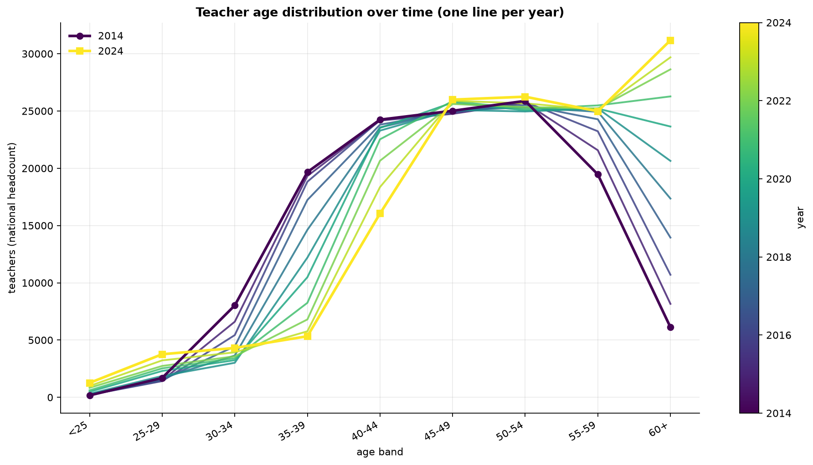{#fig-agelines}

A diagnostic was built to test a claim that the block might otherwise have made
without support. Band headcounts have fallen sharply over the decade in the
younger and middle ranges, with the 35 to 39 band falling from 19,666 to 5,331
between 2014 and 2024, a loss of 72.9 per cent, and the 30 to 39 range as a
whole falling from 21.3 per cent to 6.9 per cent of the workforce. @fig-mosaic
sets out the movement band by band. The convenient reading is that this is
composition: cohorts ageing out of one band and into the next, with no
implication that anyone left. Testing that reading requires following each band
forward and subtracting the entrants who arrived during the interval and aged
into the destination band, and the entrants have to be located rather than
assumed. They are located by injecting each year's gross entry vector into an
otherwise empty panel and ageing it forward through the model's own arithmetic
to the target year.

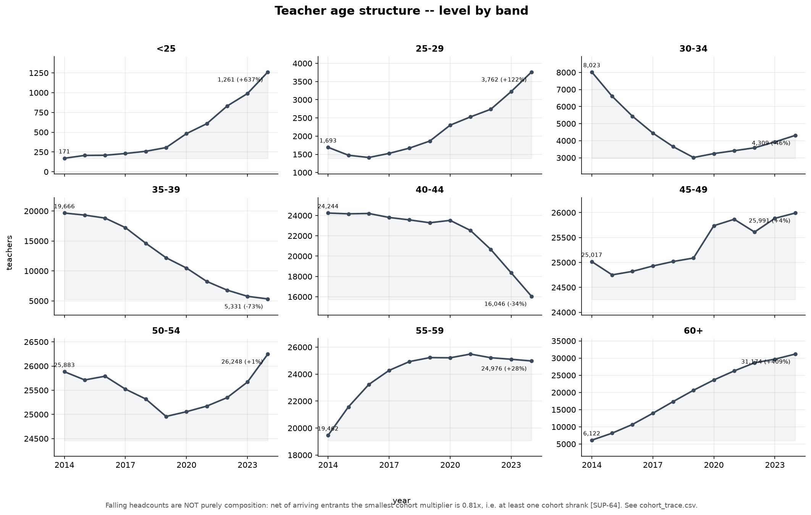{#fig-mosaic}

The test does not support the composition reading. Of the seven cohorts
followed, three fall below 0.99 on the net multiplier, at 0.813, 0.829 and
0.867, with the lowest belonging to the cohort passing from ages 35 to 39 in
2014 to ages 45 to 49 in 2024. One cohort, from ages 45 to 49 to ages 55 to 59,
falls below unity even on the gross measure at 0.9984, before any entrants are
subtracted. Falling band headcounts are therefore partly composition and partly
genuine cohort shrinkage, and the composition claim should not be repeated
without reference to the trace.

Two further results come out of the propagation. Of 40,832 gross entries
injected across nine cohorts, 37,895 are still present in 2024, a survival rate
of 92.8 per cent. The implied annual attrition rises from 1.17 per cent for the
most recent cohort to 2.44 per cent for the 2016 cohort, which is consistent
with cohorts passing through the 30 to 34 and 35 to 39 bands, the only two in
the younger range with hazards above the floor. Of those survivors, 33,130 sit
in the seven destination bands the trace examines, leaving a residual of 4,765
who survived but are still in the under-25 and 25 to 29 bands. Set against the
2024 combined stock of those two bands, 5,023, this indicates that 94.9 per cent
of teachers under 30 in 2024 entered in the previous nine years.

The trace rests on one behavioural assumption that the arithmetic does not
supply: entrants are taken to face the same band hazards as incumbents. If
lateral entrants, who are the larger of the two entry channels, leave faster
than incumbents of the same age, then the 0.813 multiplier is an overestimate
and more cohorts shrank than the trace reports.

## The 60 and over band specification

Almost the entire retirement wave comes out of one band, so the specification
of that band deserves separate treatment before the wave itself is discussed.

The band is not in steady state, and this is the central diagnostic finding.
Its stock grew from 6,122 in 2014 to 31,174 in 2024, a factor of 5.1; across the
nine transitions of the flow window the opening stock rose from 8,162 to 29,687,
a factor of 3.6. Over the same period the ageing inflow feeding the band has
been close to flat, between 4,856 and 5,098 a year since the transition ending
in 2018. The implied steady-state headcount, computed as inflow divided by the
observed hazard, exceeds the actual headcount in every year of the window, by 70
per cent at the transition ending in 2018 and by 30 per cent at the one ending
in 2024. The band is still filling. A ratio of exits to stock computed on a
filling band understates the structural hazard, because the denominator is
growing for reasons unconnected to exit behaviour. The guard conditions in the
estimator did not bind in any year, so the diagnostic is clean.

@fig-hazard shows what this looks like in the data. The observed 60 and over
hazard falls steeply from 0.217 at the transition ending in 2016 and settles
near 0.10 for most of the window, recovering to 0.119 at the end. The deployed
value sits above the estimation-window mean throughout, and the gap between the
two lines is the adjustment being made.

{#fig-hazard}

This is the argument for setting the base hazard from the statutory exit age
rather than from a window mean, and it is a sound argument. The base is
0.142857, the reciprocal of seven years in an open band starting at 60, which
implies a mean exit age of 67.0. The alternatives are the full-window mean at
0.1237, implying 68.1, the post-2017 mean at 0.1093, implying 69.2, and the
last-three-year mean at 0.1208, implying 68.3.

The direction of the adjustment should be stated plainly. The deployed base sits
15.5 per cent above the full-window estimate and implies retirement 1.1 years
earlier. A higher hazard produces more retirements and therefore more required
recruitment, which is the direction that reinforces a scarcity finding. The
justification for the adjustment is independent of that convenience, but the
coincidence is worth recording, and the sensitivity grid prices it: moving the
hazard across the plausible range moves cumulative recruitment from minus 15.6
per cent at 0.1000 to plus 21.3 per cent at 0.2500.

A second specification of the same band is implemented and produces materially
different results. Instead of a constant hazard, it models the band as a tenure
queue in which the hazard depends on how long a teacher has been in the band:
0.060 for the first three years, rising through 0.223 and 0.387, and reaching
0.550 from the sixth year onward. The implied mean exit age is 65.2.

The two specifications describe incompatible behaviour. The queue says that
almost nobody leaves between 60 and 63 and that there is a wall at 66. The flat
chain says that 14.29 per cent leave every year, uniformly, regardless of how
long they have been eligible. The queue is the more plausible description of how
retirement decisions are actually made around a statutory threshold, and it is
the specification that is not live.

The consequences of the choice were decomposed by projecting a third path: the
queue shifted along the tenure axis until its mean exit age matches the flat
chain's 67.0, which requires a shift of 2.891 years. This isolates the effect of
the hazard shape from the effect of the exit age level. Cumulative recruitment
is 90,575 under the flat chain, 87,275 under the age-matched queue, and 98,579
under the queue as specified. The shape of the hazard is therefore worth minus
3.6 per cent and the level of the exit age is worth plus 13.0 per cent, for a
net of plus 8.8 per cent. @fig-spec separates the two bands of effect.

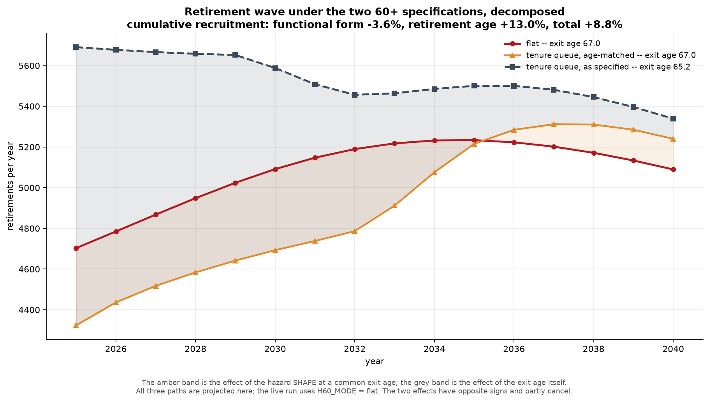{#fig-spec}

The two channels have opposite signs, so the headline gap of 8.8 per cent is the
net of two forces pulling apart and understates both. Quoting it alone conceals
the fact that even at a common exit age the two specifications disagree by 3.6
per cent, which means the shape of the hazard within the band does real work
independently of where the band's centre of mass sits.

Two features of the comparison are visible only in the full annual series, and
both are legible in @fig-spec. The difference between the two specifications
narrows over time, from 987 retirements a year in 2025 to 249 in 2040, a
reduction of 74.8 per cent. The choice of specification matters most in the
years closest to the present, which is precisely where a workforce plan would
need it to be reliable. And the age-matched queue crosses the flat chain in
2036, producing fewer retirements before that year and more after it, which
confirms that the hazard shape redistributes the wave in time even when the exit
age is held constant.

## Composition of the retirement wave

Evaluated at 2024 stocks, the annual retirement wave is 4,703 teachers. The 60
and over band contributes 4,453, being 31,174 teachers at a hazard of 0.142857,
and the 55 to 59 band contributes 250, being 24,976 teachers at the floor of
0.0100. The older band accounts for 94.69 per cent of the wave.

The 250 figure is not an estimate. The observed hazard for the 55 to 59 band
sits exactly on the attrition floor of 0.0100 in every one of the nine years in
the flow window, which is the flat amber line in @fig-hazard. Once the floor is
imposed, the identity returns the maximum of the floor times the opening stock
and the negative of the net flow, and the net flow for that band never falls
below the floor times the opening stock. The series is constant by construction
and measures nothing. The 250 retirements a year attributed to the band are an
assumption.

The direct consequence is that the model contains no early retirement before
age 60. Whether this is a reasonable description of current behaviour is an
empirical question the data in hand cannot settle, since the series that would
answer it has been rendered uninformative by the floor. What can be quantified
is the cost of the assumption being wrong: raising the band's hazard to 0.02
adds 3.2 per cent to cumulative recruitment, and raising it to 0.05 adds 11.6
per cent.

Because 94.7 per cent of the wave comes from a single hazard, and that hazard is
set from the statutory exit age rather than estimated, every statement about the
timing of the retirement wave is a statement about the specification discussed
above and about nothing else. The sensitivity grid confirms the
ordering: the hazard for the 60 and over band moves cumulative recruitment more
than any parameter other than the demand path itself.

The cumulative figures are the strongest result the block produces. Over the
sixteen years, retirements total 81,260 under the flat chain and 88,510 under
the tenure queue, against a 2024 age-band sum of 139,098. Between 58.4 and 63.6
per cent of the current workforce retires within the horizon, depending on the
specification. The annual average is 5,079 under the flat chain and 5,532 under
the queue.

@fig-wave places the wave against the recruitment it induces. The wave is the
lower line and rises gently to a plateau around 2034; recruitment is the upper
line and exceeds it in every year, by a margin that varies with the demand path
rather than with anything in the supply model.

{#fig-wave}

The wave is not a peak that passes. The stock aged 55 and over falls from 56,237
in 2025 to 51,435 in 2040, a decline of 8.5 per cent. A workforce plan built on
the expectation that the retirement bulge clears and the system returns to a
lower replacement rate would be wrong: the contingent aged 55 and over remains
above 51,000 throughout.

A further component of the exit flow is separated in the projection output and
is easy to overlook because the retirement wave is defined to exclude it. Total
exits run from 5,699 in 2025 to 6,110 in 2040, against retirements of 4,703 and
5,090. The difference, attrition from bands below 55, is between 961 and 1,020 a
year and represents between 15.7 and 17.5 per cent of all exits. Expressed as
rates on the 2024 stock, the first projected year has total exits at 4.10 per
cent, retirements at 3.38 per cent, and sub-55 attrition at 0.72 per cent. The
retirement narrative covers roughly five sixths of the outflow problem.

This component interacts with the specification choice in a way that is not
obvious. In 2025 the difference between total exits and the wave is identical to
ten decimal places under both specifications, which confirms that the tenure
queue touches only the 60 and over band. By 2040 the two diverge, at 1,085
against 1,020, a gap of 6.4 per cent. The mechanism is indirect: the queue
requires more recruitment, those recruits enter bands below 55, and they
generate additional attrition at the floor. The specification of the oldest band
feeds back into the attrition of the youngest through the recruitment channel.

## The graduate channel and the lateral channel

The entry profile determines which bands receive new recruits, and it was
estimated from the same flow window as the hazards. The heuristic repair
built into the estimator did not fire, so the profile is the raw shape.

The shape is not what a system drawing primarily on initial teacher education
would produce. The largest single receiving band is 40 to 44, at 25.98 per cent
of entries, which at the projected requirement is 1,471 teachers a year. The 45
to 49 band takes a further 17.78 per cent. The two bands below 30, which
together define the graduate channel, take 27.68 per cent between them, leaving
72.32 per cent for the lateral and re-entry channel. The bands at 50 and over
take 15.07 per cent, which is 853 teachers a year recruited at ages 50 to 59,
all of whom will reach the statutory exit age within the projection horizon.

Applied to the requirement of 5,661 a year, the split gives 1,567 through the
graduate channel and 4,094 through the lateral and re-entry channel. The lateral
channel is 2.61 times the size of the graduate channel. Over the horizon the
cumulative figures are 25,072 and 65,503, which sum to the 90,575 of the flat
chain. @fig-channel-supply shows the two bands separately against the historical
record.

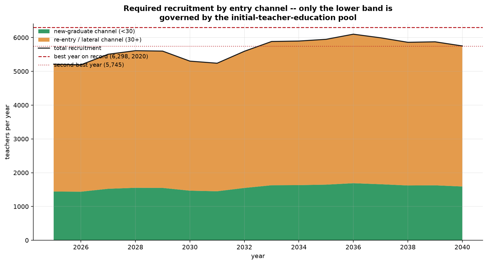{#fig-channel-supply}

This division carries the main implication of the block for what follows. Only
the graduate channel is governed by the output of initial teacher education. The
lateral channel is drawn from the contracted reserve, from teachers returning
after a period outside the system, and from career changers, and none of those
sources is constrained by the number of masters graduates in a given year. The
reserve shrinks as the workforce shrinks, and it has no stock model in this
block or in any other. A recruitment ceiling imposed in @sec-training-constraint
on the total would be wrong in both directions: too tight on the lateral channel,
which the qualifying pool does not govern, and potentially too loose on the
graduate channel if the pool is smaller than the requirement.

The channel share is frozen across the horizon, and the observed series is not.
The young share rose from 4.4 per cent in 2016 to 29.2 per cent in 2024, with an
ordinary least squares slope of 2.87 percentage points a year. The projection
takes the last three years, 27.68 per cent, and holds it constant from 2025
onward. The ratio of young to total recruitment is 0.27681286 in all sixteen
projected years without variation, which is why the boundary between the two
bands in @fig-channel-supply is almost flat.

The decision to freeze is defensible on its face, since extrapolating 2.87
percentage points a year for sixteen years would put the young share above 70
per cent by 2040, which no plausible reading of the qualifying pool supports.
The sensitivity grid shows that the choice costs little in aggregate: the three
alternative windows move cumulative recruitment between minus 0.26 per cent and
plus 0.49 per cent. The choice matters for the split rather than for the total,
and the split is what @sec-training-constraint will restrict.

Entries into the youngest band have risen sharply in absolute terms, from 45 in
2016 to 480 in 2024, a factor of ten, with the full-series mean at 213 and the
last three years averaging 388. @fig-lt25 sets out the series. Set against the
annual requirement of 5,661, the 2024 figure is 8.5 per cent. The growth is real
and the level remains small.

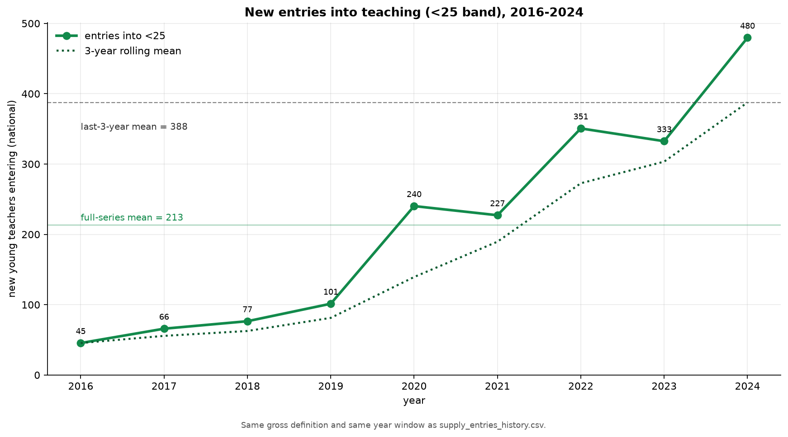{#fig-lt25}

The regional dispersion of the channel split is wider than the national average
suggests, and it is the finding most likely to affect how a qualifying-pool
constraint should be applied. At NUTS II level the young share runs from 11.6
per cent in the Centro region to 51.2 per cent in the Lisbon metropolitan area, a
factor of 4.4. At NUTS III level it runs from 3.0 per cent to 51.2 per cent, a
factor of 17.0. Five NUTS III regions sit below 10 per cent. In the region with
the lowest share, 97 per cent of modelled entries are lateral, so a ceiling on
graduate entry would barely touch it. @fig-universe-nuts3 shows how unevenly the
cumulative requirement is distributed across the finer partition.

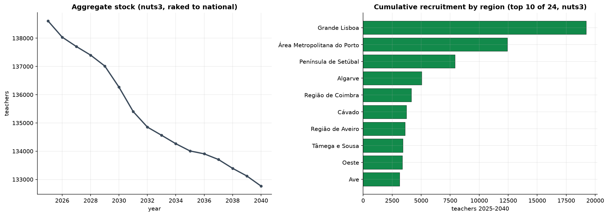{#fig-universe-nuts3}

One property of the regional results limits how they can be used. The regional
series are raked to reproduce the national totals, and the raking discards 2.3
per cent of regional recruitment on average at NUTS II and 6.8 per cent at
NUTS III. That discarded quantity is regional heterogeneity, arising from
zero-flooring and from region-specific hazard sets, which the national model
does not carry. A further consequence is that recruitment for a given region is
not invariant to the level of aggregation: three NUTS II regions are composed of
a single NUTS III region, and for all three the recruitment figure falls by
exactly 5.24 per cent when moving from the coarser to the finer universe, which
is the ratio of the two raking factors. The number attributed to a region
depends on how many other regions are in the table, and @sec-training-constraint
fixes one universe and stays with it.

## Endogenous and unconstrained entry

Recruitment in this block is the quantity that closes the gap between the aged
workforce and the demand path. Each projected year is evaluated twice: a first
pass ages the workforce with zero entry to size the shortfall, and a second pass
applies the resulting entry and advances the state. The state produced by the
first pass is discarded.

No feasibility constraint is applied. The block assumes that whatever the demand
path requires is hired, and the manifest records the entry constraint as absent
with the restriction assigned to @sec-training-constraint. This is a deliberate
division of labour rather than an oversight, and it has the merit of keeping the
arithmetic of the workforce separate from the arithmetic of the training
pipeline. It also means that the recruitment series should be read as the size of
the ask.

Three alternative entry policies were projected to place the base path in
context, and @fig-policies shows the four stock trajectories together. Under
replacement, where entry equals exits, the stock is held at its 2024 value of
139,098 and cumulative recruitment is 98,078, which is 7,503 more than the
endogenous path requires. Under constant entry at the historical mean of 4,537 a
year, the stock falls to 117,041 and cumulative recruitment is 72,590. Under
zero entry, the stock falls to 55,141, a decline of 60.4 per cent over sixteen
years.

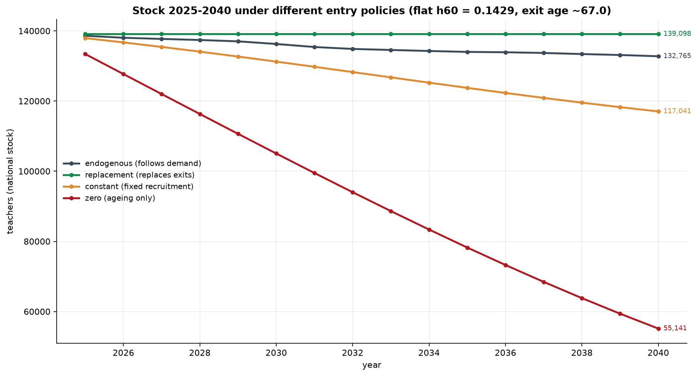{#fig-policies}

The zero-entry path is the one worth dwelling on, because it measures the
inertia of the system rather than any policy. Absent all recruitment, ageing and
attrition alone remove three fifths of the workforce within the horizon. This is
the quantity that any recruitment policy is working against, and it sets the
scale of the problem more clearly than the recruitment series itself.

The age structure the endogenous path arrives at is not a rejuvenated one.
@fig-pyramid compares 2024 with 2040 under the base and replacement policies.
The 60 and over band reaches 25.4 per cent of the workforce by 2040 under the
base policy, above the 22.4 per cent it occupies in 2024. At 33,722 it also sits
7.5 per cent above the steady state of 31,364 implied by its own 2040 feeder,
which means the band is still shedding an inherited bulge at the end of the
horizon rather than converging on its long-run level from below. The ageing
problem is not resolved within the projection window under any of the policies
tested.

{#fig-pyramid}

The parameters that move the cumulative requirement were ranked by a
one-at-a-time grid of nineteen scenarios, reported in @fig-tornado. The ordering
is unambiguous: the demand path first, the 60 and over hazard second, and every
other lever a distant third. The channel share scenarios move the total by less
than one per cent in either direction, which is the quantitative form of the
point made above that the channel split matters for composition
rather than for volume. Two scenarios in the grid carry a caveat. The ageing
rate scenarios mutate the transition parameter without re-estimating the hazards
and the entry profile, both of which were estimated under the original value, so
those two bars are internally inconsistent. The effect is small, at plus and
minus roughly 4.5 per cent, but the inconsistency is real.

{#fig-tornado}

The uncertainty around the recruitment path was quantified by Monte Carlo with
2,000 draws, perturbing the retirement age and scale, the hazards for the 35 to
39 through 55 to 59 bands, and the demand path as a random walk. Cumulative
recruitment over the horizon has a tenth percentile of 91,311, a median of
98,773, and a ninetieth percentile of 106,963, giving a spread of 15.85 per cent
of the median. This median belongs to the tenure-queue path shown in
@fig-montecarlo, not to the flat chain that this block identifies as live,
and the two differ by 9.1 per cent.

{#fig-montecarlo}

The decomposition of that band by source requires care in how it is reported.
In variance terms the demand path accounts for 78.8 per cent, the retirement age
for 20.6 per cent, and all other hazards for 0.7 per cent, a ratio of 3.83 to 1
between the first two. In standard deviation terms, which is the unit in which
the band is read off a chart, the figures are 793, 405, and 72, a ratio of 1.96
to 1. The retirement age is worth roughly half the demand path, not a quarter.
The variance shares are correct and the 3.83 ratio does not transfer to the
width of the interval.

The dominance of the demand path has a mechanical explanation. Recruitment is
4.6 per cent of the demand level, so a proportional shock to demand arrives at
recruitment multiplied by roughly 22. The band around the recruitment path is
mostly imported uncertainty from @sec-demand rather than a measure of what this
block does not know.

The width of the band does not grow monotonically, as @fig-montecarlo shows. It
is 31.2 per cent of the median in 2025, widens to 44.6 per cent in 2026, and
narrows to 34.4 per cent by 2040. The early opening reflects the demand dip and
the small residual through which it passes.

## The scale of the recruitment effort against history

The projected requirement averages 5,661 teachers a year over the horizon and
5,505 over the first ten years, peaking at 6,101 in 2036. The nine years of
observed history give a mean of 4,537, a median of 4,618, and an average of
4,860 over the last five years. The requirement is 24.8 per cent above the
historical mean and 22.6 per cent above the median.

The two reference years that frame this comparison both need qualification. The
highest year on record is 2020 at 6,298, which is the first pandemic year. The
second highest is 2016 at 5,745, which is the opening year of the flow window
and carries a young share of 4.4 per cent that never recurs. Excluding 2020, the
historical mean falls to 4,317 and the requirement stands 31.1 per cent above
it. Excluding both years, the mean falls to 4,113.

The comparison against the second-highest year is where the arithmetic and the
operative reading diverge, and @fig-channel-supply draws both reference lines
across the projection. The requirement averages 1.5 per cent below the 5,745
recorded in 2016, which taken alone would suggest the ask is within historical
reach. The distribution tells a different story: no projected year exceeds the
all-time high, and eight of the sixteen exceed the second-highest year. The
system would have to beat a year it has reached once, in the opening year of the
observable record, in half of the projection horizon. The mean is the less
informative of the two statistics here.

The requirement can be decomposed for the first ten years, which is the window
the published benchmark covers. Recruitment of 55,045 equals total exits of
59,879 less a demand reduction of 4,834. Within the exits, retirements account
for 50,207 and sub-55 attrition for 9,672, or 83.8 and 16.2 per cent
respectively.

Set against this, the DGEEC study projects 38,779 recruitments to 2034/35, an
average of 3,878 a year, with the peak requirement of around 4,000 falling in
2025/26. The path projected here is 41.9 per cent above that benchmark on the
flat chain before any perimeter adjustment, and higher still on the tenure
queue. @sec-validation reports the comparison in its adjusted form and
decomposes the residual; what follows here is the material this block
contributes to that comparison.

Part of the gap is perimeter. The starting workforce here is the age-band sum of
139,098 against the approximately 122,000 counted in the reference census, a
difference of 14.0 per cent, quantified in full in @sec-training-constraint.
@sec-demand documents the same discrepancy on the student side and identifies
private and state-funded private provision as the likely source. A larger
workforce generates proportionally more retirements and more attrition, so part
of the gap is arithmetic rather than substantive.

Part of it is the exit rate. This block produces 43.0 exits per thousand staff
per year over the first decade. The DGEEC projection, in which active teachers
fall from about 122,000 to about 76,000 over ten years, implies roughly 37.7 per
thousand. The difference of 14 per cent points toward the attrition floor of one
per cent applied to all bands below 55, which alone generates 9,672 exits over
the decade.

Neither adjustment closes the gap, and the residual should be reported as a
residual rather than explained away. A third candidate is the definition of
recruitment: this block counts all gross entries, including re-entries by
teachers who left and returned, and a projection counting only net additions to
the permanent establishment would produce a smaller number from the same
underlying workforce dynamics.

The DGEEC study itself demonstrates how much a definitional choice can move a
requirement of this kind. Its two alternative scenarios differ from the base
case only in whether teachers' available hours can be reallocated in full to
classroom teaching, and that single change reduces the cumulative requirement
from 38,779 to between 15,579 and 16,474, a range of some 23,200 teachers. A
comparison between the two studies that does not first establish which
definition of teaching time each is using risks attributing to demography or to
attrition a difference that comes from neither.

One further quantity from the same study bears on how the recruitment path
should be interpreted regionally. Of teachers holding a masters qualification
completed after 2013, 42 per cent are working in a region other than the one in
which they qualified, and the Norte region functions as a net exporter to every
other region (Nunes et al., 2025). Regional recruitment requirements computed on
a closed-region assumption will therefore misstate the pressure on any
individual region's training capacity, and the regional series shown in
@fig-universe-nuts3 inherit that limitation.

The requirement projected in this block is for permanent posts derived from the
demand path. It excludes the reserve needed to cover temporary absence, medical
leave, and short-term substitution, which is absorbed implicitly into the
observed student-teacher ratio discussed in @sec-demand. Since that absorption
is implicit, no separate estimate of the substitution reserve exists on either
side of the comparison, and an assessment of whether the system can be staffed
in practice will require one.

# The initial-training constraint {#sec-training-constraint}

@sec-supply projected recruitment on the assumption that whatever the demand
path requires is hired. This section applies the constraint that assumption
deferred. It takes the recruitment series produced by the supply block, splits
it into the two entry channels that block identified, and confronts the
graduate channel with the output of initial teacher education. The second
channel, drawn from the contracted reserve rather than from initial training,
is projected against the workforce it is recruited from.

One sign convention governs every gap reported from here onward, and it is
applied throughout the rest of the report. A positive deficit is a shortage and
a negative deficit is a surplus.

The block covers the same horizon and the same perimeter as the supply block.
Before applying the constraint it smooths the recruitment series with a
three-year centred moving average, applied to the expansion component rather
than to the total. The operation redistributes the requirement across years and
leaves the sixteen-year sum at 90,575, the same figure the supply block reports,
with a residual of 0.06 teachers. Annual values move by up to 143 teachers, the
largest adjustment falling in 2031. The smoothed and unsmoothed paths therefore
differ year by year while agreeing exactly in cumulative total, and any annual
figure quoted from this block should be attributed to one or the other.

Three properties govern how the output should be read.

The first is that the constraint binds on one channel only. Initial teacher
education governs entry below the age of 30, which @sec-supply established as
27.68 per cent of the projected requirement. The remaining 72.32 per cent is
drawn from teachers returning after a period outside the system, from the
contracted reserve, and from career changers. A ceiling derived from the
number of masters graduates in a given year has no purchase on that larger
flow, and applying one to the total would compare a quantity to a population
that does not contain it.

The second is that the conversion rate estimated in this block measures a
realised placement rather than a willingness to teach. Its numerator counts
people who entered the profession, which is the lesser of the number who
sought entry and the number of posts available. The identification subsection
below sets out why this distinction cannot be resolved with the data in hand
and what follows from leaving it unresolved.

The third is that the level of graduate entry is set externally. The supply
block inferred 1,231 graduate entrants a year over 2022 to 2024; the figure
carried into the conversion ratio is 2,000, a rescaling of 62.4 per cent
imposed to match published counts of masters-in-teaching completions and
first-time placements. Every conversion rate reported in this section is the
inferred rate multiplied by that factor, and the subsection on external
anchoring shows that the sign of the graduate-channel result depends on it.

## Graduate pool and conversion rate

The graduate pool is built from the column of the teacher supply panel that
counts completions in the qualifying fields. The observed series runs from
1996 to 2024 and has the shape of a collapse followed by a partial recovery.
Completions peaked at 14,949 in 2002, fell to 3,433 by 2018, a decline of 77.0
per cent over sixteen years, and have since recovered to 5,137 in 2024, an
increase of 49.6 per cent from the trough and the highest annual figure since
2014. The recovery is recent and is concentrated in the last three
observations.

Future completions are held constant at the mean of the last five observed
years, 4,199 a year. That mean spans 2020 to 2024 and therefore includes the
early part of the recovery while discarding its endpoint. The projected level
sits 18.3 per cent below the most recent observation. The subsection on the
regime transition returns to this choice alongside the treatment of the rate,
since the two are not symmetric in their effect.

The pool available to a given year is the sum of three completion cohorts
lagged by one year, so the pool for 2025 is formed from the graduates of 2022,
2023 and 2024. The consequence is a step that has no behavioural content. The
pool stands at 13,783 in 2025, when all three cohorts are observed, falls to
13,769 in 2026 and 13,535 in 2027 as projected cohorts replace observed ones,
and settles at 12,598 from 2028 onward, when the moving window contains no
observed data at all. Feasible graduate entries fall by 6.9 per cent between
2027 and 2028 and remain flat for the following thirteen years. The step is an
artefact of the window, not a projection of anything happening in the training
system.

The magnitude of the convention can be stated directly. Had the pool been held
at the 2024 completion level rather than at the five-year mean, feasible
graduate entries in the steady state would be 3,025 a year instead of 2,473,
an increase of 22.3 per cent.

The conversion rate is annual graduate entries divided by the three-year pool.
Multiplying it by three gives what the block calls cohort conversion, the
share of a completion cohort that enters teaching over the three years it
remains in the window. The rate carried forward is the last observed value,
19.63 per cent, equivalent to a cohort conversion of 58.9 per cent. Two
alternatives are computed. The median of the last three years gives 17.45 per
cent, which is the 2023 value exactly. A damped extrapolation of the recent
slope starts at 21.74 per cent in 2025, reaches the ceiling of 28.33 per cent
by 2030 and remains there, capped in eleven of the sixteen projected years.
The ceiling itself is the imposed limit of 85 per cent cohort conversion
divided by the three-year window.

@fig-conversion shows the observed series against the three projected paths.
Two features of the estimate deserve attention.

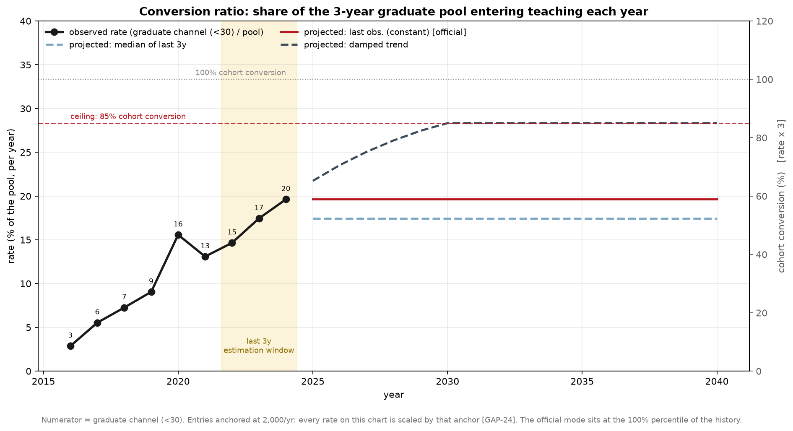{#fig-conversion}

The first is that the mode carried forward sits at the hundredth percentile of
its own history. It is the highest value observed in nine years, and it is
projected unchanged for sixteen. This is not a criticism of the arithmetic,
which is transparent, but it does mean that the central path assumes the
recent peak is the new level rather than the upper end of a range.

The second concerns the uncertainty band. The band is constructed from the
interquartile range of the last three observations expressed as a ratio to the
central path, giving factors of 0.818 and 0.944. Both lie below one. The band
does not surround the central estimate; it sits entirely beneath it. This
follows mechanically from taking the maximum as the central value, since no
quantile of the history can exceed it, and it means the projection carries no
representation of the possibility that conversion rises further. The band as
drawn is a downside range that has been labelled as symmetric uncertainty.

A third caution belongs with the estimate. The rate is projected from three
observations. The full series contains nine, and the block reports the wider
history alongside the estimate, but the parameters that enter the projection
are drawn from 2022, 2023 and 2024 alone.

## Identification: observed placements do not measure propensity

The exercise asks whether initial teacher education can supply the graduates
the demand path requires. The answer is constructed from a rate estimated on
people who were hired. The two are not the same quantity, and the gap between
them is not a technical refinement.

The numerator of the conversion ratio is derived from the supply block's
series of gross entries into the bands below 30, which in turn is recovered
from year-on-year changes in the age-band stock. It counts arrivals. An
arrival requires both that someone sought to teach and that a post existed for
them, so the series measures the lesser of the two. Where posts were the
binding side, the rate estimates a placement ceiling rather than a supply
ceiling. This is the standing difficulty in workforce forecasting from
administrative records, and it is well recognised in the methodological
literature: employment counts are used as a proxy for demand precisely because
no direct measure of demand exists, an assumption that becomes questionable as
soon as there are signs of unfilled positions (Richardson and Tan, 2007).

The observed period gives every reason to think posts were the binding side
for part of it. @sec-supply documented that the share of entries arriving
through the under-30 channel rose from 4.4 per cent in 2016 to 29.2 per cent
in 2024, a trend of 2.87 percentage points a year. The system was placing an
increasing number of young entrants over precisely the window from which the
conversion rate is estimated. A rise from 2.87 per cent to 19.63 per cent is
equally consistent with a rising willingness to teach among graduates and with
an unchanged willingness meeting a market that moved from slack to tight. The
data contain no variation that separates the two.

The circularity this creates runs through the whole exercise. The question
posed is whether the pool can meet the requirement. The answer uses a rate
estimated from placements, which exist only because posts were offered.
Projecting 19.63 per cent forward to 2040 assumes that posts continue to be
offered at the 2024 rate, which is the quantity under examination. If 19.63
per cent is a placement ceiling, the 2,473 feasible graduate entries are not a
supply limit at all. They are an extrapolation of past hiring.

The direction of the resulting bias is not obvious, because a second feature
of the construction pushes the other way. The pool overlaps cohorts. With a
three-year window and a one-year lag, a graduate is counted in three
consecutive pools. Someone who entered teaching in the first year remains in
the denominator for the two that follow. The denominator is therefore
inflated by people already placed, which biases the rate downward and means
that cohort conversion, defined as the rate multiplied by three, is not a
clean cumulative probability. The two cautions are of opposite sign and there
is no basis in the data for netting them.

A separate confusion is worth naming because two numbers in the block carry
the same label. The young-channel share of the projected requirement is 27.68
per cent, taken from the supply block's forward-looking entry profile. The
young-channel share of observed historical entries is 17.92 per cent, a ratio
of summed flows over the full window and therefore weighted towards the early
years when the share was low. The two differ by a factor of 1.545. The
conversion ratio is built on the second; the split of the requirement is built
on the first. They are different statistics over different periods and should
not be read as a discrepancy.

One further consideration bears on the interpretation of the requirement side.
@sec-demand derived demand from the observed student-teacher ratio. If teachers
were short during the observed period, that ratio is biased upward, projected
demand is biased downward, and the shortfall computed here is a lower bound on
that account. The bias runs in the same direction as the placement-ceiling
concern, which is to say that both caution against reading the graduate-channel
surplus as comfortable.

## Regime transition in the 2016-2024 series

The conversion ratio rises by a factor of 6.84 over the observed window, from
2.87 per cent in 2016 to 19.63 per cent in 2024. A rise of this size in nine
years is the most striking feature of the data the block uses, and its
composition matters for what can be projected from it.

The rise decomposes exactly. Graduate entries rose by a factor of 5.94, from
409 to 2,430. The pool fell by 13.2 per cent, from 14,256 to 12,382, which
multiplies the ratio by a further 1.151. The product of the two, 6.84, is the
observed change. On a logarithmic decomposition the numerator accounts for
92.7 per cent of the rise and the contraction of the denominator for 7.3 per
cent. Almost all of the movement is the flow of entrants rising, though a
small part of what reads as rising propensity is the pool shrinking beneath
that flow.

The trajectory is not smooth. The rate rises steadily through 2019, jumps to
15.58 per cent in 2020, falls back to 13.09 per cent in 2021, and then climbs
again through 2022, 2023 and 2024. The 2020 observation is the first pandemic
year, which @sec-supply already identified as an outlier in the entry series.
The estimation window excludes it, but the window is short enough that the
choice of any three consecutive years carries considerable weight.

The mode carried forward is the last observation, which places the central
path at the top of a series that has not yet demonstrated a plateau. Two
readings are available and the data do not separate them. Either the system
has moved to a new level of graduate conversion, in which case projecting
19.63 per cent forward is reasonable; or the rise reflects an unusually
absorptive period of recruitment, in which case the level is a peak and the
projection inherits it.

The block flags a related asymmetry in its own diagnostics, and the flag is
worth restating with a correction. It reports that the rate is read at the
hundredth percentile of its history while the graduate pool is set 18.3 per
cent below its latest observation, and describes the two conventions as
pushing the result in the same direction. They do not. A rate read at its
maximum raises feasible entries. A pool read below its latest observation
lowers them. The two conventions work against each other, and the second is
the larger.

The comparison can be made directly. Holding both conventions gives 2,473
feasible graduate entries a year in the steady state. Holding neither, so
reading the rate at the median of the last three years and the pool at the
2024 completion level, gives 2,689. The conventions as adopted therefore leave
feasible entries roughly 217 a year lower than the alternative, not higher.
Taken separately, moving the pool from the projected level to the 2024 level
would add 552 entries a year, while moving the rate from the maximum to the
median would remove about 275.

The implication runs against the block's own reading. The conventions are
asymmetric and should be declared, but on balance they are conservative: the
published surplus survives them rather than depending on them. What the
surplus does depend on is the external rescaling of the entry level, which the
next subsection examines.

## External anchoring of the entry level

The conversion rate is entries divided by pool, and the entries used are not
the entries the supply block inferred. The last three observations of the
inferred graduate flow average 1,231 a year. The block rescales them so that
the same three-year mean equals 2,000, a factor of 1.6243 and an uplift of
62.4 per cent. The rationale recorded in the configuration is that published
counts place the masters-in-teaching completion flow between 1,668 and 2,069
and first-time placements at 2,651, both graduate-channel quantities, and that
the inferred series is implausibly low against them. Independent work reaches
a comparable order of magnitude, reporting roughly 1,500 completions in
teaching masters programmes in 2018/19 against projected annual requirements
several times larger (Nunes, Reis, Freitas and Conceição, 2022).

The rescaling is defensible on its own terms. Its consequence for everything
downstream is arithmetic and should be stated plainly. The pool is left
untouched, so every conversion rate in this section is the inferred rate
multiplied by 1.6243. The observed series before the rescaling runs from 1.77
per cent in 2016 to 12.08 per cent in 2024, and the 2024 cohort conversion is
36.2 per cent rather than 58.9 per cent. The three rate modes are the median,
the last observation and the damped trend of the same rescaled series, so all
three carry the identical factor. Their agreement is one estimate seen from
three angles, and it is not independent evidence about the conversion
assumption.

The block tests the consequence directly by rerunning the projection with the
rescaling removed, walking the official rate path year by year. The result is
the single most consequential finding in this section. Under the anchored
series the graduate channel returns a mean gap of minus 946 a year, a surplus
in all sixteen years. With the rescaling removed the mean gap is plus 19.9 a
year, a shortage under the sign convention stated above. The sign of the
verdict changes, the ceiling does not bind in the unanchored run, and the
change therefore reflects the anchor itself rather than an assumption rescuing
a result. Over the sixteen-year horizon the two paths differ by 15,456
teachers.

A mean of plus 19.9 teachers a year against a requirement averaging 1,567 is
not a shortage of any consequence. What it is, is zero. The unanchored
projection places the graduate channel exactly on the line, which means the
entire margin in the published result belongs to the rescaling.

@fig-modes sets the three rate modes against each other in both
configurations. Anchored, all three return a surplus in every year, with mean
gaps of minus 667 for the median, minus 946 for the last observation and minus
1,912 for the damped trend. Unanchored, the median gives a mean gap of plus
192 with shortfalls in fourteen of sixteen years beginning in 2027, the last
observation gives plus 20 with shortfalls in eleven years beginning in 2028,
and only the damped trend, which spends most of the horizon pinned at the
ceiling, remains in surplus throughout.

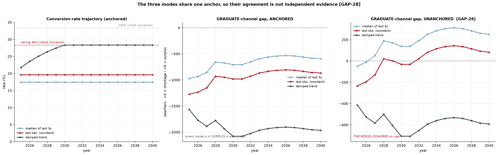{#fig-modes}

The interaction between the anchor and the two internal conventions can be set
out compactly. @tbl-anchor-conventions gives feasible graduate entries in the
steady state under each combination of rate convention and pool convention,
against the peak graduate requirement of 1,666 in 2036.

| Rate and pool convention | Anchored | Unanchored |
|---|---|---|
| Rate at maximum, pool at five-year mean | 2,473 (surplus 807) | 1,522 (shortfall 143) |
| Rate at maximum, pool at 2024 level | 3,025 (surplus 1,359) | 1,862 (surplus 197) |
| Rate at median, pool at five-year mean | 2,198 (surplus 533) | 1,353 (shortfall 312) |
| Rate at median, pool at 2024 level | 2,689 (surplus 1,024) | 1,656 (shortfall 10) |

: Feasible graduate entries in the steady state under each combination of rate
and pool convention, against the peak graduate requirement of 1,666
{#tbl-anchor-conventions}

Anchored, the surplus survives all four combinations. Unanchored, three of the
four produce a shortfall and the fourth sits within 200 of balance. The
internal conventions move the result; the anchor determines its sign.

One inconsistency introduced by the rescaling should be recorded. The block
scales the graduate columns and deliberately leaves the lateral column
untouched, on the reasoning that the anchor is a graduate-channel quantity.
The identity by which young and lateral entries sum to total entries therefore
does not hold in the anchored frame. The unanchored columns are retained for
anyone reconstructing the historical accounting.

## Lateral channel and contracted reserve

The second channel is projected on a different basis, and the difference
matters. Lateral entries are expressed as a share of the previous year's
teaching stock measured on the age-band definition, which is the same universe
the supply block projects. The share is set at the mean of the last five
observations, 2.706 per cent, and is not rescaled, since the external anchor
is a graduate-channel quantity.

The observed history behaves nothing like the graduate series. The lateral
rate reaches 4.163 per cent in 2016 and 1.850 per cent in 2022, a range of a
factor 2.25, with intermediate values scattered across the interval and no
discernible direction. The ordinary least squares slope is minus 0.112
percentage points a year, which is indistinguishable from flat given the
dispersion. The full-window mean of 2.725 per cent and the five-year mean of
2.706 per cent are almost identical, which is what a series with no trend
produces. In levels, lateral entries range from 2,592 to 5,493 with a
mean of 3,723. Against a graduate channel that rose by a factor of 6.84 with a
clear direction, the lateral channel oscillates around a constant.

Applying a fixed rate to a shrinking workforce produces a declining series.
Feasible lateral entries fall from 3,764 in 2025 to 3,603 in 2040. The lateral
requirement moves the other way, rising from 3,738 to a peak of 4,351 in 2036
before easing to 4,192. The two cross in 2026, and the shortfall widens
thereafter. @fig-channel-split sets the requirement and the feasible supply
side by side for both channels and shows the per-channel gaps in the
right-hand panel.

{#fig-channel-split}

By 2028 the lateral shortfall is 304 a year, by 2032 it is 368, and it reaches
725 in 2036, the year of peak requirement, when lateral coverage falls to 83.3
per cent. Over the horizon the lateral requirement totals 65,503 against
feasible entries of 58,764. The difference between those two cumulative
figures is 6,739, and the shortfall reported is 6,765, because the single year
of surplus, 26 teachers in 2025, is excluded from the offset rather than
allowed to reduce the shortfall in later years. The reported figure is the sum
of the annual shortfalls.

The methodological caution attached to this channel is severe and is stated in
the block itself. The rate is applied to the teaching stock, not to the
reserve. There is no stock model of the contracted reserve anywhere in the
chain, so what is modelled is the assumption that the reserve delivers a fixed
proportion of the workforce each year. The construction makes the channel
shrink in step with the workforce by definition rather than by evidence, and
it says nothing about whether the reserve itself can sustain that draw.

The direction of any error is clear enough. If the reserve depletes faster
than the workforce contracts, which is the reading consistent with the
evidence of an ageing corps and a training flow well below replacement
(Figueiredo et al., 2025), then 6,765 is a lower bound. The channel that
carries roughly seventy per cent of the requirement is the one about which the
chain knows least.

## What the block establishes and what it does not

The headline result is that the initial-training constraint never binds. The
restriction is slack in all sixteen years. Graduate coverage runs from 189.1
per cent in 2025 to a minimum of 148.5 per cent in 2036 and recovers to 154.1
per cent by 2040. Over the horizon the graduate channel supplies 40,208
entries against a requirement of 25,072, a surplus of 15,136 on the cumulative
figures.

@fig-constraint sets out the division of labour between the two blocks and
shows coverage by channel beneath it.

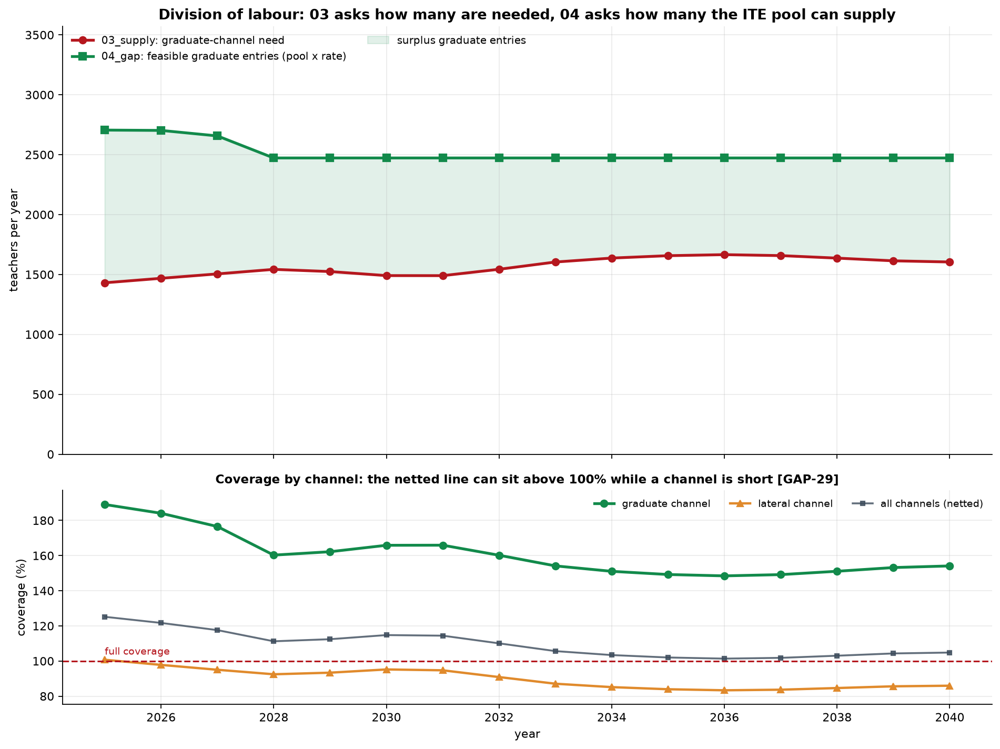{#fig-constraint}

Three findings qualify that result, and they are of different kinds.

The first is that the verdict belongs to the anchor. Removing the external
rescaling moves the mean graduate gap from minus 946 to plus 19.9, and two of
the three rate modes cross into shortage from 2027 or 2028. The robustness
test reports the verdict as not robust, and the ceiling plays no part in the
change. A result that reverses on the removal of a 62.4 per cent uplift to the
level of one input should not be reported as a property of the training system.

The second is that the netting across channels removes the finding that
matters. The graduate surplus of 15,136 is 2.24 times the lateral shortfall of
6,765, so when the two are combined the second disappears entirely. The block
reports netted unmet need as zero in every one of the sixteen years. Aggregate
coverage never falls below 101.4 per cent, and it reaches that minimum in
2036, the year in which lateral coverage is 83.3 per cent. The offset assumes
the channels substitute one for one, which the construction does not support:
the split was derived from the entry age profile of the supply block, so
filling a post projected as lateral with someone under thirty alters the input
from which the split was taken. The measure to report is the sum of the
per-channel shortfalls.

The third is the scale of what the chain does not measure. The requirement
modelled here is permanent posts. The substitution reserve, which covers
temporary absence and short-term replacement, appears nowhere in the
projection. Applying the reference share of twenty per cent to the 2025 stock
of 138,611 gives an implied reserve of 27,722 teachers in a single year. That
is 4.10 times the cumulative lateral shortfall this block reports over sixteen
years. The component the chain does not measure is larger by an order of
magnitude than the one it does.

The perimeter question resolves more cleanly than expected and is worth
recording for that reason. The panel carries two stock definitions. The
age-band sum stands at 139,098 in 2024, which is what the supply block
projects, while the published total stands at 156,475, a coverage factor of
1.125. The difference between the two is 17,377 teachers, or 11.1 per cent of
the published total, and that 11.1 per cent of the panel carries no age band.
Against the reference census of approximately 122,000 active teachers in
mainland provision, the age-band definition is 14.0 per cent higher, a ratio of
1.140 and a difference of 17,098 teachers, and the published total is 28.3 per
cent higher. The comparison is like for like in time, both being 2024
observations, and the test of internal consistency passes: the projected 2025
base follows from the 2024 stock by flows, with implied exits of 5,655 against
the 5,699 the chain reports. The difference against the reference census is
therefore a genuine perimeter question rather than an artefact internal to the
panel, with private provision and the definition of active status the leading
candidates. Every level reported in this section carries that relative error.

The replacement and expansion decomposition confirms what @sec-supply already
established about the direction of the system. Total exits over the horizon
reach 96,908 against a requirement of 90,575, so replacement accounts for
107.0 per cent of recruitment and expansion is negative in all sixteen years,
ranging from minus 186 in 2036 to minus 721 in 2031. The international
reference of roughly 58 per cent replacement and 42 per cent expansion
(Bruneforth et al., 2009) describes systems with growing enrolment and is not
a comparator here. The Portuguese system is recruiting to stand still and
failing to stand still.

The regional figures require one clarification about their provenance. The
cumulative requirement across the 24 mainland NUTS III regions, reported in
@sec-results, sums to 90,575, and the distribution is heavily concentrated:
the Lisbon metropolitan area accounts for 21.2 per cent, the Porto
metropolitan area for 13.7 per cent and the Setúbal peninsula for 8.7 per
cent, so three regions carry 43.7 per cent of the national requirement.

The regional series is raked onto the national total, and the residual has a
different origin here than in @sec-supply. The regional sum reproduces the
unsmoothed national total exactly, to an order of $10^{-13}$, in every one of
the sixteen years. The annual discrepancy of between minus 2.65 per cent and
plus 1.68 per cent is created entirely by the smoothing applied within this
block, oscillates around zero without direction, and cancels in the cumulative.
No regional heterogeneity is lost. This contrasts with the raking performed in
@sec-supply, where 6.8 per cent of regional recruitment was discarded at NUTS
III level through genuine zero-flooring.

Two limitations on the regional reading carry over from @sec-supply and are not
addressed here. Recruitment attributed to a region is not invariant to the
level of aggregation, moving by 5.24 per cent between the two universes, and
the closed-region assumption is contradicted by the finding that 42 per cent of
teachers holding a masters qualification completed after 2013 work outside the
region in which they qualified (Nunes et al., 2025). Regional training capacity
and regional requirement are not the same quantity and should not be compared
directly.

One output of the block should not be read as a result at all. The
demographic pressure series computed against a fixed baseline subtracts a
constant, the projected 2025 stock, from the demand path. It therefore
contains no supply dynamics and is the demand series shifted. The companion
series computed against a no-replacement path does carry supply information,
but its central value in 2040, 90,575, is identical to cumulative recruitment.
This is definitional rather than informative: the difference between demand
and a stock that never replaces anyone is, by construction, everything that
must be recruited.

What this block establishes, then, is narrower than its headline suggests. It
establishes that under an externally rescaled entry level, the output of
initial teacher education exceeds the requirement of the channel it governs,
and that the result holds across the internal conventions the block adopts for
the rate and the pool. It does not establish that the system can staff its
schools. The channel that binds is the one initial teacher education does not
govern, the reserve that channel is drawn from has no stock model anywhere in
the chain, and the substitution requirement that sits outside the projection
is several times larger than the shortfall the projection finds. The question
was put to the wrong channel, answered with a rate that does not identify
propensity, and anchored to an external level on which the sign of the answer
depends.

# Uncertainty {#sec-uncertainty}

The uncertainty block places a distribution around the deficit computed in
@sec-training-constraint. It does not re-estimate anything. It takes the central
paths produced upstream, attaches a dispersion to each parameter that the chain
treats as uncertain, and propagates them jointly through the same arithmetic
that produced the point estimate. The sign convention stated at the opening of
@sec-training-constraint applies throughout: a positive deficit is a shortage
and a negative deficit is a surplus.

The quantity being measured needs to be stated precisely, because the chain
carries two deficits and they behave differently. The headline distribution is
the graduate-channel deficit: the need for entrants under 30, set against the
graduate pool multiplied by the conversion rate. This is the only channel that
initial teacher education governs, and setting the total need against
graduate-only supply would compare quantities defined on different perimeters.
The lateral channel is modelled beside it, against the contracted reserve, and
the two are reported without netting, for the reasons @sec-training-constraint
establishes.

## Propagated axes and simulation design

Five axes carry dispersion, and the diagnostic confirms that all five can vary:
none returns a degenerate distribution, and the perimeter check passes on the
channel basis.

The need shock is the uncertainty inherited from the supply block. Its annual
dispersion is recovered from the percentiles of that block's own Monte Carlo,
converted to a log standard deviation and capped at 0.20. The shock is applied
to both channels with the same multiplier, since both move with the same
demography. This is a modelling decision with a consequence worth stating: the
need shock cannot drive the two channels in opposite directions, so any
divergence between them comes from the supply side.

The conversion rate carries the dispersion of the ratio of graduate entries to
the qualifying pool. The estimator matters here more than in any other axis.
The nine observed rates climb almost monotonically, with a fitted slope of 2.51
percentage points a year, so the raw coefficient of variation of the levels is
49.2 per cent. That figure measures the amplitude of the climb rather than the
scatter around the current level, which is the quantity a projection anchored
at today's rate requires. Fitting a linear trend in logs and taking the
residual dispersion returns 23.0 per cent, a factor of 2.14 smaller. The
detrended figure is the one deployed.

The lateral reserve carries the dispersion of its depletion rate, estimated
from the same nine years of history using the same detrended estimator. Here
the estimator barely matters: the raw figure is 29.3 per cent and the detrended
figure 25.8 per cent, a ratio of 1.13, because the series has almost no trend,
with a fitted slope of minus 0.096 percentage points a year. The observed rate
runs from 1.85 to 4.16 per cent of the previous year's stock, a factor of 2.25
between the extremes, with a mean of 2.73 per cent. The contrast with the
conversion rate is worth recording: the same estimator applied to two series
produces a correction of a factor of two in one case and almost nothing in the
other, which is what a trend-sensitive estimator should do.

The graduate pool carries a coefficient of variation of 6 per cent, the
smallest of the five. The demographic axis is not a shock but a discrete
mixture: each path draws one of the three enrolment scenarios with weights of
0.55 for central and 0.225 for each of high and low, and the resulting total
need is split between channels using the young share from
@sec-training-constraint.

Three of the five shocks are drawn once per path and held across all sixteen
years: the conversion rate, the graduate pool and the lateral reserve. This
treats them as level assumptions rather than year-by-year processes, which is
the right structure for a parameter whose value is uncertain but not volatile.
The consequence for the correlation grid below is direct, and is taken up there.

The simulation runs 4,000 draws from a fixed seed over 2025 to 2040. Every
reported probability is an exact multiple of one in four thousand, which
confirms the draw count and allows a statement about individual draws later in
this section.

Two checks establish that the block is measuring what it claims to measure. The
first rebuilds the central need from replacement plus the change in demand and
compares it with the path @sec-training-constraint published. The worst annual
deviation is minus 2.65 per cent in 2031, and the cumulative deviation over the
horizon is minus 0.05 per cent, well inside the five per cent tolerance. The
second compares the simulated median with the published central path. The
cumulative need across both channels has a median of 90,837 against a central
path of 90,575, a difference of 0.29 per cent, so the simulation is centred on
the point estimate rather than displaced from it. The mean of 91,365 exceeds
the median by 529, the right skew that lognormal shocks produce.

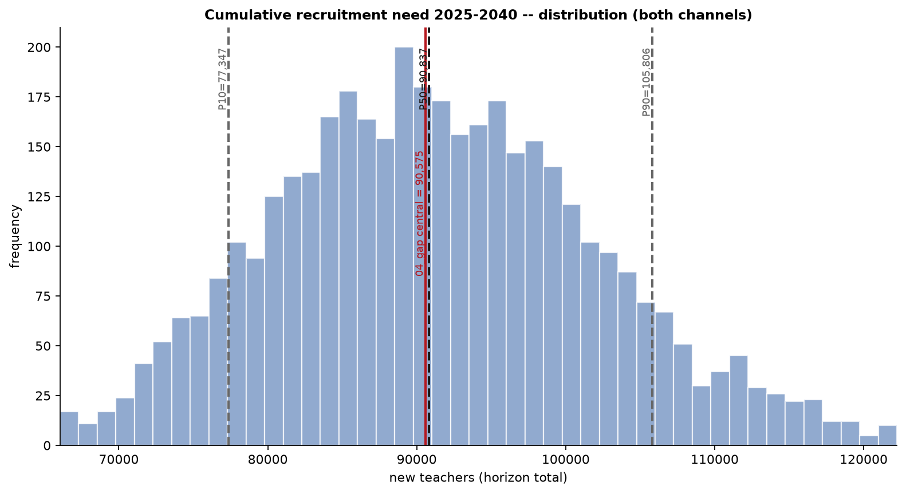{#fig-cumulative}

The resulting distribution of the graduate-channel deficit is shown in
@fig-fan. The median is negative in every year, running from a surplus of 1,253
in 2025 to 874 in 2040, with the narrowest surplus of 778 in 2036. The
narrowing comes from both sides: the simulated median need for young entrants
rises from 1,428 to a peak of 1,684 in 2036, while median entrants fall from
2,692 to 2,461 and then stay flat, because the projected pool plateaus from
2028 onward. These simulated medians differ slightly from the deterministic
path reported in @sec-training-constraint, where the requirement peaks at 1,666
and feasible entries settle at 2,473.

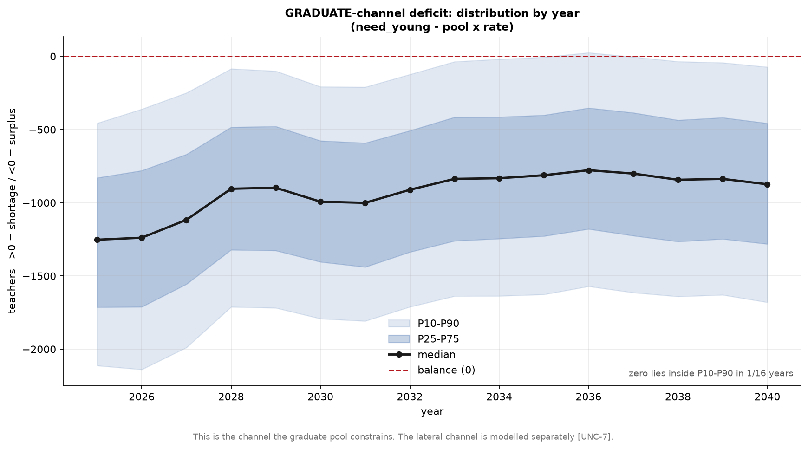{#fig-fan}

The width of the interval is close to constant in absolute terms, between 1,584
and 1,778 teachers across the sixteen years, a range of only 194. Relative to a
median that is converging toward zero, the same interval widens from 132 per
cent of the median in 2025 to 184 per cent in 2040. The sign of the graduate
deficit is determined in fifteen of the sixteen years, with 2036 the exception.
That count is nominal rather than comfortable: in 2034, 2035 and 2037 the
ninetieth percentile sits within 20, 6 and 4 teachers of zero respectively, so
four consecutive years sit at the boundary and the determination in three of
them rests on a margin smaller than a rounding error in the underlying stock.

One feature of the design conditions everything reported in this section. The
conversion rates read from @sec-training-constraint are anchored: the entries
used to form the ratio were scaled by a factor of 1.6243 before the ratio was
taken, so the whole distribution drawn here is conditional on that external
level, and the sign of the graduate-channel finding does not survive its
removal. No dispersion modelled in this block covers that, because it is a
question about the level of an input rather than its variance.

## Variance decomposition

The decomposition freezes one axis at a time at its median and measures the
resulting drop in the variance of the cumulative gap. The shares are normalised
to sum to one, so they rank the axes rather than partition the variance exactly.
How close they come to an exact partition is itself informative, and differs
between the two targets.

The decomposition is run against two quantities. The first is the
graduate-channel gap, in which the lateral reserve does not appear at all: it
is absent by construction rather than by omission, since the reserve enters
neither the need for young entrants nor the graduates available to meet it. The
second is the combined gap with no cross-channel credit, which is the headline
quantity from @sec-training-constraint and the one in which both channels
appear.

| Axis | Graduate gap | Combined gap |
|---|---:|---:|
| Conversion rate | 84.3% | 3.5% |
| Need shock | 9.2% | 21.9% |
| Graduate pool | 5.0% | 0.3% |
| Demographic scenario | 1.5% | 4.0% |
| Lateral reserve | not applicable | 70.3% |

: Variance shares by axis, normalised to sum to one {#tbl-variance}

The two rankings invert almost completely, and @fig-variance sets them side by
side. On the graduate gap the conversion rate carries 84.3 per cent of the
variance and everything else is residual. On the combined gap the conversion
rate falls to 3.5 per cent and the lateral reserve takes 70.3 per cent. The
answer to the question of where uncertainty should be reduced therefore depends
entirely on which deficit is the object of the exercise, and the two answers
point at different institutions: one at the initial teacher education pipeline,
the other at the contracted reserve.

{#fig-variance}

The additivity of the one-at-a-time shares differs between the two targets and
should be read as a diagnostic. The shares displayed in @tbl-variance are
rounded and sum to 100 per cent by construction. The diagnostic is computed on
the unrounded variance reductions, which on the graduate gap sum to 99.84 per
cent of the total, so the interaction between axes is 0.16 per cent and the
shares are close to an exact partition. On the combined gap they sum to 93.73
per cent, leaving 6.27 per cent in interaction, which arises because the
combined gap applies a floor at zero to each channel before summing, and that
floor makes the two channels interact. The combined shares are therefore a
ranking with a genuine caveat attached, while the graduate shares are very
nearly a decomposition.

The units in which the shares are read matter, as they did in the supply block.
On the graduate gap the conversion rate carries 9.20 times the variance of the
need shock, which is 3.03 times its standard deviation. On the combined gap the
lateral reserve carries 3.21 times the variance of the need shock, which is
1.79 times its standard deviation. The total standard deviation is 9,717
teachers on the graduate gap and 11,905 on the combined gap. Variance shares
are the correct way to attribute, and the square roots are the correct way to
picture the width of an interval.

The lateral channel produces the finding that most constrains what this block
can conclude. Its median gap is positive in every year, rising from 12 in 2025
to 822 in 2036 and settling at 574 by 2040, and its probability of shortage
runs from 50.4 per cent in 2025 to 77.0 per cent in 2036. The sign of that gap
is determined in none of the sixteen years. The channel that carries 70 per
cent of the variance of the headline deficit has a sign that the simulation
never resolves, which is a direct consequence of a reserve dispersion of 25.8
per cent applied to a gap whose median is small relative to the flows on either
side of it.

The mechanism behind the growing lateral gap is structural rather than
stochastic. The reserve's depletion rate is applied to the previous year's
stock, and that stock is falling, so feasible lateral entries decline from
3,764 in 2025 to 3,603 in 2040. Lateral need moves in the opposite direction,
from 3,738 to 4,160 at the simulated median, because the total need rises while
the channel split is held fixed. The gap opens from both ends.

@fig-deficit-channel shows the two channels together with the two ways of
combining them. Summing the annual medians, the graduate channel accumulates a
surplus of 14,930 over the horizon and the lateral channel a shortage of 7,205.
The no-cross-credit series accumulates 7,572, while netting the two produces
minus 7,732. The distance between those two figures, 15,304 teachers, is the
size of the error that netting introduces. Netting reports a cumulative surplus
where the channel that cannot draw on graduates is short in every year.

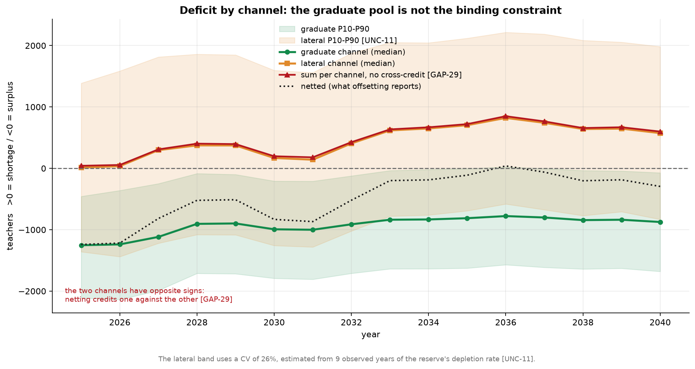{#fig-deficit-channel}

The demographic axis is the smallest contributor to the graduate gap at 1.5 per
cent, and @fig-demo shows why. All three enrolment scenarios produce a graduate
surplus in every year, and they differ by roughly 280 teachers at the point of
maximum separation in 2036, against an interval width of about 1,596 in the
same year. The ordering is the expected one, with the high-enrolment scenario
producing the smallest surplus, and the separation between scenarios is smaller
than the dispersion within any one of them.

{#fig-demo}

## Temporal correlation of the need shock

The need shock is decomposed into a component common to all years and a
component idiosyncratic to each year, with a parameter rho governing the split.
At rho equal to zero the shock is independent across years and averages out
over the horizon. At rho equal to one it is a single level shift applied to
every year. The baseline value of 0.6 is an assumption rather than an estimate,
so @tbl-rho reports the full range.

| rho | P10 | P50 | P90 | Relative width | Conversion-rate share | Years with determined sign |
|---:|---:|---:|---:|---:|---:|---:|
| 0.0 | 84,604 | 91,282 | 97,948 | 0.146 | 91.9% | 15 |
| 0.3 | 80,393 | 91,159 | 102,625 | 0.244 | 87.8% | 15 |
| 0.6 | 77,347 | 90,837 | 105,806 | 0.313 | 84.3% | 15 |
| 0.9 | 74,933 | 90,573 | 108,323 | 0.369 | 81.0% | 14 |
| 1.0 | 74,210 | 90,542 | 109,221 | 0.387 | 80.0% | 14 |

: Sensitivity of the cumulative need distribution to the temporal correlation
parameter {#tbl-rho}

Rho moves the width of the cumulative interval by a factor of 2.65, from 14.6
per cent of the median to 38.7 per cent. It does not move the median, which
falls by 0.81 per cent across the entire grid, and it does not move the verdict:
the graduate surplus survives at every value tested, and the number of years in
which the sign is determined falls only from fifteen to fourteen at the top of
the range. The probability of a graduate shortage never reaches 50 per cent in
any year at any value of rho.

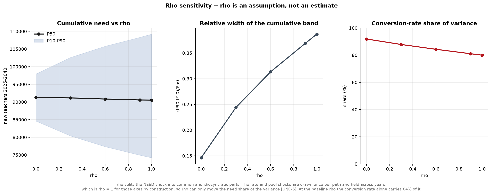{#fig-rho}

The reach of rho is limited by the design in a way that is easy to overlook.
Rho governs the need axis alone. The conversion rate, the graduate pool and the
lateral reserve are each drawn once per path and held across all sixteen years,
which is rho equal to one for those three axes by construction. Since the need
shock carries 9.2 per cent of the graduate variance at the baseline, rho can
only redistribute a share of that size. This is visible in the last column of
the grid: even at rho equal to one, where the need shock is maximally
persistent and therefore maximally influential, the conversion rate still
carries 80.0 per cent of the variance, down from 91.9 per cent at rho equal to
zero. The dominant axis is untouchable by the correlation assumption.

A reader who wanted to argue that the uncertainty reported here is understated
would therefore gain little from raising rho. The width at rho equal to one is
38.7 per cent against 31.3 per cent at the baseline, a difference of seven
percentage points, and the conclusion is unchanged. The assumption that would
matter is the one holding the three level shocks fixed across years, and that
assumption is not tested by this grid.

## Tail truncation by the conversion ceiling

@sec-training-constraint imposes a ceiling on the conversion rate of 28.33 per
cent a year, derived from an 85 per cent cohort conversion ceiling spread over
three graduating cohorts. The ceiling exists because a rate drawn from an upward
trending series can otherwise exceed any plausible share of a cohort entering
the profession. It truncates the rate from above only, which makes it a
one-sided constraint on a two-sided distribution, and one-sided truncation of
an input moves the output distribution in a known direction.

The direction is toward shortage. Clipping the rate reduces entrants, and since
the graduate gap is need minus entrants, a clipped draw moves rightward. Any
statistic that depends on the position of the distribution relative to zero is
therefore biased toward shortage by the presence of the ceiling, and the
question is by how much.

The answer is zero. Of the 4,000 draws, 105 had a rate above the ceiling and
were clipped, which is 2.625 per cent. The probability of a graduate shortage
computed with the ceiling and the probability computed without it are identical
in all sixteen years, to every digit reported. Since every probability is an
exact multiple of one in four thousand, this establishes that not one of the
105 clipped draws changed its classification.

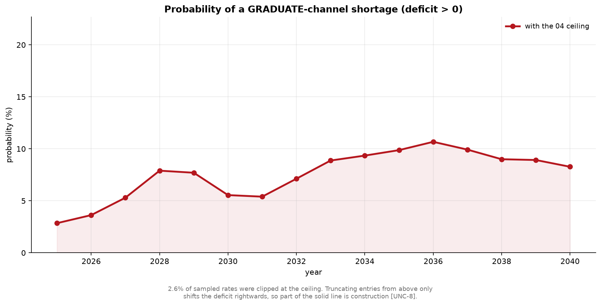{#fig-probability}

The reason is that the clipped draws sit far from the boundary. A draw is
clipped only if its rate exceeds 28.33 per cent, which is a high draw, and a
high rate produces many entrants and therefore a large surplus. Clipping pulls
that draw back toward zero from below without reaching it. The arithmetic is
straightforward: the implied graduate pool is approximately 8,686, so a clipped
draw has entrants of 2,461, while the largest median need for young entrants at
any point in the horizon is 1,684. Even at peak need, a clipped draw sits at a
surplus of around 777. The truncation operates entirely within the surplus
tail, below the tenth percentile of the deficit distribution, and the tenth
percentile itself is barely reached.

The ceiling is therefore inframarginal for every conclusion this section draws.
It compresses the extreme surplus tail, which makes the reported surplus
slightly smaller than an unconstrained simulation would produce, and it leaves
the median, the eightieth-percentile interval and the shortage probability
untouched. A reader concerned that the surplus finding is an artefact of
allowing implausibly high conversion rates can be answered directly: removing
the ceiling would widen the surplus rather than narrow it, and the finding does
not depend on where the ceiling is placed.

That conclusion should not be read as a general reassurance about the surplus,
because the ceiling is not the assumption the result rests on. The anchor is.
Scaling observed entries by 1.6243 raises the conversion rate by the same
proportion, which raises entrants by roughly 62 per cent, and it is that level
adjustment rather than the shape of the upper tail that places the median
graduate gap at a surplus of 800 to 1,250 a year. Between a ceiling that clips
2.6 per cent of draws and changes no conclusion, and an anchor that multiplies
the central level of the supply side by 1.6243 and reverses the sign, the second
is the one that a reader assessing the reliability of this projection needs to
interrogate.

Three limitations bound what the distributions in this section cover. They are
conditional on the model structure, so they price parameter uncertainty and not
specification error: the descriptive student-teacher ratio discussed in
@sec-demand, the perimeter difference against the reference census, and the
substitution reserve that is absorbed implicitly into the ratio and estimated
nowhere in the chain all lie outside them. The lateral reserve's dispersion is
estimated from nine years of its depletion rate, which measures how variable
that rate has been rather than how much reserve remains, and
@sec-training-constraint records that the size of the reserve is not measured
anywhere in this chain. And the graduate-channel result is conditional on the
anchor throughout.

# Validation {#sec-validation}

The validation block runs twenty-seven checks across seven families against the
outputs of every preceding block. It tests whether the chain is internally
coherent, whether it reconciles across spatial levels, whether it sits within a
defensible distance of the published national study, whether a cohort model of
this kind forecasts age structure out of sample, and whether any upstream block
produced a result that is formally present but substantively empty.

Every check ran. None was skipped for a missing input, which establishes that
all five upstream blocks produced their expected outputs in the form the suite
expects.

The headline count needs a qualification before it is quoted. Of the
twenty-seven checks, seven hold by construction: they re-derive a definition
that the producing block applied, so they cannot fail unless a file is corrupt
or a column is misread. Excluding those, twenty checks carry evidential weight,
and they return sixteen passes, two warnings and two failures. The two failures
are not peripheral. One concerns the dependence of the deficit's sign on an
external anchor, and the other concerns the model's ability to forecast the age
structure it is built on. The final subsection sets out which checks are
tautological and why they are retained regardless.

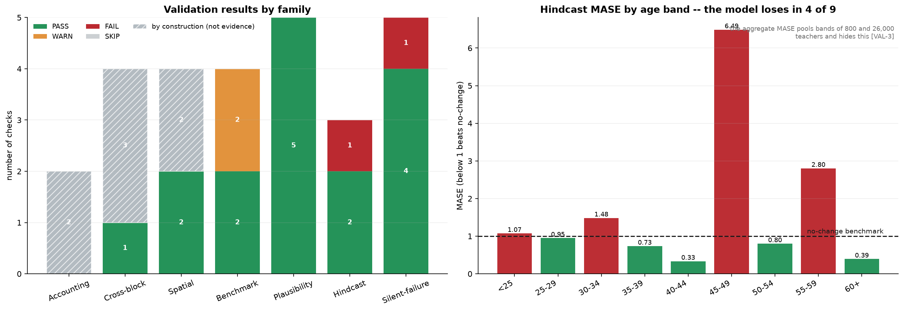{#fig-summary}

## Accounting identities and cross-block consistency

The accounting family tests two identities. The first is that the change in the
teacher stock between consecutive years equals recruitment minus exits. The
worst annual residual is $1.29 \times 10^{-16}$, which is floating-point noise.
The second is that the recruitment need equals replacement plus expansion,
following the decomposition used by the UNESCO Institute for Statistics, and the
residual is exactly zero.

Both hold by construction, and the accounting family therefore provides no
independent evidence about the model. The supply block computes the stock and
the exits inside a single loop and asserts the identity itself; the gap block
defines expansion as the need minus replacement, so the second identity is that
definition rearranged. A residual of zero in either case confirms that the file
was written and read correctly and nothing more.

The cross-block family tests four links between adjacent blocks, of which one
carries evidential weight. The cumulative median from the uncertainty block is
90,837 against a central path of 90,575 from the gap block, a difference of 0.29
per cent, well inside the two per cent tolerance. This is a genuine test because
the uncertainty block reconstructs the need from replacement plus the change in
demand rather than reading the published series, so the two could disagree and
in the annual detail they do, by up to 2.65 per cent in a single year. Their
agreement in aggregate is informative.

The remaining three links are definitional. The uncertainty block reads the
conversion ceiling out of the gap block's own file and writes it back, so the
inherited value matches to zero. The supply stock tracks the demand path because
endogenous entry sets recruitment to whatever closes the gap, so the two series
coincide whenever entry is positive. The third of these deserves a longer note
because it caught a real error before it was reclassified.

The check comparing the entry flow exported by the supply block against the
entry series the gap block uses to form its conversion ratio previously failed,
with residuals between 0.80 and 0.98. Those values are one minus the graduate
share of entries, which @sec-supply reports as rising from 4.4 per cent in 2016
to 29.2 per cent in 2024, giving a complement between 0.708 and 0.956. The cause
was a column-matching error: the gap block feeds its ratio with the graduate
channel alone, while a substring match on the entry column name returned the
total. The check was comparing the young channel against the total and
recovering the lateral share as an apparent error. It now reads the channel
label the gap block records, matches the corresponding supply column, removes
the anchor factor of 1.6243, and returns a residual of $1.91 \times 10^{-16}$
across nine overlapping years. It holds by construction once the channel is
correctly identified, and it is retained precisely because a channel mismatch
still trips it.

## Spatial reconciliation

The spatial family tests whether the regional series sum to the national one,
before and after the reconciliation step that the gap block applies.

The raw regional sum is 90,575 against a national total of 90,575, a relative
difference of $6.2 \times 10^{-7}$. This result is more informative than its
tolerance suggests. The gap block rakes the regional series because summing a
region-by-region maximum of zero and the computed need can exceed the national
figure whenever the national expansion component is negative in some region,
and the code documents that expectation. Here no such gap opens: the raw sum
already closes on the national total before any raking is applied. Either no
region carried a negative expansion large enough to bind, or the floor never
engaged. The reconciliation step is available and correct, and on this run it
had nothing to correct.

The reconciled sum closes exactly, which is arithmetic rather than evidence
because the raking factor is the ratio of the national to the regional total.
The regional shares sum to one to within $8.9 \times 10^{-16}$, which is
likewise arithmetic since the shares are formed by dividing each region by the
sum. Twenty-four mainland NUTS III regions are present, which is the expected
count and a genuine check on the completeness of the regional partition.

@sec-supply records a property of the regional results that the spatial family
cannot detect. Recruitment attributed to a given region is not invariant to the
level of aggregation: three NUTS II regions consist of a single NUTS III region,
and for all three the figure falls by 5.24 per cent when moving to the finer
partition, which is the ratio of the two raking factors. Closure at each level
is compatible with the levels disagreeing about any individual region, and the
suite tests closure alone.

## Comparison with the reference study, raw and perimeter-adjusted

The only published projection covering the same country and an overlapping
decade is the DGEEC study prepared with the Nova SBE Centre for the Economics of
Education, which reports a cumulative recruitment requirement of 38,779 teachers
to 2034/35, an average of 3,878 a year. The comparison window here is 2025 to
2034, the ten calendar years of overlap with the projection horizon.

The raw comparison returns 5,505 teachers a year against 3,878, a difference of
41.9 per cent, which exceeds the thirty per cent tolerance and is recorded as a
warning. The cumulative form of the same comparison returns 55,045 against
38,779 pro-rated to the window, giving the identical relative difference.

The perimeter difference is measured rather than asserted. The gap block
publishes a reconciliation between the workforce this chain projects and the
workforce the reference census counts, giving a ratio of 1.140.
@sec-training-constraint reports the same discrepancy from the other direction,
with the age-band sum of 139,098 against approximately 122,000 teachers in the
reference census. The external study covers 835 mainland public organisational
units and excludes private and state-funded private provision, which is the most
plausible source.

Dividing by that ratio gives 4,828 teachers a year against 3,878, a difference
of 24.5 per cent, which falls inside the tolerance and passes. The perimeter
therefore accounts for 17.4 percentage points of the original 41.9, and 24.5
percentage points remain unexplained by it.

@sec-supply identifies two candidates for the residual. The exit rate in this
chain runs at 43.0 per thousand staff per year over the first decade against
roughly 37.7 implied by the external study's own workforce trajectory, a
difference of 14 per cent that points toward the attrition floor of one per cent
applied to every band below 55, which alone generates 9,672 exits over the
decade. The definition of recruitment is the second: this chain counts all gross
entries including re-entries, where a projection counting only net additions to
the permanent establishment would return a smaller figure from identical
workforce dynamics. Neither is quantified here, and the residual is reported as
a residual.

The retirement comparison passes without adjustment. This chain produces 5,021
retirements a year over the window against 4,000 in the benchmark, a difference
of 25.5 per cent. The check records a caveat that @sec-supply establishes: 94.7
per cent of the retirement wave comes from the 60 and over hazard, which is set
from the statutory exit age rather than estimated, and the 55 to 59 component of
250 a year is an assumption rather than a measurement. A retirement figure that
agrees with an external study to within 25 per cent is agreement between one
estimate and one assumption.

The plausibility family passes on all five checks without qualification. The 60
and over hazard of 0.1429 sits inside a bound of 0.02 to 0.60. All nine observed
conversion rates fall inside one to one hundred per cent, with a maximum of 19.6
per cent. All nine cohort conversion figures fall below one hundred per cent,
with a maximum of 59 per cent. All sixteen projected annual recruitment figures
fall inside a bound of one thousand to fifteen thousand, averaging 5,661.
Student-teacher ratios across the three tested cycles fall inside five to thirty,
with a worst value of 13.4. These bounds are wide by design and a pass
establishes that no quantity is absurd rather than that any is correct.

## Out-of-sample test by age band

The hindcast holds out the final three years of the observed panel, estimates a
cohort model on 2014 to 2021, and projects 2022 to 2024 for comparison against
the observed age distribution.

The most important property of this test is what it does not test. The model
estimated here is a deliberate re-implementation and not the deployed supply
code. It inverts the projection equation to recover hazards with no attrition
floor, where the supply block uses an identity-based estimator with a floor of
one per cent. It holds annual entries constant at the training-window mean,
where the supply block drives entry endogenously from the demand path. A
favourable result therefore does not certify the supply block's estimator, and
an unfavourable one does not condemn it. What the test establishes is whether a
cohort model of this general form, fitted on this panel, can forecast the age
structure of this workforce.

The aggregate result passes. The mean absolute error across all bands and test
years is 978 teachers against 1,421 for a no-change benchmark, giving a scaled
error of 0.689. The per-band result fails.

| Band | Scaled error | Model relative error | Benchmark relative error | Weight in aggregate |
|---|---:|---:|---:|---:|
| Under 25 | 1.07 | 43.8% | 40.8% | 3.3% |
| 25 to 29 | 0.95 | 20.9% | 22.0% | 5.6% |
| 30 to 34 | 1.48 | 19.9% | 13.4% | 4.1% |
| 35 to 39 | 0.73 | 28.2% | 38.3% | 17.9% |
| 40 to 44 | 0.33 | 7.6% | 22.8% | 32.7% |
| 45 to 49 | 6.49 | 3.4% | 0.5% | 1.0% |
| 50 to 54 | 0.80 | 1.8% | 2.3% | 4.6% |
| 55 to 59 | 2.80 | 4.4% | 1.6% | 3.0% |
| 60 and over | 0.39 | 4.7% | 11.9% | 27.8% |

: Hindcast performance by age band, 2022 to 2024 {#tbl-hindcast}

The model loses to a no-change benchmark in four of the nine bands, which
triggers the failure threshold. The aggregate figure conceals this because a
scaled error pooled across bands is a weighted average in which the weights are
the benchmark's own errors. The 40 to 44 and 60 and over bands together carry
60.5 per cent of that weight, and both are bands where the no-change benchmark
performs badly because the headcount is moving fast, so the model wins easily.
The 45 to 49 band carries 1.0 per cent of the weight despite a scaled error of
6.49. The aggregate is dominated by the bands where the comparison is least
demanding.

The 45 to 49 result needs reading in relative terms before it is treated as a
collapse. The band is close to flat over the test window, moving from 25,610 to
25,991, so the no-change benchmark is almost exact with a relative error of 0.5
per cent. The model's relative error is 3.4 per cent. A ratio of 6.49 between
two small numbers is a statement about how good the benchmark is rather than how
bad the model is, and a scaled error penalises a model most heavily in exactly
the bands where persistence is hardest to beat.

The four losing bands have a property in common that the scaled error does not
reveal. Comparing the observed change from the last training year against the
predicted change, the model gets the direction wrong in the under 25 band, which
rises by 653 while the model predicts a fall of 43; in the 30 to 34 band, which
rises by 896 while the model predicts a fall of 349; in the 45 to 49 band, which
rises by 125 while the model predicts a fall of 1,553; and in the 55 to 59 band,
which falls by 512 while the model predicts a rise of 998. The four bands where
the direction of change is wrong are exactly the four that lose to no-change.
The model is not imprecise in those bands. It is pointing the wrong way.

The cause is identifiable and specific to this re-implementation. Entries are
held constant at the training-window mean, and the test window is precisely when
young entries accelerated: @sec-supply records entries into the under-25 band
rising from 45 in 2016 to 480 in 2024, with the last three years averaging 388
against a full-series mean of 213. A model that fixes entry at a historical
average cannot reproduce a surge in entry, and the bands that receive new
entrants are the bands where it fails. The deployed supply model does not make
this assumption, which is why the failure should not be transferred to it
without qualification.

The total headcount check passes, with a worst-year error of 1.05 per cent. That
pass and the per-band failure are the same result viewed at two levels of
aggregation. In the final test year the signed band errors sum to minus 1,462
teachers while the absolute band errors sum to 13,653, a cancellation factor of
9.3. The aggregate is accurate because the errors offset, with the model
overstating the 35 to 39, 40 to 44 and 55 to 59 bands by a combined 6,096 and
understating the remaining six by a combined 7,558. A projection that is used
only for a total headcount would be well served by this model; one used for the
retirement wave, which depends entirely on the two oldest bands, would not.

## Guards against silent failure

The silent-failure family asks whether an upstream block ran to completion and
produced output that is formally present but carries no information. Four of the
five checks pass and one fails.

The uncertainty block reports a non-degenerate simulation, and the deficit fan
carries a median band of 1,608 teachers and a widest band of 1,778, far above
the floor. No uncertainty axis is reported as degenerate, which @sec-uncertainty
confirms from the other side: all five axes carry dispersion and the perimeter
check passes on the channel basis. No scenario pushed the recruitment need below
zero, so no cell was floored.

One detail of the fan check is worth recording because it shows a guard partly
not firing. The check applies an absolute floor of one teacher and a relative
floor of two per cent of the median need, taking the larger. The relative
component did not engage on this run, because the column it looks for is named
for the graduate channel in the fan output and the exact-match lookup returned
nothing. The check therefore tested against the absolute floor alone. The
consequence here is immaterial, since the observed band of 1,778 exceeds both
the absolute floor of one and the relative floor of roughly thirty-two that
would have applied, but a guard that silently reduces to its weaker form is a
guard that would not catch the failure mode it was strengthened to catch.

The failing check is the one that matters most. The gap block tests whether the
sign of its deficit survives the removal of the external anchor applied to
observed entries, and it does not. The mean annual gap is minus 946 teachers
with the anchor and plus 20 without it. The sign reverses. Over the sixteen-year
horizon the two paths differ by 15,456 teachers.

@sec-uncertainty establishes what this means for every probability that block
reports. The anchor scales observed entries by 1.6243 before the conversion
ratio is formed, so the entire distribution of conversion rates drawn in the
uncertainty simulation is conditional on it, and the graduate-channel surplus of
800 to 1,250 a year rests on an adjustment that raises observed entries by 62.4
per cent. The conversion ceiling, by contrast, clips 2.6 per cent of draws and
changes no conclusion. Between an assumption that truncates a tail without
moving a verdict and one that moves the verdict, the suite flags the second.

The design decision behind this check is worth stating. An earlier version of
the suite recorded a missing verdict column as a skip. In a family built
specifically to catch silent failures, a missing verdict is itself the silent
failure, so the check now searches three historical column names and records a
failure if none is found, on the grounds that a stale or renamed upstream output
leaves the anchor dependence unexamined rather than confirmed.

## Checks that hold by construction

Seven of the twenty-seven checks, or twenty-six per cent of the suite, re-derive
a definition applied by the block that produced the file. They are listed in the
report with the reason each cannot fail, and they are excluded from the
evidential count in @fig-summary, where they appear hatched.

The two accounting identities are of this kind, which means the accounting
family contributes nothing to the evidential total. Three of the four
cross-block checks are of this kind: the inherited ceiling, the stock tracking
the demand path under endogenous entry, and the entry flow comparison once the
channel is matched. Two of the four spatial checks are of this kind: closure
after raking and shares summing to one.

They are retained for a reason that the entry flow check demonstrates
concretely. A check that holds by construction under correct specification still
fails under misspecification, and that failure is informative. The entry flow
comparison failed at residuals between 0.80 and 0.98 until the channel mismatch
was found, and those residuals were the complement of the graduate share, which
is what made the cause diagnosable. A tautology that can be broken by a wrong
column, a stale file or a renamed field is worth running. It is not worth
quoting as corroboration of the model.

The distinction matters for how the headline should be read. Sixteen passes out
of twenty evidential checks is the correct summary. Twenty-three passes out of
twenty-seven would overstate the suite's reach by counting definitions as
findings.

What the suite covers is coherence, plausibility, spatial closure, one external
comparison, one out-of-sample test of a re-implemented model, and the upstream
blocks' own self-diagnostics. It does not reach the structural assumptions on
which the projection rests. Entry is unconstrained in the supply block, and no
check tests whether the recruitment path is deliverable. The student-teacher
ratio in the demand block is descriptive rather than normative, and @sec-demand
establishes that a ratio estimated during a period of shortage is biased in a
direction that understates the requirement. The definition of the graduate pool
in the gap block determines which channel the constraint binds on, and
@sec-uncertainty shows that the answer to where uncertainty should be reduced
inverts depending on which deficit is the object. The substitution reserve is
absorbed implicitly into the observed ratio and estimated nowhere. A suite of
this kind can establish that a chain is arithmetically sound and externally
plausible. It cannot establish that the quantity being computed is the quantity
that matters.

# Results {#sec-results}

The preceding sections documented each block of the chain separately, with the
parameters it estimates and the assumptions it makes. This section brings the
outputs together. It reports the recruitment requirement at national level, its
distribution across the 24 mainland NUTS III regions, its division between the two
entry channels, and the intervals and shortage probabilities the simulation
attaches to it. Mechanisms, evidence and caveats established upstream are
referenced rather than restated.

Every figure reported here is conditional on the assumptions set out upstream, and
three of those assumptions govern the result more than any other. The
student-teacher ratio in @sec-demand is descriptive rather than normative, so the
requirement is the staffing implied by observed practice persisting. The retirement
hazard for the band aged 60 and over in @sec-supply is set from the statutory exit
age rather than estimated, and it generates 94.7 per cent of the retirement wave.
The external anchor applied to graduate entries in @sec-training-constraint raises
the observed level by 62.4 per cent, and the sign of the graduate-channel verdict
does not survive its removal. None of the three is a matter of arithmetic, and each
is identified at the point where it enters the result.

## National recruitment need

The projected requirement is 90,575 teachers over the sixteen years from 2025 to
2040, an average of 5,661 a year. Over the first ten years, which is the window the
published reference study covers, the requirement is 55,045 teachers, or 5,505 a
year on the unrounded cumulative output.

That figure belongs to one of two specifications the supply block publishes, and
the attribution matters. Under the flat chain, in which the hazard for the band
aged 60 and over is constant at 0.142857 and implies a mean exit age of 67.0, the
cumulative requirement is 90,575. Under the tenure queue, in which the hazard
depends on how long a teacher has been in the band and implies a mean exit age of
65.2, it is 98,579. The difference of 8.8 per cent decomposes into minus 3.6 per
cent from the shape of the hazard and plus 13.0 per cent from the level of the exit
age, two effects of opposite sign that partly cancel, as @sec-supply sets out. The
flat chain is the live specification and is the basis for everything reported
below, but a reader comparing this projection against another should establish
which retirement age each assumes before attributing any difference to demography.

The gap block smooths the recruitment series with a three-year centred moving
average applied to the expansion component, leaving the sixteen-year total at
90,575 with a residual of 0.06 teachers and moving annual values by up to 143
teachers. Annual figures quoted from the smoothed and unsmoothed paths therefore
differ while the cumulative agrees exactly.

The requirement rises from 5,213 in 2025 to a peak of 6,101 in 2036 before easing
to 5,752 in 2040. On the smoothed series the peak is 6,017, also in 2036.
@fig-wave, in @sec-supply, sets the requirement against the retirement wave that
drives most of it: recruitment exceeds retirements in every year of the horizon,
and the margin between the two is governed by the demand path rather than by
anything in the supply model.

The composition of the requirement is worth setting out because it establishes
what kind of problem this is. Total exits over the horizon reach 96,908 against a
requirement of 90,575, so replacement accounts for 107.0 per cent of recruitment
and the expansion component is negative in all sixteen years, ranging from minus
186 in 2036 to minus 721 in 2031. The system is recruiting to replace people who
leave, and it is recruiting slightly fewer than it loses because the number of
posts is falling. Within those exits, retirements account for 81,260 and attrition
from bands below 55 for 15,648, or 83.9 and 16.1 per cent respectively. A
projection built on retirements alone would understate the requirement by roughly
a sixth. The international decomposition of roughly 58 per cent replacement and 42
per cent expansion reported by Bruneforth, Gagnon and Wallet (2009) describes
systems with growing enrolment and is not a comparator here.

The cumulative retirement figure is the strongest single result the chain
produces. Against the 2024 age-band sum of 139,098, retirements of 81,260 under the
flat chain and 88,510 under the tenure queue mean that between 58.4 and 63.6 per
cent of the current teaching workforce leaves within the horizon. The
qualification attached to it in @sec-supply travels with it: 94.7 per cent of the
wave comes from a single hazard that is set rather than estimated, and the
contribution of the band aged 55 to 59 is an assumption.

### The requirement against realised history

The observed record runs from 2016 to 2024 and gives a mean of 4,537 entries a
year, a median of 4,618, and an average of 4,860 over the last five years. The
projected requirement of 5,661 is 24.8 per cent above the mean and 22.6 per cent
above the median. Excluding the pandemic year 2020, which is the highest year on
record at 6,298, the historical mean falls to 4,317 and the requirement stands
31.1 per cent above it.

The comparison against the second-highest year, 2016 at 5,745, is where the
summary statistic and the operative reading diverge. The requirement averages 1.5
per cent below 5,745, which taken alone would place the ask within historical
reach. The distribution says something else: no projected year exceeds the
all-time high, and eight of the sixteen exceed the second-highest year. The system
would have to beat a level it has reached once, in the first year of the
observable record, in half of the projection horizon.

### Comparison with the published reference study

The only published projection covering the same country and an overlapping decade
reports a cumulative requirement of 38,779 teachers to 2034/35, an average of
3,878 a year (Nunes et al., 2025). Against the 5,505 a year projected here over the
same window, the raw difference is 41.9 per cent. Adjusting for the perimeter ratio
of 1.140 established in @sec-training-constraint gives 4,828 a year against 3,878,
a difference of 24.5 per cent, so the perimeter accounts for 17.4 percentage points
of the original 41.9 and 24.5 percentage points remain. @sec-validation records the
raw comparison as a warning and the adjusted comparison as a pass, and identifies
the attrition floor and the definition of recruitment as the two candidates for the
residual, neither of them quantified.

The published study itself demonstrates how much a definitional choice can move a
requirement of this kind. Its two alternative scenarios differ from the base case
only in whether teachers' available hours can be reallocated in full to classroom
teaching, and that single change reduces the cumulative requirement from 38,779
to between 15,579 and 16,474. A difference of some 23,200 teachers generated by
one organisational assumption is larger than the entire gap between the two
studies, which is a reason to treat the residual as unexplained rather than to
attribute it to demography or to attrition.

### What the projected stock does not say

One output of the chain should not be read as a result. Because entry in the
supply block is endogenous, recruitment is the residual that reconciles the ageing
workforce with the demand path, and the projected stock reproduces the demand
series from @sec-demand number for number: 138,611 in 2025 and 132,765 in 2040 in
both, with demand falling 4.22 per cent over the horizon. Every statement about
supply in this section is therefore a statement about a flow. No statement about
the projected stock is a statement about supply, and the agreement between the two
series in 2025 is an identity rather than a validation.

## Regional distribution

The cumulative requirement distributes across the 24 mainland NUTS III regions as
shown in @fig-recruitment-nuts3 and @tbl-recruitment-nuts3. The regional series
sums to 90,575, reproducing the national total to a relative difference of
$6.2 \times 10^{-7}$.

{#fig-recruitment-nuts3 width=100%}

| Region | Requirement | Share | Cumulative share |
|---|---:|---:|---:|
| Área Metropolitana de Lisboa | 19,229 | 21.23% | 21.23% |
| Área Metropolitana do Porto | 12,439 | 13.73% | 34.96% |
| Península de Setúbal | 7,916 | 8.74% | 43.70% |
| Algarve | 5,050 | 5.58% | 49.28% |
| Região de Coimbra | 4,143 | 4.57% | 53.85% |
| Cávado | 3,742 | 4.13% | 57.98% |
| Região de Aveiro | 3,614 | 3.99% | 61.97% |
| Tâmega e Sousa | 3,425 | 3.78% | 65.75% |
| Oeste | 3,368 | 3.72% | 69.47% |
| Ave | 3,150 | 3.48% | 72.95% |
| Viseu Dão Lafões | 3,140 | 3.47% | 76.42% |
| Região de Leiria | 2,564 | 2.83% | 79.25% |
| Lezíria do Tejo | 2,214 | 2.44% | 81.69% |
| Beiras e Serra da Estrela | 2,211 | 2.44% | 84.13% |
| Médio Tejo | 2,205 | 2.43% | 86.57% |
| Alto Minho | 1,972 | 2.18% | 88.75% |
| Douro | 1,851 | 2.04% | 90.79% |
| Alentejo Central | 1,652 | 1.82% | 92.61% |
| Terras de Trás-os-Montes | 1,317 | 1.45% | 94.07% |
| Baixo Alentejo | 1,302 | 1.44% | 95.50% |
| Alto Alentejo | 1,125 | 1.24% | 96.75% |
| Beira Baixa | 1,089 | 1.20% | 97.95% |
| Alentejo Litoral | 932 | 1.03% | 98.98% |
| Alto Tâmega e Barroso | 925 | 1.02% | 100.00% |

: Cumulative recruitment requirement by NUTS III region, 2025 to 2040
{#tbl-recruitment-nuts3}

The distribution is heavily concentrated. The three metropolitan and coastal
regions at the top of @tbl-recruitment-nuts3 carry 43.70 per cent of the national
requirement, and the top ten carry 72.95 per cent. The ratio between the largest
and the smallest requirement is 20.8 to one, which is close to the ratio of the
teaching workforces themselves rather than a statement about differential
pressure.

### The provenance of the reconciliation residual

The regional series is raked onto the national total, and the residual has a
different origin here than in the supply block. As @sec-training-constraint
establishes, the regional sum reproduces the unsmoothed national total exactly in
every one of the sixteen years, and the annual discrepancy of between minus 2.65
and plus 1.68 per cent is created entirely by the smoothing, oscillates around
zero and cancels in the cumulative, so no regional heterogeneity is lost. That
result should be set against the equivalent operation in @sec-supply, where raking
at NUTS III level discarded 6.8 per cent of regional recruitment on average
through genuine zero-flooring and region-specific hazard sets. The two
reconciliations look alike in the output and differ in what they do: one
redistributes across years within a preserved total, the other removes regional
variation the national model does not carry.

### Three qualifications on the regional reading

The first is that the regional variation is almost entirely between NUTS II
regions rather than within them, because demographic growth factors are computed
at NUTS II level and applied uniformly to the constituent regions. @sec-enrolment
records between-region variation at thirty-two times the largest within-region
variation in enrolment, and @sec-demand records 22.5 times in demand. The levels
in @tbl-recruitment-nuts3 are specific to each region, because each carries its
own workforce, its own age structure and its own entry profile. The rates of
change are not.

The second is that recruitment attributed to a region is not invariant to the
level of aggregation, falling by exactly 5.24 per cent for the three single-region
NUTS II areas when moving from the coarser to the finer partition. Closure at each
level is compatible with the levels disagreeing about any individual region, and
@sec-validation tests closure alone. A projection quoted for a single region
should state which universe produced it.

The third is that these are requirements for posts and not requirements for
locally trained teachers. Of teachers holding a masters qualification completed
after 2013, 42 per cent work in a region other than the one in which they
qualified, and the Norte region functions as a net exporter to every other region
(Nunes et al., 2025). Regional training capacity and regional requirement are
different quantities and should not be compared directly.

A fourth consideration applies to the precision of the individual figures rather
than to their construction. The caution Richardson and Tan (2007) attach to
regionally disaggregated projections, recorded in @sec-demand, applies here: the
contrast between a contracting interior and expanding metropolitan regions is the
finding that survives it, while the individual percentages in
@tbl-recruitment-nuts3 carry more precision than the method supports.

## Need by entry channel

The requirement divides between two channels that draw on different populations.
Entry below the age of 30 is governed by the output of initial teacher education
and is 27.68 per cent of the projected requirement, taken from the entry age
profile estimated in @sec-supply. The remaining 72.32 per cent is drawn from
teachers returning after a period outside the system, from the contracted reserve,
and from career changers, and no ceiling derived from the number of masters
graduates in a given year has any purchase on it.

Over the horizon the graduate channel requires 25,072 entrants, an average of
1,567 a year, and the lateral channel requires 65,503, an average of 4,094 a year.
The two sum to 90,575. The lateral channel is 2.61 times the size of the graduate
channel. @fig-channel-split, in @sec-training-constraint, sets the requirement
against the feasible supply in each channel, and the two behave in opposite
directions.

### The graduate channel

Feasible graduate entries total 40,208 over the horizon against a requirement of
25,072, a surplus of 15,136. Coverage runs from 189.1 per cent in 2025 to a
minimum of 148.5 per cent in 2036 and recovers to 154.1 per cent by 2040. The
initial-training constraint never binds in any year.

The narrowing between 2025 and 2036 comes from both sides. The requirement for
young entrants rises from 1,431 to a peak of 1,666, while feasible entries fall
from 2,705 to 2,473 and then stay flat. The fall in feasible entries is an
artefact of the pool construction rather than a projection of anything happening in
the training system, as @sec-training-constraint sets out: the pool is the sum of
three completion cohorts lagged by one year, so it contains observed data until
2027 and settles at a constant level from 2028 onward.

The result depends on the external anchor. Under the anchored series the mean
annual graduate gap is a surplus of 946. With the rescaling removed it is a
shortage of 19.9, which is zero to any practical purpose but reverses the sign of
the verdict. The entire margin in the published graduate-channel result belongs to
the rescaling, and it should not be quoted without it.

### The lateral channel

Feasible lateral entries total 58,764 against a requirement of 65,503. Coverage
falls below 100 per cent from 2026 and reaches a minimum of 83.3 per cent in 2036,
the year of peak requirement. Summing the annual shortfalls and excluding the
single year of surplus gives 6,765 positions unfilled over the horizon.

The mechanism is structural rather than stochastic. Lateral entries are projected
as a fixed share of the previous year's teaching stock, set at 2.706 per cent, and
that stock is falling, so feasible entries decline from 3,764 in 2025 to 3,603 in
2040. The requirement moves the other way, from 3,738 to a peak of 4,351 in 2036,
because the total requirement rises while the channel split is held fixed. The gap
opens from both ends.

The caution attached to this channel is the most severe in the chain. The rate is
applied to the teaching stock and not to the reserve, because no stock model of
the contracted reserve exists in any block. What is modelled is the assumption
that the reserve delivers a fixed proportion of the workforce each year, which
makes the channel shrink in step with the workforce by definition rather than by
evidence and says nothing about whether the reserve can sustain that draw. If the
reserve depletes faster than the workforce contracts, 6,765 is a lower bound.

### What netting conceals

The graduate surplus of 15,136 is 2.24 times the lateral shortfall of 6,765, so
combining the two removes the second entirely. The gap block reports netted unmet
need as zero in every one of the sixteen years, and aggregate coverage never falls
below 101.4 per cent, reaching that minimum in 2036, the year in which lateral
coverage is 83.3 per cent. @fig-constraint, in @sec-training-constraint, shows the
two readings together. The offset assumes the channels substitute one for one,
which the construction does not support, and the measure to report is the sum of
the per-channel shortfalls.

### Regional dispersion of the split

The national channel share conceals a dispersion wide enough to change what a
graduate constraint would do. At NUTS II level the young share runs from 11.6 per
cent in the Centro region to 51.2 per cent in the Lisbon metropolitan area, a
factor of 4.4. At NUTS III level it runs from 3.0 per cent to 51.2 per cent, a
factor of 17.0, and five NUTS III regions sit below 10 per cent. In the region
with the lowest share, 97 per cent of modelled entries are lateral, so a ceiling
on graduate entry would barely touch it.

A constraint applied uniformly at national level therefore binds very unevenly in
practice, and the regions where it binds least are those most dependent on a
reserve that the chain does not model.

## Intervals and probability of shortage

The uncertainty block attaches a distribution to the deficit by propagating five
axes jointly through the same arithmetic that produced the point estimate. It
re-estimates nothing. The simulation runs 4,000 draws from a fixed seed over 2025
to 2040, so every reported probability is an exact multiple of one in four
thousand.

The simulation is centred on the point estimate rather than displaced from it.
The cumulative requirement across both channels has a median of 90,837 against a
central path of 90,575, a difference of 0.29 per cent. The mean of 91,365 exceeds
the median by 529, which is the right skew that lognormal shocks produce.

### The graduate-channel deficit

@fig-fan, in @sec-uncertainty, reports the distribution. The median is a surplus
in every year, running from 1,253 in 2025 to 874 in 2040, with the narrowest
surplus of 778 in 2036. The width of the interval is close to constant in absolute
terms, between 1,584 and 1,778 teachers across the sixteen years, a range of only
194. Relative to a median that is converging toward zero, the same interval widens
from 132 per cent of the median in 2025 to 184 per cent in 2040.

The sign of the graduate deficit is determined in fifteen of the sixteen years,
with 2036 the exception. That count is nominal rather than comfortable. In 2034,
2035 and 2037 the ninetieth percentile sits within 20, 6 and 4 teachers of zero
respectively, so four consecutive years sit at the boundary and the determination
in three of them rests on a margin smaller than a rounding error in the underlying
stock.

### The lateral-channel deficit

The lateral channel produces the finding that most constrains what can be
concluded. Its median gap is a shortage in every year, rising from 12 in 2025 to
822 in 2036 and settling at 574 by 2040. Its probability of shortage runs from
50.4 per cent in 2025 to 77.0 per cent in 2036. The sign of that gap is determined
in none of the sixteen years.

The channel that carries the larger part of the requirement, and the larger part
of the variance of the headline deficit, has a sign the simulation never resolves.
This follows from a reserve dispersion of 25.8 per cent applied to a gap whose
median is small relative to the flows on either side of it.

@fig-probability, in @sec-uncertainty, reports the shortage probability for the
graduate channel and carries a second result. The conversion ceiling of 28.33 per
cent clips 105 of the 4,000 draws, or 2.625 per cent, and the shortage probability
computed with and without it is identical in all sixteen years to every digit
reported, so not one clipped draw changed its classification. The ceiling is
inframarginal for every conclusion reported here.

### Where the uncertainty comes from

The variance decomposition inverts almost completely between the two deficits, as
@tbl-variance and @fig-variance in @sec-uncertainty set out. On the
graduate-channel gap the conversion rate carries 84.3 per cent of the variance and
everything else is residual. On the combined gap with no cross-channel credit the
conversion rate falls to 3.5 per cent and the lateral reserve takes 70.3 per cent.
The answer to the question of where uncertainty should be reduced therefore
depends entirely on which deficit is the object, and the two answers point at
different institutions: one at the initial teacher education pipeline, the other
at the contracted reserve. The total standard deviation is 9,717 teachers on the
graduate gap and 11,905 on the combined gap.

### Sensitivity to the correlation assumption

The parameter governing the temporal correlation of the need shock is set at 0.6
by assumption rather than estimated. Moving it across its full range changes the
width of the cumulative interval by a factor of 2.65, from 14.6 per cent of the
median at zero to 38.7 per cent at one, without moving the median, which falls by
0.81 per cent across the entire grid, and without moving the verdict. The reach of
that parameter is limited by the design: it governs the need axis alone, while the
conversion rate, the graduate pool and the lateral reserve are each drawn once per
path and held across all sixteen years, which is perfect persistence for those
three axes by construction. @sec-uncertainty reports the grid and the mechanism.

### What the intervals do not cover

The distributions reported in this section price parameter uncertainty conditional
on the model structure. They do not cover specification error. Four quantities lie
outside them, and each is larger than the intervals themselves.

The anchor is the first. Scaling observed entries by 1.6243 raises the conversion
rate by the same proportion, so the whole distribution of conversion rates drawn
in the simulation is conditional on it, and the sign of the graduate-channel
finding does not survive its removal. No dispersion modelled anywhere in the chain
covers that, because it is a question about the level of an input rather than its
variance.

The descriptive ratio is the second. @sec-demand derives demand from the observed
student-teacher ratio, which records the staffing that occurred including any posts
that went unfilled. Santiago (2002) describes the two routes by which a school
system brings demand and supply into line in the short run, relaxing qualification
requirements at the point of hiring and raising the workload of teachers already
employed, and observes that in situations of excess demand there may be no observed
quantity imbalance at all, only a change in the quality characteristics of the
workforce. A ratio estimated from such a period encodes the adjustment. The
direction of the resulting bias is known and its magnitude is not: projected demand
is biased downward, and the requirement reported here is a lower bound on that
account.

The perimeter is the third. Every level reported in this section carries the
relative error of 14.0 per cent against the reference census established in
@sec-training-constraint.

The substitution reserve is the fourth and the largest. The requirement modelled
throughout is for permanent posts. The reserve that covers temporary absence and
short-term replacement appears nowhere in the projection, and at twenty per cent of
the 2025 stock it would amount to 27,722 teachers in a single year, 4.10 times the
cumulative lateral shortfall reported over sixteen years. The component the chain
does not measure is larger by an order of magnitude than the one it does.

One further limitation concerns the level of aggregation at which a shortage is
meaningful. Edwards, Kraft, Christian and Candelaria measured unfilled teaching
positions in Tennessee before the pandemic and found less than two per cent of
positions vacant statewide, a figure that would support the conclusion of no
shortage, while those vacancies were concentrated in a quarter of schools and at
least seventy per cent of the variation occurred between schools within the same
district. Shortages and surpluses coexisted and the aggregate concealed both. The
projection reported here aggregates into the four cells and 24 regions, so it can
describe the size of the recruitment task and not its composition within the upper
cycles, where the evidence on Portugal locates the shortage most unevenly.

# Limitations {#sec-limitations}

The preceding sections recorded limitations at the point where each arises. This
section collects them and orders them by how much they move the result, because
that ordering is not obvious from the sequence in which they were introduced. A
limitation stated inside a technical subsection and a limitation that reverses a
headline finding read alike on the page, and they are not alike.

Four of the items below change the sign or the order of magnitude of a reported
quantity. The remainder condition the precision of figures whose direction is
secure. The separation matters for anyone deciding how much weight the projection
can carry.

## Assumptions that determine the sign of a result

### The external anchor on graduate entries

The conversion ratio in @sec-training-constraint divides graduate entries by the
qualifying pool, and the entries used are the inferred flow rescaled by 1.6243, an
uplift of 62.4 per cent imposed to match published counts of masters-in-teaching
completions and first-time placements.

What the rationale does not remove is the dependence. Under the anchored series
the mean annual graduate gap is a surplus of 946 and the initial-training
constraint never binds. With the rescaling removed the mean gap is a shortage of
19.9, and two of the three rate modes cross into shortage from 2027 or 2028. The
sign reverses, and over the sixteen-year horizon the two paths differ by 15,456
teachers.

The validation suite records this as a failure rather than a caveat, and the
classification is correct. A result that reverses on the removal of a 62.4 per
cent uplift to the level of one input is a property of that adjustment rather than
of the training system. Every probability reported for the graduate channel in
@sec-results is conditional on it, because the whole distribution of conversion
rates drawn in the simulation carries the same factor.

### The descriptive student-teacher ratio

@sec-demand derives demand by dividing projected enrolment by a ratio estimated
from observed history. That ratio records the staffing that was in place alongside
the enrolment that was recorded, including any period in which posts went
unfilled, and Santiago (2002) sets out the two short-run adjustment routes through
which such a period raises the ratio without any decision having been taken that
the higher ratio is adequate.

The published reference study reaches the same place by a different route,
assuming that in 2024/25 the staff available in each unit matched the need and
holding the resulting ratio constant. Neither approach separates the descriptive
equilibrium from a normative target.

The direction of the resulting bias is known and its magnitude is not. If the
observed window contained unmet demand, the ratio is biased upward, projected
demand is biased downward, and every requirement reported in @sec-results is a
lower bound on that account. The panel contains posts filled rather than posts
established, so the shortfall between the two is not recoverable from the source.

### The retirement hazard for the band aged 60 and over

@sec-supply sets the hazard for the oldest band at 0.142857, which implies a mean
exit age of 67.0. That single parameter generates 94.7 per cent of the retirement
wave, and the retirement wave generates 83.9 per cent of total exits.

Two features of the choice deserve to be stated together. The deployed value sits
15.5 per cent above the full-window estimate of 0.1237 and implies retirement 1.1
years earlier. The argument for departing from the window mean is sound, since the
band is not in steady state and a ratio of exits to stock computed on a filling
band understates the structural hazard. The direction of the adjustment
nonetheless coincides with the direction that reinforces a scarcity finding, and
the sensitivity grid prices it at between minus 15.6 and plus 21.3 per cent of
cumulative recruitment.

A second specification of the same band, a tenure queue in which the hazard rises
with time spent in the band, implies a mean exit age of 65.2 and produces a
cumulative requirement of 98,579 against 90,575. The two describe incompatible
behaviour. The queue says almost nobody leaves between 60 and 63 and there is a
wall at 66; the flat chain says 14.29 per cent leave every year regardless of how
long they have been eligible. The queue is the more plausible description of
retirement around a statutory threshold, and it is the specification that is not
live.

### The substitution reserve

The requirement modelled throughout is for permanent posts. The reserve that
covers temporary absence, medical leave and short-term replacement appears nowhere
in the projection, and it is absorbed implicitly into the observed ratio discussed
above.

At twenty per cent of the 2025 stock the implied reserve is 27,722 teachers in a
single year, which is 4.10 times the cumulative lateral shortfall of 6,765
reported over sixteen years. The component the chain does not measure is larger by
an order of magnitude than the one it does, and the same omission applies to the
published reference study, so the two are at least comparable in what they exclude.

## The channel that binds is the one least measured

The requirement divides at 27.68 per cent to the graduate channel and 72.32 per
cent to the lateral channel. The initial-training constraint binds on the first
and has no purchase on the second.

The lateral channel is projected as a fixed share of the previous year's teaching
stock, set at 2.706 per cent. The rate is applied to the workforce and not to the
reserve, because no stock model of the contracted reserve exists anywhere in the
chain. What is modelled is the assumption that the reserve delivers a fixed
proportion of the workforce each year, which makes the channel shrink in step with
the workforce by definition rather than by evidence.

Three consequences follow. The projected lateral shortfall of 6,765 is a lower
bound if the reserve depletes faster than the workforce contracts, which is the
reading consistent with an ageing corps and a training flow below replacement
(Figueiredo et al., 2025). @sec-uncertainty finds that this channel carries 70.3
per cent of the variance of the combined deficit while its sign is determined in
none of the sixteen years. And the evidence on interventions aimed at this
population is thin: De Witte, De Cort and Gambi (2023) rate incentives directed at
retired teachers and career switchers as less cost-effective than targeted
financial incentives, on a weaker evidence base.

The channel that carries roughly seventy per cent of the requirement is the one
about which the chain knows least, and the one about which the policy literature
has least to offer.

Netting across channels removes the finding. @sec-training-constraint establishes
that the graduate surplus is 2.24 times the lateral shortfall, so the netted
series reports zero unmet need in every year, and @sec-uncertainty puts the
distance between the two ways of combining the channels at 15,304 teachers. The
netted convention should not be used for the headline feasibility result.

## Structural features of the method

### Regional variation is between NUTS II regions, not within them

Demographic growth factors are computed at NUTS II level, because that is the
level at which the statistical office publishes population projections, and every
NUTS III region inside a given NUTS II region receives an identical factor for a
given cycle and year. @sec-enrolment records between-region variation at
thirty-two times the largest within-region variation, and @sec-demand at 22.5
times.

The levels reported by region are specific to each, because each carries its own
workforce, age structure and entry profile. The rates of change are not. A section
reporting results by NUTS III reports, in substance, results by NUTS II applied
uniformly within each, and the difference between two regions inside the same
NUTS II grouping is composition rather than demography.

### Recruitment by region is not invariant to the level of aggregation

Three NUTS II regions consist of a single NUTS III region, and for all three the
recruitment figure falls by exactly 5.24 per cent when moving from the coarser to
the finer partition, which is the ratio of the two raking factors. Closure at each
level is compatible with the levels disagreeing about any individual region, and
@sec-validation tests closure alone. The raking in @sec-supply also discards 6.8
per cent of regional recruitment at NUTS III level, which is regional
heterogeneity the national model does not carry.

### Regional requirements are not regional training requirements

Of teachers holding a masters qualification completed after 2013, 42 per cent work
in a region other than the one in which they qualified, and the Norte region is a
net exporter to every other region (Nunes et al., 2025). The pattern is
asymmetric: 86 per cent of teachers working in the Norte qualified there, against
16 per cent in the Algarve. Regional training capacity and regional requirement
are different quantities.

### Five of nine hazard bands carry no behavioural information

Net flows do not identify gross entries and gross exits separately. The estimator
resolves this by imposing an attrition floor of one per cent on every band below
60 and recovering the remainder from the identity. Five of the nine bands sit
exactly on that floor in every year of the window, which is to say that their
observed series measure nothing.

The band aged 55 to 59 is the consequential case. Its contribution of 250
retirements a year is an assumption, not an estimate, and the direct implication
is that the model contains no early retirement before age 60. Raising that band's
hazard to 0.02 adds 3.2 per cent to cumulative recruitment and raising it to 0.05
adds 11.6 per cent.

### The projection carries no price mechanism

Entry is treated as a rate applied to a pool. Salaries, the structure of the
placement system, geographic mobility costs and working conditions all affect how
many qualified graduates choose to teach and how long they stay, and all are
policy instruments. De Witte et al. (2023) report evidence from Oslo that a
retention premium of around ten per cent, forfeited on moving to a low-vacancy
school, reduced the probability of voluntary quitting by approximately six
percentage points.

Treating the conversion rate as a parameter rather than as a behavioural response
means the projection cannot say what a salary change would do to the pipeline. It
can say what happens if entry behaviour continues as observed, or moves to a
stated alternative.

### The perimeter differs from the published benchmark

The workforce this chain projects stands at the age-band sum of 139,098 in 2024
against approximately 122,000 in the reference census, a ratio of 1.140, and
against a published total of 156,475 in the same panel. The published study covers
835 mainland public organisational units and excludes private and state-funded
private provision.

The gap is a genuine perimeter question rather than an artefact internal to the
panel, as the internal consistency test in @sec-training-constraint establishes.
@sec-defects records that the panel already carries a column separating public
from private provision, so the comparison could be made on the public subset
directly rather than through a ratio adjustment. Every level reported in
@sec-results carries that relative error.

## What the projection does not address

### Subject composition

The projection aggregates into the four cells, one of which combines the third
cycle with secondary education. The evidence on Portugal locates the shortage very
unevenly across subjects, and the published reference study puts the largest
absolute requirement in exactly that combined cell, at 20,606 teachers.

A model at this level of aggregation describes the size of the recruitment task
and not its composition within the upper cycles. Langford (1986) argued four
decades ago that aggregate secondary projections conceal the specialisms where
recruitment actually binds, and the argument holds here.

### The level at which a shortage is meaningful

The Tennessee evidence recorded in @sec-framing and @sec-results establishes that
a statewide vacancy rate below two per cent coexisted with vacancies concentrated
in a quarter of schools, with at least seventy per cent of the variation occurring
between schools within the same district. Shortages and surpluses coexisted and
the aggregate concealed both.

A projection at four cells and 24 regions cannot detect the quantity that binds,
which is local and subject-specific. Aggregation averages a shortage in one cell
against a surplus in another, which is the same error the chain identifies in
cross-channel netting and commits at a finer geography.

### Out-of-sample performance of the deployed model

The hindcast in @sec-validation tests a deliberate re-implementation and not the
deployed supply code. It estimates hazards without an attrition floor and holds
entries constant at the training-window mean, where the supply block uses an
identity-based estimator and drives entry endogenously. A favourable result does
not certify the deployed estimator and an unfavourable one does not condemn it.

What the test does establish is that a cohort model of this general form, fitted
on this panel, loses to a no-change benchmark in four of the nine age bands, and
that in exactly those four bands it gets the direction of change wrong. The
aggregate headcount error of 1.05 per cent conceals this, because the signed band
errors sum to minus 1,462 while the absolute band errors sum to 13,653, a
cancellation factor of 9.3. A projection used for a total headcount would be well
served; one used for the retirement wave, which depends on the two oldest bands,
would not.

### Specification error

The intervals reported in @sec-results price parameter uncertainty conditional on
the model structure. They do not cover the choice of structure. Richardson and Tan
(2007) report that in labour demand forecasting, accuracy falls rapidly as the
horizon extends, as skills become more disaggregated, and as projections are made
by region, and that over a nine-year window the MONASH model had the direction of
change wrong for three of five detailed occupations. Those are the three
dimensions on which teacher requirement projections are routinely published,
including this one.

Aaronson and Meckel (2009) provide the relevant order of magnitude from the other
direction: their projection for the United States spans a factor of two between
low and high paths, generated by assumptions that each seemed reasonable. The
intervals in this report are narrower than that, and the difference is a statement
about what was varied rather than about what is known.

# Conclusions {#sec-conclusions}

## What the projection establishes

Mainland Portugal requires between 90,575 and 98,579 teacher recruitments over
2025 to 2040, depending on which retirement specification is used, an average of
5,661 to 6,161 a year. Over the first decade the requirement is 55,045 on the live
flat-chain specification, or 5,505 a year.

The requirement is replacement rather than expansion. Total exits over the horizon
reach 96,908 against a requirement of 90,575, so replacement accounts for 107.0
per cent of recruitment and the expansion component is negative in all sixteen
years. The system is recruiting to stand still and recruiting slightly fewer than
it loses, because the number of posts is falling. The international decomposition
of roughly 58 per cent replacement and 42 per cent expansion describes systems
with growing enrolment and does not apply.

Between 58.4 and 63.6 per cent of the teaching workforce in place in 2024 retires
within the horizon. That figure carries the qualification recorded in
@sec-limitations: it is generated overwhelmingly by a hazard set from the
statutory exit age rather than estimated.

The retirement wave does not pass. The stock aged 55 and over falls from 56,237 in
2025 to 51,435 in 2040, a decline of 8.5 per cent, so a workforce plan built on
the expectation that the bulge clears and the replacement rate falls would be
wrong. The age structure at the end of the horizon is not rejuvenated either: the
band aged 60 and over reaches 25.4 per cent of the workforce in 2040 against 22.4
per cent in 2024, and at 33,722 it sits 7.5 per cent above the steady state
implied by its own feeder, still shedding an inherited bulge.

Roughly a sixth of the outflow is not retirement. Attrition from bands below 55
runs between 961 and 1,020 a year and accounts for 16.1 per cent of total exits,
15,648 over the horizon. A projection built on retirements alone would understate
the requirement by that proportion.

## What it does not establish

The projection does not establish that the system can staff its schools.

The question of feasibility was put to the graduate channel, which carries 27.68
per cent of the requirement, and answered with a conversion rate estimated from
observed placements. Those placements count arrivals, and an arrival requires both
that someone sought to teach and that a post existed, so the series measures the
lesser of the two. Where posts were the binding side, the rate estimates a
placement ceiling rather than a supply ceiling, and the circularity runs through
the whole exercise: projecting 19.63 per cent forward assumes that posts continue
to be offered at the 2024 rate, which is the quantity under examination.

The channel that binds is the one initial teacher education does not govern. The
lateral channel falls below full coverage from 2026 and reaches 83.3 per cent in
2036, leaving 6,765 positions unfilled over the horizon, and it is drawn from a
reserve with no stock model anywhere in the chain. Netting the two channels
reports zero unmet need in every year and conceals a difference of 15,304 teachers
between the two ways of combining them.

The substitution requirement that sits outside the projection is several times
larger than the shortfall the projection finds. And the sign of the
graduate-channel result does not survive the removal of the external anchor on one
input.

## What the exercise contributes beyond its own numbers

Four findings are about how projections of this kind behave rather than about
Portugal, and they transfer.

The first concerns where uncertainty lives. The variance decomposition inverts
almost completely between the two deficits: the conversion rate carries 84.3 per
cent of the variance of the graduate gap and 3.5 per cent of the combined gap,
while the lateral reserve carries 70.3 per cent of the combined gap and does not
enter the graduate gap at all. The answer to the question of where effort should
be spent reducing uncertainty depends entirely on which quantity is the object,
and the two answers point at different institutions. Reporting a single
decomposition would have selected the answer by selecting the target.

The second concerns the distinction between a checked identity and a tested
prediction. Seven of the twenty-seven validation checks hold by construction, and
a headline of twenty-three passes out of twenty-seven would count definitions as
findings. The correct summary is sixteen passes out of twenty evidential checks.
Those seven are retained because a check that holds under correct specification
still fails under misspecification: one of them caught a channel-matching error
whose residual was the complement of the graduate share, which is what made the
cause diagnosable.

The third concerns what aggregate accuracy conceals. The hindcast passes on total
headcount at 1.05 per cent error and fails on age structure in four of nine bands,
and the two are the same result viewed at different levels of aggregation. The
bands where the model fails are exactly those where it gets the direction of
change wrong, and the aggregate is accurate because the errors offset. A scaled
error pooled across bands of very different size is a weighted average in which
the weights are the benchmark's own errors, so it is dominated by the bands where
the comparison is least demanding.

The fourth concerns the relative weight of definitional and demographic choices.
The published reference study reduces its cumulative requirement from 38,779 to
between 15,579 and 16,474 by changing one organisational assumption about whether
teachers' available hours can be reallocated to classroom teaching. That range of
some 23,200 teachers is larger than the entire gap between that study and this
one. A comparison between two projections that does not first establish which
definition of teaching time each uses risks attributing to demography a difference
that comes from neither demography nor attrition.

## For a reader deciding how to use these figures

The requirement is a lower bound on three separate counts: the descriptive ratio
biases projected demand downward if the observation window contained unmet demand;
the lateral shortfall is a lower bound if the reserve depletes faster than the
workforce; and the substitution reserve is excluded entirely.

The national and channel-level results carry more weight than the regional ones.
Regional levels are specific to each region, regional rates of change are not, and
the figure attributed to a region depends on which universe produced it.

The graduate-channel surplus should not be quoted without the anchor. The lateral
shortfall should not be quoted without the statement that the reserve it draws on
is unmeasured. And no figure in this report should be quoted without the
retirement specification it belongs to, since the two published paths differ by
8.8 per cent for reasons that have nothing to do with demography.

The most consequential assumptions are the descriptive ratio in the demand block,
the entry rate and its anchor in the gap block, and the channel split inherited
from the supply block. A reader who disagrees with any of the three will reach a
different answer, and the code is released so that the disagreement can be made
precise.

# Code and data availability {.unnumbered}

All code and the public data used in this report are available at
<https://github.com/joaovieira22/teacher-forecasting>. The code was written with
the assistance of AI tools; the
methodology, model choices and validation are the author's.


# References {.unnumbered}

Aaronson, D., and Meckel, K. (2009). How will baby boomer retirements affect
teacher labor markets? *Economic Perspectives*, 4Q/2009. Chicago: Federal Reserve
Bank of Chicago. [VERIFY] page range not supplied in the drafts.

Bordón, P., Lara, B., and Marotta, L. (2025). *Proyección de la oferta y demanda
de docentes: un modelo para América Latina y el Caribe*. Nota Técnica
IDB-TN-03274. Washington, DC: Banco Interamericano de Desarrollo, División de
Educación.

Bruneforth, M., Gagnon, A. S., and Wallet, P. (2009). *Projecting the Global
Demand for Teachers: Meeting the Goal of Universal Primary Education by 2015*.
Technical Paper No. 3. Montreal: UNESCO Institute for Statistics.
ISBN 978-92-9189-079-8.

Cameron, A. C., Gelbach, J. B., and Miller, D. L. (2008). Bootstrap-based
improvements for inference with clustered errors. *The Review of Economics and
Statistics*, 90(3), 414-427.

Cavique, L., Pombinho, P., Tallón-Ballesteros, A. J., and Correia, L. (2020). Data
pre-processing and data generation in the student flow case study. In C. Analide
et al. (Eds.), *Intelligent Data Engineering and Automated Learning: IDEAL 2020*.
Lecture Notes in Computer Science, vol. 12490, pp. 35-43. Cham: Springer.

De Witte, K., De Cort, W., and Gambi, L. (2023). *Evidence-based Solutions to
Teacher Shortages*. EENEE-NESET Analytical Report 1/2023. Luxembourg: Publications
Office of the European Union. ISBN 978-92-68-06751-2.
<https://doi.org/10.2766/475647>

Edwards, D. S., Kraft, M. A., Christian, A., and Candelaria, C. A. (in press).
Teacher shortages: A framework for understanding and predicting vacancies.
*Educational Evaluation and Policy Analysis*.
<https://doi.org/10.3102/01623737241235224> [VERIFY] publication status: the
drafts give this work as undated, as in press, and with a DOI; volume, issue and
page range are not supplied.

Figueiredo, H., Sá, C., Sarrico, C., Aguiar, J., Araújo, M., Machado, I., Tavares,
O., and Silva, P. L. (2025). *Balanço Anual da Educação 2025*. Porto: EDULOG,
Fundação Belmiro de Azevedo. ISBN 978-989-35739-7-6.

Fiori Maccioni, A. (2023). A stochastic Markov chain for estimating new entrants
into professional pension funds. *Journal of Risk and Financial Management*,
16(5), 276. <https://doi.org/10.3390/jrfm16050276>

Lakens, D. (2017). Equivalence tests: a practical primer for t tests,
correlations, and meta-analyses. *Social Psychological and Personality Science*,
8(4), 355-362.

Langford, J. (1986). *Secondary Teacher Forecasting: A Consideration of Subject
Specialities and Other Selected Aspects*. Dissertation submitted in partial
fulfilment of the requirements for the degree of Master of Educational Studies,
Department of Education, University of Tasmania.

Lindsay, J., Wan, Y., Berg-Jacobson, A., Walston, J., and Redford, J. (2017).
*Strategies for Estimating Teacher Supply and Demand Using Student and Teacher
Data*. REL 2017-197. Washington, DC: U.S. Department of Education, Institute of
Education Sciences, National Center for Education Evaluation and Regional
Assistance, Regional Educational Laboratory Midwest.

MacKinnon, J. G., and Webb, M. D. (2018). The wild bootstrap for few (treated)
clusters. *The Econometrics Journal*, 21(2), 114-135.

Nunes, L. C., Gomes, S., Capelo, C., Gião, J., Duarte, J., Ferreira, A. P., and
Silva, P. L. (2025). *Estudo de diagnóstico de necessidades docentes de 2025 a
2034*. Lisboa: Direção-Geral de Estatísticas da Educação e Ciência.

Nunes, L. C., Reis, A. B., Freitas, P., and Conceição, D. (2022). *Medidas
Educativas no Contexto Atual de Falta de Professores*. Policy Brief, 18 May 2022.
Lisboa: Nova SBE, Centro de Economia da Educação.

Nunes, L. C., Reis, A. B., Freitas, P., Nunes, M., and Gabriel, J. M. (2021).
*Estudo de diagnóstico de necessidades docentes de 2021 a 2030*. Lisboa:
Direção-Geral de Estatísticas da Educação e Ciência.

Pathak, P. A., and Shi, P. (2014). *Demand Modeling, Forecasting, and
Counterfactuals, Part I*. NBER Working Paper No. 19859. Cambridge, MA: National
Bureau of Economic Research.

Richardson, S., and Tan, Y. (2007). *Forecasting Future Demands: What We Can and
Cannot Know*. Adelaide: National Centre for Vocational Education Research.
ISBN 978-1-921170-68-3.

Santiago, P. (2002). *Teacher Demand and Supply: Improving Teaching Quality and
Addressing Teacher Shortages*. OECD Education Working Papers No. 1. Paris: OECD
Publishing.

Schuirmann, D. J. (1987). A comparison of the two one-sided tests procedure and
the power approach for assessing the equivalence of average bioavailability.
*Journal of Pharmacokinetics and Biopharmaceutics*, 15(6), 657-680.

UNESCO and International Task Force on Teachers for Education 2030. (2024).
*Global Report on Teachers: Addressing Teacher Shortages and Transforming the
Profession*. Paris: UNESCO. ISBN 978-92-3-100655-5.

Wang, X., Hyndman, R. J., Li, F., and Kang, Y. (2022). *Forecast combinations: an
over 50-year review*. arXiv:2205.04216v2.

Xia, F. (2025). Forecasting teacher demand in China's compulsory education: a time
series analysis approach. *Exploration of Humanities and Social Research*, 1(1),
1-9.

